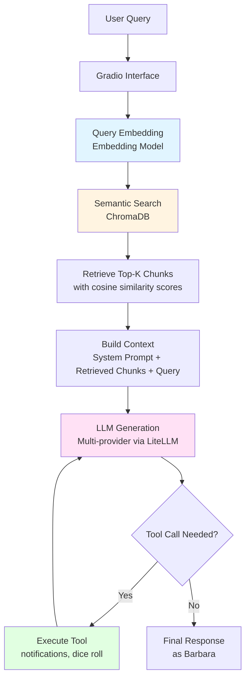
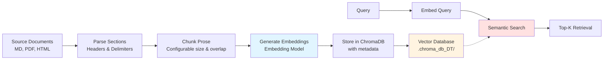
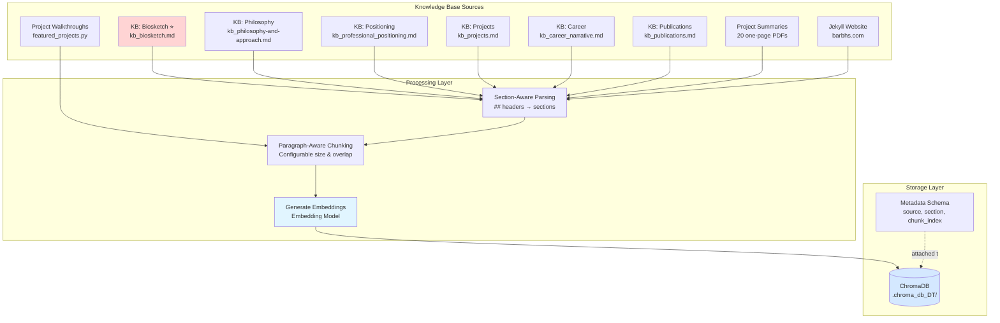

# Developer Guide: Building & Customizing the Digital Twin

This guide covers installation, architecture, and customization for developers who want to run, modify, or fork this digital twin project.

## Prerequisites

- Python 3.11+
- OpenAI API key (for embeddings and LLM)
- (Optional) Anthropic, Google, or Ollama API keys for multi-provider support
- (Optional) Pushover API credentials for notifications

## Installation & Setup

### 1. Clone the repository

```bash
git clone https://github.com/dagny099/barbs-digital-twin.git my-digital-twin
cd my-digital-twin
```

### 2. Create and activate virtual environment

```bash
python -m venv .venv
source .venv/bin/activate  # On Windows: .venv\Scripts\activate
```

### 3. Install dependencies

```bash
pip install -r requirements.txt
```

### 4. Configure environment variables

Copy `.env.example` to `.env` and fill in your values:

```bash
cp .env.example .env
```

**Minimum required:** `OPENAI_API_KEY`

**Optional variables:**
- `LLM_MODEL` - Default LLM to use (see `.env.example` for options)
- `ANTHROPIC_API_KEY` - For Claude models
- `GEMINI_API_KEY` - For Google models
- `PUSHOVER_TOKEN`, `PUSHOVER_USER` - For notification tool
- `SHOW_SETTINGS_PANEL` - Show model/temperature controls in UI (default: false)
- `N_CHUNKS_RETRIEVE` - Number of chunks to retrieve (default: 10)
- `ADMIN_PORT` - Port for admin interface (default: 7862)

See `.env.example` for the complete list with descriptions.

### 5. Run the application

```bash
python app.py
```

The Gradio interface will launch at `http://localhost:7860`

## Architecture

### RAG Query Flow



### Data Processing Pipeline



**Key Processing Steps:**
1. **Chunking**: Text split into configurable chunks with overlap
2. **Embedding**: Each chunk embedded via embedding model
3. **Storage**: Chunks + embeddings + metadata stored in ChromaDB
4. **Retrieval**: Query embedded → top-k semantic search → context injection

## Prompt Engineering

The system prompt is a core architectural component, not an afterthought. `SYSTEM_PROMPT.md` is organized into 13 sections covering persona, voice consistency, narrative priorities, factual accuracy guardrails, and tool integration.

**Key Design Decisions**:
- **Structured sections**: Numbered sections make debugging and iteration easier
- **Explicit failure modes** (Section 13): Table of wrong vs. right responses prevents common errors
- **Source priority ordering** (Section 5): Knowledge base conflicts resolved deterministically
- **"I don't know" protocols** (Sections 8, 9): Uncertainty is acceptable; fabrication is not
- **Featured projects** (Section 4): Proactive surfacing without being spammy

**Design Philosophy**: The prompt balances authenticity (Barbara's actual voice), accuracy (source-based only), and utility (helpful without overpromising). Each section addresses a specific failure mode observed during development and eval testing.

**Validation**: The evaluation suite (see `evals/`) tests adherence to these guidelines across 8 categories.

**Learn more:** [SYSTEM_PROMPT.md](SYSTEM_PROMPT.md) | [docs/PROMPT_DESIGN.md](docs/PROMPT_DESIGN.md)

## Knowledge Base Management

### Knowledge Base Architecture



### Ingestion Manager (`ingest.py`)

The recommended way to manage all data sources. Run it with no arguments for an interactive menu that shows current DB status before asking you to do anything:

```bash
python ingest.py
```

The menu displays a live status table — chunk counts per source, so you can see at a glance what's embedded and what isn't:

```
  #   Source                     Description                            Status
  1   KB: Biosketch ⭐            inputs/kb_biosketch.md               ✅  42 chunks
  2   KB: Philosophy & Approach  inputs/kb_philosophy-and-appro...     ✅  31 chunks
  3   KB: Professional Pos...    inputs/kb_professional_positio...      ✅  28 chunks
  4   KB: Project Portfolio      inputs/kb_projects.md                 ✅  65 chunks
  5   KB: Career Narrative       inputs/kb_career_narrative.md         ✅  44 chunks
  6   KB: Publications & Res...  inputs/kb_publications.md             ✅  18 chunks
  7   Project Summaries (PDFs)   inputs/project-summaries/ (one...     ✅  98 chunks
  8   Jekyll Website             https://barbhs.com (via sitemap)      ✅  210 chunks
```

Select a source by number → choose "Embed", "Force re-embed", or "Dry run".

**Non-interactive flags** (for scripting or CI/CD):
```bash
python ingest.py --status                              # Show DB status and exit
python ingest.py --all                                 # Embed all sources
python ingest.py --all --force                         # Force re-embed everything
python ingest.py --source kb-biosketch                 # Embed one source
python ingest.py --source kb-biosketch --force         # Force re-embed one source
python ingest.py --source project-summaries --dry-run  # Preview without embedding
```

**Source keys**: `kb-biosketch`, `kb-philosophy`, `kb-positioning`, `kb-intellectual-foundations`, `kb-dissertation-overview`, `kb-dissertation-relevance`, `kb-dissertation-philosophy`, `kb-projects`, `kb-career`, `kb-publications`, `kb-answers`, `kb-origins`, `kb-easter-eggs`, `project-summaries`, `jekyll`, `project-walkthroughs`

### Checking DB Contents

```bash
python ingest.py --status                          # Quick chunk counts per source
python verify_collection.py                        # Detailed stats + sample chunks
python verify_collection.py --show-sources         # Per-source breakdown
python verify_collection.py --show-sections        # All unique section names
```

### Auditing Chunk Quality

The `chunk_inspector.py` tool helps you audit chunk quality and simulate retrieval before the LLM ever sees it:

```bash
python chunk_inspector.py                        # Full audit report
python chunk_inspector.py --source kb-projects   # One source only
python chunk_inspector.py --query "Resume Explorer architecture"
python chunk_inspector.py --tiny                 # Show only bad chunks (<150 chars)
python chunk_inspector.py --all-chunks           # Dump every chunk
python chunk_inspector.py --query "..." --n 12   # Retrieve N chunks
```

**What it does:**
1. Chunk size distribution — find orphaned tiny chunks
2. Per-source breakdown — chunk count and avg size per source
3. Retrieval simulation — embed a query, show the chunks retrieved, formatted exactly as the LLM would see them
4. Gap detection — sections with suspiciously few chunks

### Wiping the DB

```bash
python clear_collection.py                         # Interactive confirmation required
```

---

## Data Sources

The knowledge base uses **section-aware metadata** so the LLM knows exactly where each retrieved chunk came from within a document.

### Metadata Schema
```python
{
    'source': 'source-type:identifier',  # e.g., 'kb-biosketch:kb_biosketch.md'
    'section': 'Section Name' or None,   # e.g., 'Professional Experience', 'Published Papers'
    'chunk_index': 0                     # position within section (resets per section)
}
```

### 1. KB: Biosketch (Authoritative) ⭐
- **File**: `inputs/kb_biosketch.md`
- **Source key**: `kb-biosketch`
- **Priority**: Highest — source of truth for identity, background, values, personality
- **Parsing**: Markdown `##` headers → named sections (all handled by `embed_kb_doc.py`)
- **Wins over**: all other sources in any conflict

### 2. KB: Philosophy & Approach
- **File**: `inputs/kb_philosophy-and-approach.md`
- **Source key**: `kb-philosophy`
- **Content**: How Barbara thinks about data, meaning-making, her father's influence, and what good work looks like

### 3. KB: Professional Positioning
- **File**: `inputs/kb_professional_positioning.md`
- **Source key**: `kb-positioning`
- **Content**: What sets Barbara apart, the cognitive science angle, the knowledge engineering angle, the four problems she solves

### 4. KB: Project Portfolio
- **File**: `inputs/kb_projects.md`
- **Source key**: `kb-projects`
- **Content**: Registry of all major projects with tech stack, deployment status, and cross-project connections

### 5. KB: Career Narrative
- **File**: `inputs/kb_career_narrative.md`
- **Source key**: `kb-career`
- **Content**: Career arc told as a story — five chapters from MIT through independent GenAI work

### 6. KB: Publications & Research
- **File**: `inputs/kb_publications.md`
- **Source key**: `kb-publications`
- **Content**: Academic papers, conference posters, and dissertation with PDF links

> All  KB documents above use `embed_kb_doc.py` — the same parsing logic (`##` headers → sections → `chunk_prose`).

### 7. Project Summaries
- **Folder**: `inputs/project-summaries/` (one-page PDFs)
- **Source key**: `project-summaries`
- **Content**: Curated one-pagers following a consistent template: What it is / Who it's for / What it does / How it works
- **Parsing**: Template-aware section detection (fuzzy prefix matching on known section labels)
- **Special**: Each document also gets a synthetic "overview" chunk combining the title + What it is + Who it's for, optimized for portfolio-style queries
- **Metadata extras**: `project_name`, `tech_stack` (comma-joined list of detected technologies)

### 8. Jekyll Website
- **URL**: `https://barbhs.com` (fetched live via sitemap.xml)
- **Source key**: `jekyll`
- **Tool**: `trafilatura` for main-content extraction (strips nav/footer automatically)
- **Parsing**: Page title used as section name; each page is one document

### 9. Project Walkthroughs
- **Source**: `featured_projects.py` (the `walkthrough_context` field of each featured project)
- **Source key**: `project-walkthroughs`
- **Script**: `embed_walkthroughs.py`
- **Content**: One chunk per featured project — title + summary + walkthrough notes + tags — enabling normal RAG to surface this content without triggering walkthrough mode
- **Metadata**: `project_name`, `section="walkthrough"`, `char_count`

## Shared Utilities (utils.py)

The project uses a centralized `utils.py` module to eliminate code duplication:

### Core Functions
- **`chunk_prose()`**: Paragraph-aware text chunking with overlap
- **`parse_paragraphs()`**: Split text on blank lines
- **`parse_sections_by_delimiter()`**: Parse TXT files by delimiter (e.g., `======`)
- **`parse_markdown_sections()`**: Parse markdown files by headers (e.g., `##`)
- **`build_metadata()`**: Construct standardized metadata dicts
- **`delete_chunks_by_source()`**: Wipe all chunks for a given source prefix (used by `--force-reembed`)
- **`section_already_embedded()`**: Per-section idempotency check (skip if already stored)

All ingestion scripts import from `utils.py` to ensure consistent chunking behavior across all sources.

## Chunking Strategy

- **Chunk Size**: Configurable (default ~500 characters)
- **Overlap**: Configurable (default 50 characters)
- **Atomic Unit**: Paragraphs (double-newline delimited)
- **Principle**: Never split mid-sentence; overlap re-includes trailing paragraphs
- **chunk_index semantics**: Resets to 0 for each section (not global)

This approach balances:
- Semantic coherence (paragraphs as natural units)
- Retrieval granularity (chunks ≈ 1-2 paragraphs)
- Context continuity (overlap prevents boundary issues)
- Section awareness (chunks know their parent section)

## Admin Interface

A developer-focused debug interface that runs alongside the main app:

```bash
python app_admin.py   # http://localhost:7862  (or $ADMIN_PORT if set)
```

**Shared features** (also in `app.py` when `SHOW_SETTINGS_PANEL=true`):
- **Multi-provider model switching** — compare OpenAI, Anthropic, Google, and Ollama models via LiteLLM
- **Adjustable top-k and temperature** — experiment without code changes
- **Session cost tracking** — running token count and USD cost across the session

**Admin-only features**:
- **Side-by-side chat + retrieval inspector** — see every retrieved chunk with cosine similarity scores
- **Collection browser** — browse, filter, and text-search all chunks in the knowledge base
- **Semantic probe** — embed any query and rank the entire collection to check KB coverage
- **Separate logging** — `query_log_admin.jsonl` for experimentation without corrupting production analytics

Set your provider API keys in `.env` (`ANTHROPIC_API_KEY`, `GEMINI_API_KEY`) to unlock non-OpenAI models. Ollama requires a local server at the default port. Note that LiteLLM model names require a provider prefix (e.g. `openai/gpt-4.1`, `anthropic/claude-sonnet-4-5`).

**Production tip:** Keep `SHOW_SETTINGS_PANEL=false` in production for a clean UI. Enable it locally for development and testing.

`app_admin.py` is not included in the HF Spaces deployment and is intended for local development only.

## Key Design Decisions

### Why ChromaDB?
- **Persistent storage**: No re-embedding on restart
- **Lightweight**: Runs locally without external dependencies
- **Python-native**: Seamless integration with OpenAI SDK
- **Metadata filtering**: Supports source-based filtering and priority rules

### Why multi-provider support?
- **Flexibility**: Test OpenAI, Anthropic, Google, and Ollama models without code changes
- **Cost optimization**: Admin interface enables data-driven model selection via ROI analysis
- **Provider resilience**: Swap providers if one experiences downtime or pricing changes
- **Configurable default**: Set `LLM_MODEL` in `.env` to choose your model; see `.env.example` for options and cost notes
- **Local development**: Settings panel (`SHOW_SETTINGS_PANEL=true`) for experimentation; hidden in production

### Why configurable chunk size?
- **Context window**: Fits multiple chunks comfortably in context with room for conversation
- **Semantic unit**: Aligns with paragraph-level ideas
- **Retrieval quality**: Small enough for precision, large enough for coherence

## Customizing for Your Own Twin

To adapt this codebase for your own digital twin:

1. **Replace knowledge base content**:
   - Create your own `inputs/kb_*.md` files
   - Add your project summaries to `inputs/project-summaries/`
   - Update `SYSTEM_PROMPT.md` with your persona and voice

2. **Update featured projects** (optional):
   - Edit `featured_projects.py` with your projects
   - Create SVG diagrams for walkthroughs if desired

3. **Customize the UI**:
   - Edit `app.py` to change title, description, example questions
   - Update CSS styling in the Gradio interface

4. **Re-embed the knowledge base**:
   ```bash
   python clear_collection.py  # Wipe Barbara's data
   python ingest.py --all      # Embed your content
   ```

5. **Test thoroughly**:
   - Use `chunk_inspector.py` to audit chunk quality
   - Try queries in the admin interface
   - Run evals to test response quality (see MAINTAINER_GUIDE.md)

## Contributing

This is a personal project, but suggestions and ideas are welcome! Feel free to:
- Open issues for bugs or feature requests
- Submit PRs for improvements (especially documentation)
- Fork the repo to create your own digital twin

See the main [README.md](README.md) for contact information.

---

**Next Steps:**
- [MAINTAINER_GUIDE.md](MAINTAINER_GUIDE.md) - Deployment, evaluation, and operations
- [VISITOR_GUIDE.md](VISITOR_GUIDE.md) - How to use the twin
- [docs/](docs/) - Additional technical documentation
