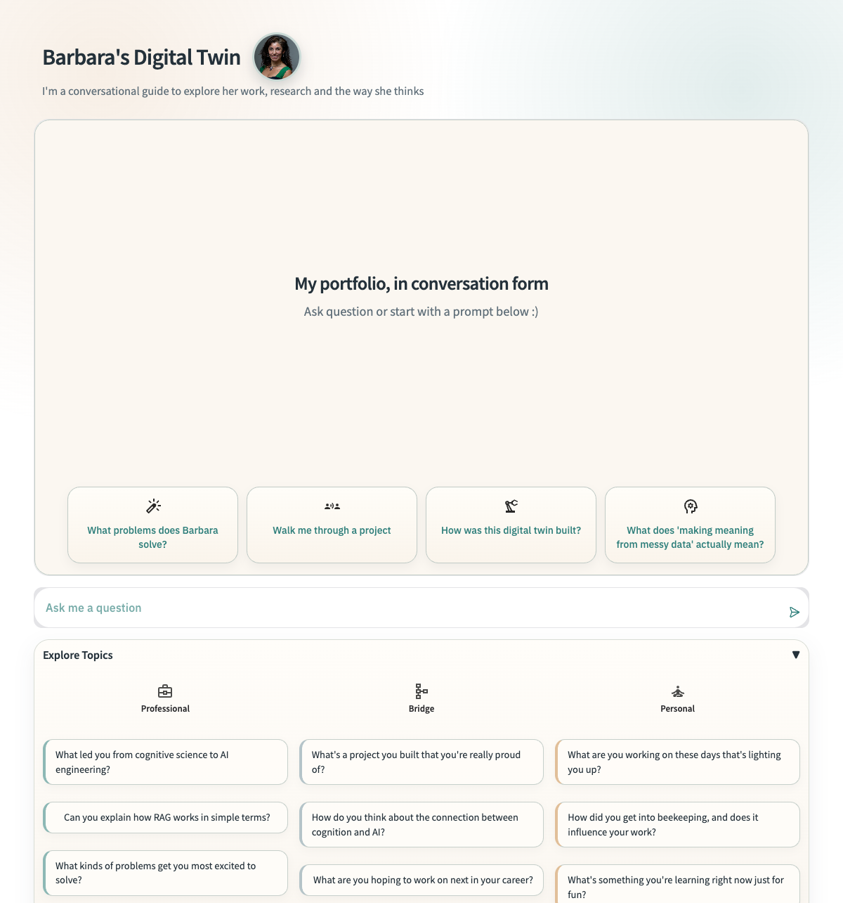
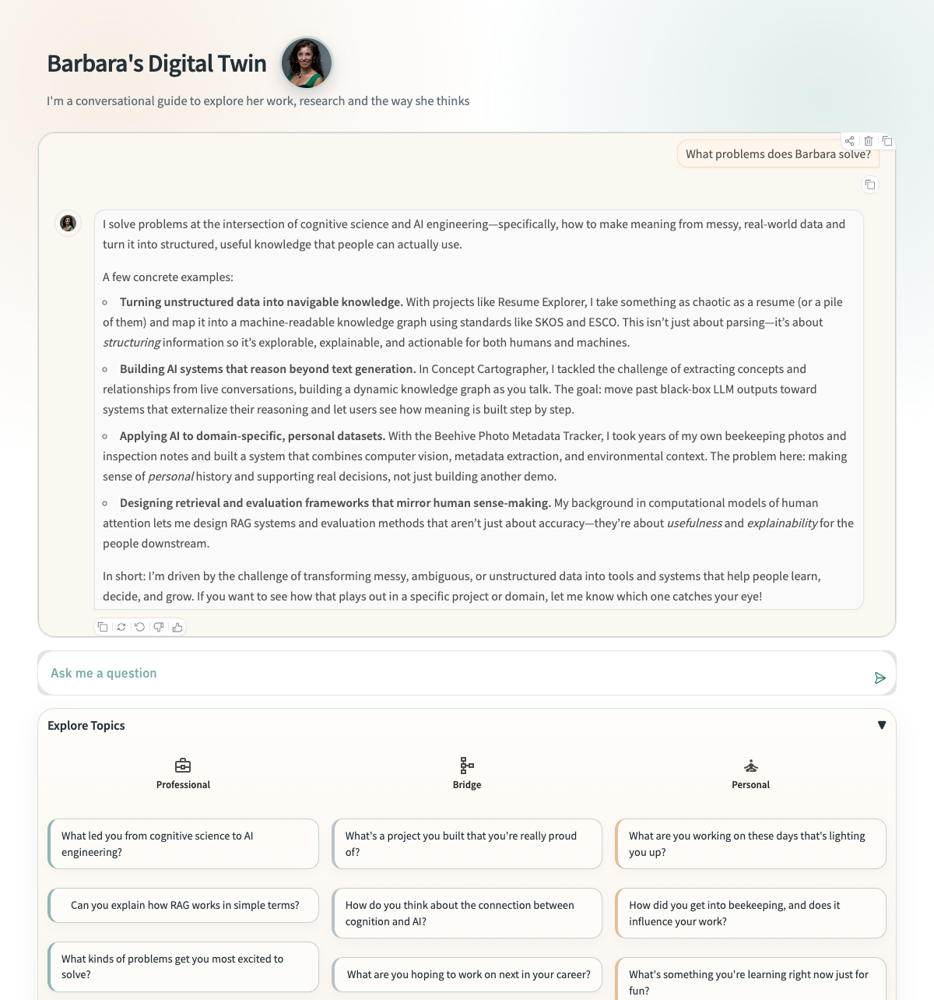

# Digital Twin: Barbara Hidalgo-Sotelo


A conversational AI digital twin powered by RAG (Retrieval-Augmented Generation) that embodies Barbara Hidalgo-Sotelo's professional knowledge, project portfolio, and personal expertise. Built with Python, Gradio, ChromaDB, and multi-provider LLM support via LiteLLM.

## Overview

This digital twin serves as an intelligent interface to explore Barbara's professional background, technical projects, and expertise. It uses vector embeddings and semantic search to retrieve relevant context from multiple knowledge sources, then generates responses in Barbara's voice and personality.

**For Visitors**: Chat with the twin at [twin.barbhs.com](https://twin.barbhs.com)
**For Developers**: Clone this repo to explore the RAG architecture, evaluation suite, and admin debugging tools

## Screenshots

| Landing page | Conversation in action |
|---|---|
|  |  |

## Quick Start

Want to run it locally in 5 minutes?

1. Clone the repo: `git clone https://github.com/dagny099/barbs-digital-twin.git`
2. Install dependencies: `pip install -r requirements.txt`
3. Set `OPENAI_API_KEY` in `.env` (copy from `.env.example`)
4. Run: `python app.py`
5. Open http://localhost:7860

**Need more details?** See [DEVELOPER_GUIDE.md](DEVELOPER_GUIDE.md) for full installation and setup instructions.

## Features

- **Multi-Source Knowledge Base**: Structured knowledge base documents, project PDFs, publications, and live website content
- **Semantic Search & RAG**: ChromaDB vector store for intelligent context retrieval
- **Section-Aware Ingestion**: Precise provenance tracking for every retrieved chunk
- **Conversational Interface**: Natural conversations via Gradio ChatInterface
- **Multi-Provider LLM Support**: OpenAI, Anthropic, Google, and Ollama via LiteLLM
- **Tool Integration**: Function calling for notifications and interactive features
- **First-Person Perspective**: Responds as Barbara with consistent voice and personality
- **Production-Grade Logging**: Tracks model performance, cost, and visitor satisfaction
- **Persistent Vector Database**: Incremental updates without full reprocessing
- **Interactive Admin Interface**: Debug tool with retrieval inspector and semantic probe

## Tech Stack

| Component | Technology |
|-----------|------------|
| **LLM** | Multi-provider support via LiteLLM (OpenAI, Anthropic, Google, Ollama)<br>Model configurable via `LLM_MODEL` env var (see `.env.example`) |
| **Embeddings** | OpenAI text-embedding-3-small (1536 dimensions) |
| **Vector Database** | ChromaDB (persistent local storage) |
| **UI Framework** | Gradio |
| **Language** | Python 3.11 |
| **Deployment** | AWS EC2 (primary), Hugging Face Spaces (secondary) |

## How It Works

This digital twin uses **RAG (Retrieval-Augmented Generation)** to combine semantic search with LLM generation:

1. **Knowledge Base**: Curated content from structured markdown docs, project PDFs, publications, and Barbara's website
2. **Semantic Search**: User queries are embedded and matched against a ChromaDB vector database
3. **Context Injection**: Top-K most relevant chunks are retrieved and injected into the LLM prompt
4. **Response Generation**: Multi-provider LLM generates responses in Barbara's voice
5. **Tool Integration**: Optional function calling for notifications and interactive features

**Want the technical details?** See [DEVELOPER_GUIDE.md](DEVELOPER_GUIDE.md) for architecture diagrams, data flow, and design decisions.

## Documentation

Detailed documentation is organized by role:

### 📘 [VISITOR_GUIDE.md](VISITOR_GUIDE.md)
**For everyone using the twin**
- How to ask good questions
- Example questions by category (recruiter, collaborator, curious visitor)
- What the twin knows (and doesn't know)
- Understanding responses and project walkthroughs
- Tips for better conversations

### 🔧 [DEVELOPER_GUIDE.md](DEVELOPER_GUIDE.md)
**For developers building or customizing**
- Installation & setup instructions
- Architecture diagrams and data flow
- Knowledge base management (`ingest.py`, `chunk_inspector.py`)
- Prompt engineering design philosophy
- Data sources and metadata schema
- Admin interface features
- Customizing for your own digital twin

### 🚀 [MAINTAINER_GUIDE.md](MAINTAINER_GUIDE.md)
**For deployment and operations**
- EC2 & Hugging Face Spaces deployment automation
- Evaluation workflow and testing harness
- Query log analytics and cost tracking
- Database operations and ChromaDB sync
- Monitoring, troubleshooting, and maintenance schedules
- Roadmap and contributing guidelines

## Project Structure

```
digital-twin/
├── app.py                              # Main Gradio application (public-facing)
├── app_admin.py                        # Admin/debug interface (local only, default port 7862, configurable via ADMIN_PORT)
├── featured_projects.py                # Project walkthrough logic and diagram serving
├── ingest.py                           # Master ingestion manager (start here)
├── embed_kb_doc.py                     # Generic: embed any inputs/kb_*.md document
├── embed_project_summaries.py          # Embed one-page project summary PDFs
├── embed_jekyll.py                     # Embed Jekyll website via sitemap
├── db_sync.py                          # Push/pull ChromaDB to/from HF Hub
├── utils.py                            # Shared text processing utilities
├── chunk_inspector.py                  # Audit chunk quality and simulate retrieval (run `python chunk_inspector.py --query "..."` to test RAG)
├── verify_collection.py                # Inspect ChromaDB contents
├── clear_collection.py                 # Wipe ChromaDB collection
├── requirements.txt                    # Python dependencies
├── SYSTEM_PROMPT.md                    # LLM system prompt (loaded by app.py)
├── VISITOR_GUIDE.md                    # Usage guide for visitors
├── DEVELOPER_GUIDE.md                  # Technical guide for developers
├── MAINTAINER_GUIDE.md                 # Operations guide for maintainers
├── docs/                               # Detailed info about setup and design choices
│   ├── PROMPT_DESIGN.md                # System prompt design rationale
│   ├── LOGGING_GUIDE.md                # Production logging setup and query analytics
│   ├── ADMIN_LOGGING_GUIDE.md          # Admin-mode logging for model comparison
│   ├── USAGE.md                        # Usage patterns and best practices
│   ├── CLAUDE.md                       # Claude Code integration notes
│   └── IMPLEMENTATION_SUMMARY.md       # Architecture and implementation notes
├── inputs/
│   ├── kb_biosketch.md                 # Biographical sketch  ⭐ authoritative
│   ├── kb_philosophy-and-approach.md   # Working philosophy and meaning-making
│   ├── kb_professional_positioning.md  # Positioning, differentiators, value prop
│   ├── kb_projects.md                  # Project portfolio registry
│   ├── kb_career_narrative.md          # Career story and trajectory
│   ├── kb_publications.md              # Research papers and academic work
│   └── project-summaries/              # One-page PDF summaries (20 projects)
├── evals/                               # Offline evaluation harness for systematic quality testing
│   ├── run_evals.py                    # Execute evaluation suite across all categories
│   ├── analyze_evals.py                # Analyze results and export for manual grading
│   ├── eval_questions.csv              # Seed questions organized by coverage & visitor type
│   ├── EVAL_QUICKSTART.md              # 5-minute getting started guide
│   └── EVAL_WORKFLOW.md                # Full evaluation workflow documentation
├── .chroma_db_DT/                      # ChromaDB vector store (gitignored)
├── .venv/                              # Virtual environment (gitignored)
└── README.md                           # This file
```

## Contributing

This is a personal project, but suggestions and ideas are welcome! Feel free to:
- Open issues for bugs or feature requests
- Submit PRs for improvements (especially documentation)
- Fork the repo to create your own digital twin

## License

This project is open-source under the MIT License. See `LICENSE` file for details.

The biographical content and project descriptions are © Barbara Hidalgo-Sotelo. Reuse of the *code/architecture* is encouraged; reuse of the *personal content* should be adapted to your own story.

## Contact & Links

- **LinkedIn**: [barbara-hidalgo-sotelo](https://www.linkedin.com/in/barbara-hidalgo-sotelo)
- **Personal Site**: [barbhs.com](https://www.barbhs.com/)
- **GitHub**: [dagny099](https://github.com/dagny099)
- **Google Scholar**: [Barbara Hidalgo-Sotelo](https://scholar.google.com/citations?hl=en&user=nQG25vkAAAAJ)

---

**Built with curiosity, engineered with precision.**
*"I can, I will, and I shall!"* - Barbara's mantra
