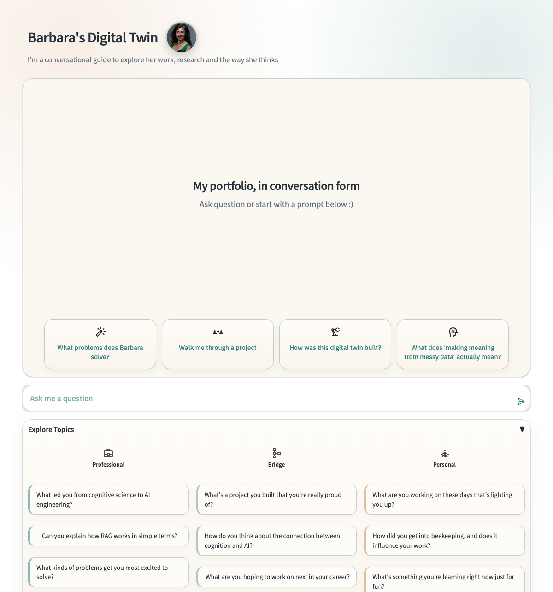
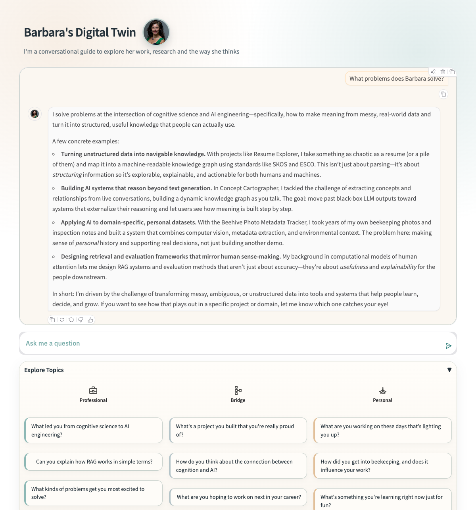

# Digital Twin: Barbara Hidalgo-Sotelo


A conversational AI digital twin powered by GraphRAG — retrieval-augmented generation backed by a Neo4j knowledge graph — that embodies Barbara Hidalgo-Sotelo's professional knowledge, project portfolio, and personal expertise. Built with Python, Gradio, Neo4j, and multi-provider LLM support via LiteLLM.

## Overview

This digital twin is an intelligent interface for exploring Barbara's professional background, technical projects, and expertise. It retrieves context from a structured knowledge graph — combining vector similarity with graph signals (project links, entity mentions) — and generates responses in Barbara's voice and personality.

**For Visitors**: Chat with the twin at [twin.barbhs.com](https://twin.barbhs.com)
**For Developers**: Clone this repo to explore the GraphRAG architecture, Neo4j knowledge graph, evaluation suite, and admin debugging tools

## Screenshots

| Landing page | Conversation in action |
|---|---|
|  |  |

## Quick Start

1. Clone the repo: `git clone https://github.com/dagny099/barbs-digital-twin.git`
2. Install dependencies: `pip install -r requirements.txt`
3. Copy `.env.example` to `.env` and set `OPENAI_API_KEY`. For a local run, also set
   `RETRIEVAL_BACKEND=chromadb` — the code default is `neo4j`, which requires a running
   Neo4j instance (`NEO4J_URI` etc.) and will error on the first query if none is configured.
4. Populate a knowledge base. Barbara's KB content is **not committed** (it lives in a private
   store); a fresh clone has no chunks to retrieve. Point the app at your own content via the
   ingestion pipeline — see [DEVELOPER_GUIDE.md](docs/DEVELOPER_GUIDE.md) (`scripts/ingest.py`).
5. Run: `python app.py` and open http://localhost:7860

**Need more details?** See [DEVELOPER_GUIDE.md](docs/DEVELOPER_GUIDE.md) for full installation and setup instructions.

## Features

- **Multi-Source Knowledge Base**: Structured KB docs, project PDFs, publications, and website content — parsed into named sections with provenance metadata
- **Dual retrieval backends**: One codebase, two live backends selected per deployment via `RETRIEVAL_BACKEND`. ChromaDB (pure vector) currently serves production at [twin.barbhs.com](https://twin.barbhs.com); Neo4j GraphRAG (hybrid vector + graph bonuses for project-linked and entity-rich sections) runs on the `graphy.` preview and is being validated before it takes over production.
- **Neo4j Knowledge Graph**: Documents, Sections, Projects, and 167 canonical entity nodes (Skills, Methods, Technologies, Concepts) connected via typed relationships
- **Section-Aware Ingestion**: Provenance tracked at the section level — every retrieved chunk knows its parent section, source document, and sensitivity tier
- **Conversational Interface**: Natural conversations via Gradio ChatInterface
- **Multi-Provider LLM Support**: OpenAI, Anthropic, Google, and Ollama via LiteLLM
- **Tool Integration**: Function calling for notifications and interactive features
- **First-Person Perspective**: Responds as Barbara with consistent voice and personality
- **Production-Grade Logging**: Tracks model performance, cost, and visitor satisfaction
- **Interactive Admin Interface**: Debug tool with retrieval inspector, semantic probe, and side-by-side Neo4j vs. ChromaDB comparison

## Tech Stack

| Component | Technology |
|-----------|------------|
| **LLM** | Multi-provider support via LiteLLM (OpenAI, Anthropic, Google, Ollama)<br>Model configurable via `LLM_MODEL` env var (see `.env.example`) |
| **Embeddings** | OpenAI text-embedding-3-small (1536 dimensions) |
| **Vector Database** | ChromaDB — pure vector retrieval; **currently the production backend** at twin.barbhs.com |
| **Knowledge Graph** | Neo4j — hybrid vector + graph retrieval; live on the `graphy.` preview, in validation |
| **UI Framework** | Gradio |
| **Language** | Python 3.11 |
| **Deployment** | AWS EC2 (primary), Hugging Face Spaces (secondary) |

## How It Works

This digital twin uses **GraphRAG** — retrieval-augmented generation backed by a Neo4j knowledge graph:

1. **Knowledge Base**: Curated content from structured KB docs, project PDFs, publications, and Barbara's website — parsed into named sections using `##` header boundaries
2. **Graph Construction**: Sections become nodes in a Neo4j graph, embedded with OpenAI's `text-embedding-3-small`. An entity extraction pipeline populates 167 canonical entity nodes (Skills, Methods, Technologies, Concepts) connected to sections via `MENTIONS` relationships. Projects link to their descriptive sections via `DESCRIBED_IN`.
3. **Hybrid Retrieval**: User query is embedded and matched against Neo4j's vector index. A composite scoring formula — vector similarity (×0.85) plus graph bonuses for project links (×0.08), entity mentions (×0.05), and section length (×0.02) — reranks candidates. Graph signals act as tiebreakers, not overrides.
4. **Tier Gating**: A sensitivity tier system (`public` / `personal` / `inner_circle`) controls which sections are eligible for retrieval. Deeper tiers unlock via passphrase.
5. **Response Generation**: Top-K sections injected as context into a carefully designed system prompt. Multi-provider LLM generates responses in Barbara's voice.
6. **Tool Integration**: Optional function calling for notifications and interactive features.

**Want the technical details?** See [DEVELOPER_GUIDE.md](docs/DEVELOPER_GUIDE.md) for architecture diagrams, data flow, and design decisions.

## Documentation

Detailed documentation is organized by role:

### 📘 [VISITOR_GUIDE.md](docs/VISITOR_GUIDE.md)
**For everyone using the twin**
- How to ask good questions
- Example questions by category (recruiter, collaborator, curious visitor)
- What the twin knows (and doesn't know)
- Understanding responses and project walkthroughs
- Tips for better conversations

### 🔧 [DEVELOPER_GUIDE.md](docs/DEVELOPER_GUIDE.md)
**For developers building or customizing**
- Installation & setup instructions
- Architecture diagrams and data flow
- Knowledge base management (`ingest.py`, `chunk_inspector.py`)
- Prompt engineering design philosophy
- Data sources and metadata schema
- Admin interface features
- Customizing for your own digital twin

### 🚀 [MAINTAINER_GUIDE.md](docs/MAINTAINER_GUIDE.md)
**For deployment and operations**
- EC2 & Hugging Face Spaces deployment automation
- Evaluation workflow and testing harness
- Query log analytics and cost tracking
- Database operations and ChromaDB sync
- Monitoring, troubleshooting, and maintenance schedules
- Roadmap and contributing guidelines

### 🧪 Evaluation
**For prompt iteration, regression checks, and model comparison**
- [EVALUATION_GUIDE.md](evals/EVALUATION_GUIDE.md) — Canonical reference for the evaluation system design
- [EVAL_QUICKSTART.md](evals/EVAL_QUICKSTART.md) — Quick commands for running the offline harness


## Project Structure

```
digital-twin/
├── app.py                              # Main Gradio application (public-facing)
├── app_admin.py                        # Admin/debug interface (local only, default port 7862, configurable via ADMIN_PORT)
├── featured_projects.py                # Project walkthrough logic and diagram serving
├── featured_projects.yaml              # Generated walkthrough data (consumed by featured_projects.py)
├── neo4j_utils.py                      # Neo4j driver + query_neo4j_rag() + scoring weights
├── chroma_utils.py                     # ChromaDB vector retrieval, query_chroma_rag()
├── db_sync.py                          # Push/pull ChromaDB to/from a private HF Hub dataset
├── utils.py                            # Shared text processing utilities
├── chunk_inspector.py                  # Audit chunk quality and simulate retrieval (`python chunk_inspector.py --query "..."`)
├── replay_retrieval.py                 # Neo4j retrieval debugger (`--compare` for Neo4j vs ChromaDB)
├── requirements.txt                    # Python dependencies
├── SYSTEM_PROMPT.md                    # LLM system prompt (loaded by app.py)
├── scripts/                            # Ingestion, embedding, and DB maintenance CLIs
│   ├── ingest.py                       # Master ingestion manager (start here)
│   ├── embed_kb_doc.py                 # Generic: embed any inputs/kb_*.md document
│   ├── embed_project_summaries.py      # Embed one-page project summary PDFs
│   ├── embed_jekyll.py                 # Embed Jekyll website via sitemap
│   ├── verify_collection.py            # Inspect ChromaDB contents
│   ├── clear_collection.py             # Wipe ChromaDB collection
│   └── healthcheck.py                  # Validate all external service connections
├── docs/                               # Documentation organized by role
│   ├── VISITOR_GUIDE.md                # Usage guide for visitors
│   ├── DEVELOPER_GUIDE.md              # Technical guide for developers
│   ├── MAINTAINER_GUIDE.md             # Operations guide for maintainers
│   ├── PROMPT_DESIGN.md                # System prompt design rationale
│   ├── LOGGING_GUIDE.md                # Production logging setup and query analytics
│   ├── ADMIN_LOGGING_GUIDE.md          # Admin-mode logging for model comparison
│   └── USAGE.md                        # Usage patterns and best practices
├── inputs/                             # KB source content — NOT committed (private); provide your own
│   ├── kb_*.md                         # Biographical / philosophy / positioning / projects / career / publications
│   └── project-summaries/              # One-page project summary PDFs
├── evals/                              # Offline evaluation harness and review artifacts
│   ├── run_evals.py                    # Execute evaluation suite
│   ├── analyze_evals.py                # Analyze results and export for review
│   ├── eval_questions.csv              # Question bank
│   ├── EVALUATION_GUIDE.md             # Canonical evaluation design reference
│   └── EVAL_QUICKSTART.md              # Quick run commands
├── .chroma_db_DT/                      # ChromaDB vector store (gitignored)
├── .venv/                              # Virtual environment (gitignored)
└── README.md                           # This file
```

## Contributing

This is a personal project, but suggestions and ideas are welcome! Feel free to:
- Open issues for bugs or feature requests
- Submit PRs for improvements (especially documentation)
- Fork the repo to create your own digital twin

## License

This project is open-source under the MIT License. See `LICENSE` file for details.

The biographical content and project descriptions are © Barbara Hidalgo-Sotelo. Reuse of the *code/architecture* is encouraged; reuse of the *personal content* should be adapted to your own story.

## Contact & Links

- **LinkedIn**: [barbara-hidalgo-sotelo](https://www.linkedin.com/in/barbara-hidalgo-sotelo)
- **Personal Site**: [barbhs.com](https://www.barbhs.com/)
- **GitHub**: [dagny099](https://github.com/dagny099)
- **Google Scholar**: [Barbara Hidalgo-Sotelo](https://scholar.google.com/citations?hl=en&user=nQG25vkAAAAJ)

---

**Built with curiosity, engineered with precision.**
*"I can, I will, and I shall!"* - Barbara's mantra
