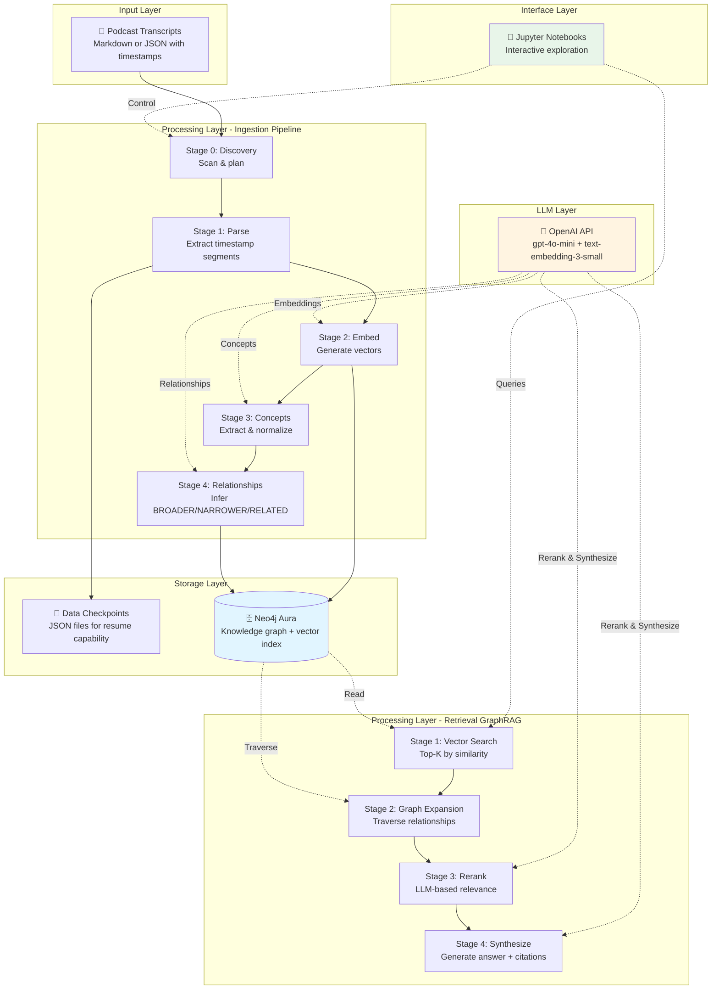

# Neo4j GraphRAG Podcast Knowledge Base

**A production-ready GraphRAG system for building searchable knowledge graphs from podcast transcripts.**

Ask questions, get answers with precise timestamp citations, discover related concepts through graph traversal, and find exactly which episodes to re-listen to.

---

## 🎯 Current Status

**Phase 2 Complete** ✅ (December 19, 2025)

- ✅ **Phase 1:** Core GraphRAG implementation (M1-M6)
  - Transcript parsing with timestamp provenance
  - Neo4j knowledge graph with SKOS-inspired concepts
  - Vector embeddings and semantic search
  - 2-stage GraphRAG retrieval (vector + graph expansion)
  - Answer synthesis with citations and re-listen recommendations

- ✅ **Phase 2:** Production ingestion pipeline
  - Automated batch processing for entire podcast shows
  - Smart skip logic (idempotent, resume-capable)
  - Progress tracking and error handling
  - Ready to scale to 5+ podcast shows

**Current Data:**
- 2 podcast shows: "Catalog & Cocktails", "Graph Geeks"
- 8 episodes across both shows
- ~800+ transcript segments with embeddings
- ~50+ normalized concepts
- ~60+ SKOS relationships (BROADER/NARROWER/RELATED)

---

## 🏗️ Architecture

### System Overview



### Tech Stack

| Layer | Technology | Purpose |
|-------|-----------|---------|
| **Database** | Neo4j Aura | Knowledge graph + vector index |
| **LLM Provider** | OpenAI (swappable to Claude) | Embeddings, extraction, synthesis |
| **Language** | Python 3.10+ | All application logic |
| **Interface** | Jupyter Notebooks | Interactive development |
| **Dependencies** | Ultra-light (7 core) | Maintainable, learning-first |

---

## 🚀 Quick Start

### Prerequisites

1. **Neo4j Aura account** (free tier works)
2. **OpenAI API key** (or Anthropic for Claude)
3. **Python 3.10+**

### Installation

```bash
# Clone repository
cd /Users/bhs/PROJECTS/graph-rag-with-podcasts

# Install dependencies
pip install -r requirements.txt
```

### Configuration

Edit `config.env`:

```bash
# Neo4j Aura
NEO4J_URI=neo4j+s://your-instance.databases.neo4j.io
NEO4J_USER=neo4j
NEO4J_PASSWORD=your-password

# LLM Provider
LLM_PROVIDER=openai  # or 'claude'
OPENAI_API_KEY=sk-...
ANTHROPIC_API_KEY=sk-ant-...  # if using Claude

# Models
EMBEDDING_MODEL=text-embedding-3-small
COMPLETION_MODEL=gpt-4o-mini
```

### Verify Setup

```bash
jupyter notebook notebooks/06_graphrag_qa.ipynb
```

Run the setup cells - if you see "✓ Neo4j connected", you're ready!

---

## 📖 Common Operations

### 1. Ingest a New Podcast Show

**Use the automated pipeline:**

```bash
jupyter notebook notebooks/07_podcast_ingestion_pipeline.ipynb
```

**Steps:**
1. Place transcript files (`.md` or `.json`) in `transcripts/PODCAST - Your Show Name/`
2. Run **Setup** cells (1-2)
3. Run **Dry Run** cell to preview plan
4. Run **Live Run** cell to process
5. Review ingestion report

**Expected time:** 15-20 minutes for 3 episodes (~600 segments)
**Expected cost:** ~$0.50-1.00 (OpenAI API)

**The pipeline will:**
- ✅ Skip already-processed episodes
- ✅ Parse transcripts into timestamp segments
- ✅ Generate embeddings
- ✅ Extract and normalize concepts
- ✅ Infer SKOS relationships
- ✅ Create comprehensive report

**Supported Transcript Formats:**
- **Markdown** (.md) - Graph Geeks style with timestamp markers
- **JSON** (.json) - Catalog & Cocktails style with speaker attribution

### 2. Query the Knowledge Graph

**Use the interactive Q&A interface:**

```bash
jupyter notebook notebooks/06_graphrag_qa.ipynb
```

**Quick query:**

```python
# After running setup cells
result = ask("What is vector database memory?")
```

**You'll get:**
- 2-4 bullet point answer
- ≥2 citations with exact timestamps
- 2-4 "re-listen" recommendations
- Confidence score

**Example output:**

```
Answer:
• Vector databases use compressed graph representations for long-term memory storage...
• This approach reduces token usage by 70x and latency by 10x compared to full context...

Citations:
[Graph Geeks | Emerging AI Memory with Dave Bechberger | 10:21–10:45]
  "the data it was providing from the graph was kind of a summarized compressed version..."

Re-Listen Recommendations:
• [10:21–11:12] - How graph memory reduces token usage
• [15:05–16:30] - Different memory architectures (temporal, lexical, domain)
```

### 3. Verify Data State

**Check what's in Neo4j:**

```python
from graph.data_loader import verify_data_loaded
from neo4j import GraphDatabase
import os
from dotenv import load_dotenv

load_dotenv('config.env')
driver = GraphDatabase.driver(
    os.getenv('NEO4J_URI'),
    auth=(os.getenv('NEO4J_USER'), os.getenv('NEO4J_PASSWORD'))
)

verify_data_loaded(driver)
```

**Output:**
```
Podcast Shows: 2
Episodes: 8
Segments: 850
Concepts: 52
Relationships: MENTIONS (180), BROADER (18), NARROWER (18), RELATED (24)
```

### 4. Add New Episodes to Existing Show

Just add the new `.md` or `.json` files to the show folder and re-run the ingestion pipeline:

```bash
transcripts/PODCAST - Catalog and Cocktails/
  ├── catalog-and-cocktails_TRANSCRIPT_2024-04-24.json  # existing
  ├── catalog-and-cocktails_TRANSCRIPT_2024-04-17.json  # existing
  └── catalog-and-cocktails_TRANSCRIPT_2024-05-01.json  # NEW - will be detected
```

The pipeline will:
- Skip already-processed episodes
- Process new episodes only
- Re-normalize concepts across ALL episodes (prevents duplicates)
- Re-infer relationships on full concept set

### 5. Explore the Knowledge Graph

**Visualize concept hierarchy:**

```bash
jupyter notebook notebooks/04_skos_relationships.ipynb
```

**Find broader concepts:**

```cypher
// In Neo4j Browser
MATCH (c:Concept {prefLabel: "Graph Memory"})-[:BROADER*1..2]->(broader:Concept)
RETURN c.prefLabel, broader.prefLabel
```

**Find all segments mentioning a concept:**

```cypher
MATCH (s:TranscriptSegment)-[m:MENTIONS]->(c:Concept {prefLabel: "Vector Databases"})
RETURN s.start_timestamp_str, s.end_timestamp_str, s.raw_text, m.confidence
ORDER BY s.start_time_sec
```

---

## 📁 File Organization Map

### Need to modify something? Here's where to look:

| **Task** | **File** | **Lines** |
|----------|----------|-----------|
| **Parse transcript format** | `src/parsers/transcript_parser.py` | ~350 |
| **Adjust concept extraction prompts** | `src/extraction/concept_extractor.py` | ~350 |
| **Change normalization logic** | `src/extraction/normalizer.py` | ~280 |
| **Modify relationship inference** | `src/extraction/relationship_inference.py` | ~370 |
| **Tweak vector search** | `src/retrieval/vector_search.py` | ~180 |
| **Adjust graph expansion** | `src/retrieval/graph_expansion.py` | ~235 |
| **Modify answer synthesis** | `src/generation/answer_synthesizer.py` | ~320 |
| **Change pipeline stages** | `src/pipelines/podcast_ingestion.py` | ~750 |
| **Update skip detection** | `src/pipelines/skip_detection.py` | ~155 |
| **Modify progress tracking** | `src/pipelines/progress_tracker.py` | ~239 |

### Module Responsibilities

```
src/
├── config.py                    # Environment config loading
├── providers/
│   └── llm_provider.py          # Abstract LLM interface (OpenAI/Claude)
├── models/
│   ├── schemas.py               # Data classes for shows, episodes, segments
│   └── media_asset.py           # Multimodal asset references
├── parsers/
│   └── transcript_parser.py     # Timestamp-aware parsing (MD + JSON)
├── graph/
│   ├── schema_builder.py        # Neo4j schema creation
│   ├── kg_builder.py            # Knowledge graph construction
│   └── data_loader.py           # Data verification utilities
├── embeddings/
│   └── embedder.py              # Embedding generation (batch)
├── extraction/
│   ├── concept_extractor.py     # LLM-based concept extraction
│   ├── normalizer.py            # Concept deduplication
│   └── relationship_inference.py # SKOS relationship inference
├── retrieval/
│   ├── vector_search.py         # Stage 1: Vector similarity search
│   ├── graph_expansion.py       # Stage 2: Graph traversal
│   ├── reranker.py              # LLM-based relevance scoring
│   └── graph_rag.py             # Main GraphRAG orchestrator
├── generation/
│   ├── answer_synthesizer.py   # Answer generation with citations
│   ├── wiki_generator.py        # Wiki-style summaries
│   └── question_suggester.py   # Suggest follow-up questions
└── pipelines/
    ├── podcast_ingestion.py     # Main ingestion pipeline
    ├── skip_detection.py        # Smart skip logic
    └── progress_tracker.py      # Progress tracking
```

---

## 📚 Project Structure

```
graph-rag-with-podcasts/
├── notebooks/                   # Interactive Jupyter notebooks
│   ├── 01_schema_and_parsing.ipynb          # M1: Parse & schema
│   ├── 02_embeddings_vector_search.ipynb    # M2: Embeddings
│   ├── 03_concept_extraction.ipynb          # M3: Concepts
│   ├── 04_skos_relationships.ipynb          # M4: SKOS relationships
│   ├── 05_multimodal_ready.ipynb            # M5: Multimodal architecture
│   ├── 06_graphrag_qa.ipynb                 # M6: Q&A interface
│   └── 07_podcast_ingestion_pipeline.ipynb  # Production pipeline
│
├── src/                         # Source code (17 modules)
│   ├── config.py
│   ├── providers/               # LLM provider abstraction
│   ├── models/                  # Data classes
│   ├── parsers/                 # Transcript parsing
│   ├── graph/                   # Neo4j operations
│   ├── embeddings/              # Vector generation
│   ├── extraction/              # Concept & relationship extraction
│   ├── retrieval/               # GraphRAG retrieval
│   ├── generation/              # Answer synthesis
│   └── pipelines/               # Podcast ingestion pipeline
│
├── data/                        # Generated data (checkpoints)
│   ├── parsed/                  # Parsed segments JSON
│   ├── concepts/                # Extracted concepts JSON
│   ├── relationships/           # Inferred relationships JSON
│   └── qa_results/              # Q&A test results
│
├── transcripts/                 # Input files
│   ├── PODCAST - Catalog and Cocktails/
│   │   ├── catalog-and-cocktails_TRANSCRIPT_2024-04-24.json
│   │   ├── catalog-and-cocktails_TRANSCRIPT_2024-04-17.json
│   │   └── ...
│   └── PODCAST - Graph Geeks/
│       ├── episode_2025-10-24.md
│       ├── episode_2025-10-15.md
│       └── ...
│
├── scripts/                     # Helper scripts
│   ├── ingest_new_episodes.py
│   └── manual_ingest_each_episode_with_podcast_metadata.py
│
├── dev/                         # Development docs
│   ├── REFACTOR_MAPPING_PLAN.md
│   └── ...
│
├── config.env                   # Environment variables (YOU MUST CREATE)
├── requirements.txt             # Python dependencies
├── CLAUDE.md                    # Agent guide & technical details
└── README.md                    # This file
```

---

## 🎓 Learning Goals & Design Philosophy

This project was built with **learning-first principles:**

1. **Explicit over implicit** - Every LLM call, Neo4j query, and data transformation is visible in notebooks
2. **Minimal abstractions** - No heavy frameworks (LangChain, LangGraph) in v1
3. **Provider-agnostic** - Swap OpenAI ↔ Claude ↔ local models through 50-line interface
4. **Notebook-driven** - Interactive exploration beats black-box APIs
5. **Production-capable** - Clean architecture allows scaling to CLI/UI without rewrites

### Why This Stack?

| **Choice** | **Rationale** |
|------------|---------------|
| Neo4j (not FAISS) | Single database, graph traversal, visual debugging |
| Ultra-light (not LangGraph) | Learning-first, no framework lock-in |
| SKOS-inspired (not full RDF) | Pragmatic, Neo4j-native |
| LLM extraction (not rules) | Handles nuance, evolves with models |
| Notebooks (not CLI first) | Exploration, education, iteration |

---

## 🔍 Neo4j Schema (Quick Reference)

### Node Types

- `:PodcastShow` - Show metadata (publisher, hosts, feed URL)
- `:Episode` - Individual episodes (pub date, guests, audio URL)
- `:TranscriptSegment` - Timestamp-aligned text with embeddings (3-10 sec)
- `:ConceptScheme` - SKOS scheme (one per show)
- `:Concept` - Extracted concepts with prefLabel, altLabel, definition
- `:Person` - Hosts and guests
- `:Organization` - Sponsors and publishers
- `:MediaAsset` - Multimodal references (v1: links only, v2: embeddings)

### Key Relationships

```
(PodcastShow)-[:HAS_EPISODE {order}]->(Episode)
(Episode)-[:HAS_SEGMENT {order}]->(TranscriptSegment)
(PodcastShow)-[:HAS_SCHEME]->(ConceptScheme)
(ConceptScheme)-[:INCLUDES]->(Concept)
(TranscriptSegment)-[:MENTIONS {confidence, evidence_quote}]->(Concept)
(Concept)-[:BROADER|NARROWER|RELATED {confidence, inferred}]->(Concept)
(Person)-[:HOSTS]->(PodcastShow)
(Person)-[:GUEST_ON {episode_date}]->(Episode)
(Organization)-[:SPONSORS]->(PodcastShow)
(PodcastShow)-[:PUBLISHED_BY]->(Organization)
(MediaAsset)-[:ALIGNED_TO]->(TranscriptSegment)
(MediaAsset)-[:ILLUSTRATES]->(Concept)
```

### Timestamp Provenance

Every segment preserves exact timestamps:

```python
{
  'segment_id': 'catalog_cocktails__2024-04-24__vector_databases__00270__0012',
  'start_time_sec': 270,
  'end_time_sec': 278,
  'start_timestamp_str': '4:30',
  'end_timestamp_str': '4:38',
  'raw_text': 'A vector database is a database where...',
  'embedding': [0.023, -0.142, ...]  # 1536-dim vector
}
```

Citations in answers always include timestamp ranges:

```
[Catalog & Cocktails | Demystifying Vector Databases | 4:30–4:38]
```

---

## 🛠️ Troubleshooting

### "Neo4j connection failed"

1. Check `config.env` has correct `NEO4J_URI`, `NEO4J_USER`, `NEO4J_PASSWORD`
2. Verify Neo4j Aura instance is running (check web console)
3. Ensure URI starts with `neo4j+s://` (not `bolt://`)

### "OpenAI API error"

1. Check `OPENAI_API_KEY` in `config.env`
2. Verify API key is active (check OpenAI dashboard)
3. Check billing/quota limits
4. For rate limits: pipeline has built-in retry with exponential backoff

### "Pipeline skips everything but I want to reprocess"

Delete checkpoint files to force re-processing:

```bash
# Force re-parse specific episode
rm data/parsed/catalog_cocktails__2024-04-24__vector_databases_segments.json

# Force re-extract concepts from episode
rm data/concepts/catalog_cocktails__2024-04-24__vector_databases_concepts.json

# Force re-normalize (will always re-run relationships too)
rm data/concepts/catalog_cocktails_normalized.json
```

### "Duplicate concepts appearing"

The pipeline always re-normalizes at show-level, but if you manually created concepts outside the pipeline:

```cypher
// Find duplicate concepts by prefLabel
MATCH (c:Concept)
WITH c.prefLabel as label, collect(c) as concepts
WHERE size(concepts) > 1
RETURN label, size(concepts) as count
```

**Fix:** Re-run pipeline Stage 3-4 (will MERGE and deduplicate)

### "JSON vs Markdown transcript format?"

Both are supported! The parser detects format automatically:
- `.json` files → Catalog & Cocktails format (with speaker attribution)
- `.md` files → Graph Geeks format (simple timestamps)

---

## 📊 Performance & Costs

### Ingestion (per show, 3 episodes, ~600 segments)

| **Stage** | **Time** | **Cost** | **Skippable?** |
|-----------|----------|----------|----------------|
| Parse | ~30 sec | Free | ✅ Yes (if JSON exists) |
| Embed | ~5 min | ~$0.10 | ✅ Yes (if in Neo4j) |
| Extract Concepts | ~8 min | ~$0.30 | ✅ Yes (if JSON exists) |
| Normalize | ~2 min | ~$0.05 | ❌ Always runs |
| Relationships | ~3 min | ~$0.10 | ❌ Always runs |
| **Total (first run)** | **~18 min** | **~$0.55** | - |
| **Total (re-run)** | **~5 min** | **~$0.15** | Smart skips |

### Query (per question)

| **Operation** | **Time** | **Cost** |
|---------------|----------|----------|
| Vector search | ~0.1 sec | ~$0.0001 |
| Graph expansion | ~0.2 sec | Free |
| LLM reranking | ~1 sec | ~$0.005 |
| Answer synthesis | ~2 sec | ~$0.01 |
| **Total** | **~3-4 sec** | **~$0.015** |

---

## 🚀 Next Steps

### Immediate (You're Ready For)

1. **Add more podcast shows** - Place transcripts in `transcripts/PODCAST - Name/`, run pipeline
2. **Experiment with queries** - Try different questions, see what works well
3. **Tune parameters** - Adjust `GraphRAGConfig` in notebook 06 (top_k, similarity thresholds)

### Near-Term Enhancements

1. **CLI interface** - Wrap pipeline in `argparse` for command-line use
2. **Streamlit UI** - Interactive podcast management and querying
3. **Export features** - Generate study notes from concepts
4. **Cross-show queries** - "Compare vector database approaches across all podcasts"

### Future (v2+)

1. **Multimodal embeddings** - CLIP for images, Whisper for audio
2. **LangGraph integration** - Production UI with streaming
3. **Evaluation framework** - Track answer quality over time
4. **Advanced retrieval** - Hybrid search, reranking models

---

## 📖 Documentation

- **Quick Start:** This README
- **Technical Details:** See `CLAUDE.md` for agent guide and implementation details
- **Refactor Plan:** See `dev/REFACTOR_MAPPING_PLAN.md` for architecture decisions
- **Interactive Tutorials:** See `notebooks/` (01-07)

---

## 🎯 Success Criteria (All Met ✅)

- ✅ Parse 8+ podcast episodes with timestamp provenance
- ✅ Build knowledge graph with 50+ concepts, SKOS relationships
- ✅ Answer queries with ≥2 citations, precise timestamp ranges
- ✅ Provide "what to re-listen" recommendations
- ✅ All code explicit and learnable (notebook-first)
- ✅ Provider-agnostic (can swap OpenAI ↔ Claude)
- ✅ Multimodal-ready architecture (linkable MediaAssets)
- ✅ Production pipeline (batch ingestion, idempotent, scalable)
- ✅ Support multiple transcript formats (JSON + Markdown)

---

**Status:** Phase 2 Complete - Ready for Multi-Show Scaling
**Built:** December 2025
**Stack:** Neo4j + OpenAI + Jupyter + Python
**Philosophy:** Learning-first, notebook-driven, production-capable
**Domain:** Podcast Knowledge Management
