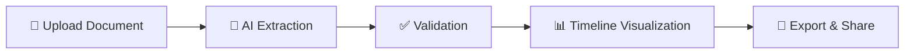

# ChronoScope ⏰

**Transform your documents into beautiful interactive timelines using AI**

ChronoScope automatically extracts life events from resumes, cover letters, and personal documents to create rich, visual timelines of your journey. Powered by AI and built with simplicity in mind.

 |
| ✅ **Quality Validation** | ⚠️ Beta | Quick checks for missing data, confidence scores (advanced metrics planned) |
| 🔒 **Local-First Privacy** | ✅ Production | Documents & data stored locally; OpenAI API for extraction ([details](docs/privacy-security.md)) |
| 📝 **Personal Notes** | ✅ Production | Persistent JSON-based note storage with metadata |
| 🎨 **Professional UI** | ✅ Production | Clean Streamlit interface (desktop browsers) |

---

## 🚀 Quick Start

### Installation (3 steps)

**Option 1: Automated Setup (Recommended)**
```bash
# 1. Clone and navigate
git clone https://github.com/dagny099/chronoscope.git
cd chronoscope

# 2. Run setup script (handles everything!)
chmod +x setup_new_machine.sh
./setup_new_machine.sh

# 3. Add your OpenAI API key
echo 'OPENAI_API_KEY = "sk-your-key-here"' > .streamlit/secrets.toml
```

**Option 2: Manual Setup**
```bash
# 1. Clone and navigate to the project
git clone https://github.com/dagny099/chronoscope.git
cd chronoscope

# 2. Install dependencies
python3 -m venv .venv
source .venv/bin/activate  # Windows: .venv\Scripts\activate
pip install --upgrade pip
pip install -r requirements.txt

# 3. Clear Streamlit cache (prevents "No module named frontend" error)
streamlit cache clear
rm -rf ~/.streamlit/cache/

# 4. Add your OpenAI API key
echo 'OPENAI_API_KEY = "sk-your-key-here"' > .streamlit/secrets.toml
```

### Launch the App

```bash
# Make sure virtual environment is activated
source .venv/bin/activate  # Windows: .venv\Scripts\activate

# Run the app
streamlit run timeline-mvp-pipeline.py
```

Your browser will open to `http://localhost:8501` 🎉

### ⚠️ Troubleshooting Installation

**"No module named 'frontend'" Error?**

This is a known Streamlit cache issue. Fix it with:
```bash
# Activate your virtual environment first
source .venv/bin/activate

# Clear all Streamlit caches
streamlit cache clear
rm -rf ~/.streamlit/cache/
rm -rf .streamlit/cache/

# Restart the app
streamlit run timeline-mvp-pipeline.py
```

**Still having issues?** Run the automated setup script which handles all edge cases:
```bash
./setup_new_machine.sh
```

---

## 💡 How It Works



1. **Upload** - Drop in your resume (excellent results) or try cover letters/statements (experimental)
2. **Extract** - AI identifies events, dates, locations, and people
3. **Validate** - Quality checks highlight issues (missing dates, low confidence)
4. **Visualize** - Explore your timeline with interactive charts
5. **Export** - Save or share your timeline

---

## 📸 Screenshots

<table>
  <tr>
    <td width="50%">
      
      <p align="center"><em>Main Timeline View</em></p>
    </td>
    <td width="50%">
      
      <p align="center"><em>Advanced Settings</em></p>
    </td>
  </tr>
</table>

---

## 📚 Documentation

**New to ChronoScope?**
- 📖 [Full Documentation](https://docs.barbhs.com/chronoscope) - Complete user guide
- ⚡ [Quick Start Tutorial](docs/getting-started/quickstart.md) - 5-minute walkthrough
- 🎯 [Your First Timeline](docs/getting-started/first-timeline.md) - Step-by-step guide

**Learn More:**
- [Uploading Documents](docs/user-guide/uploading-documents.md) - Best practices for document upload
- [Visualization Guide](docs/features/visualization.md) - Customize your timeline
- [Troubleshooting](docs/troubleshooting/common-issues.md) - Common issues & solutions
- [Privacy & Security](docs/privacy-security.md) - How your data is handled

**For Developers:**
- [Architecture Overview](docs/developer/architecture.md) - Technical deep dive
- [API Reference](docs/developer/api-reference.md) - Code documentation

---

## 🎯 Use Cases

- **Career Portfolio** - Visualize your professional journey
- **Academic Timeline** - Track education and research milestones
- **Life Story** - Document personal achievements and memories
- **Project History** - Chart project evolution and deliverables
- **Team Retrospective** - Collective timeline for team achievements

---

## ❓ Frequently Asked Questions

**Q: Is my data sent to OpenAI?**
A: Only document text for event extraction. Timeline data stays local. [Details](docs/privacy-security.md)

**Q: Can I use local LLMs instead of OpenAI?**
A: Ollama support planned for v2.0. Track progress in [issue #X]

**Q: Does it work offline?**
A: After extraction, yes. Initial processing requires internet for OpenAI API.


---

## 🛠️ Tech Stack

- **Frontend**: Streamlit (Python web framework)
- **Visualization**: Plotly (interactive charts), NetworkX (graph networks)
- **AI**: OpenAI GPT (event extraction)
- **Storage**: JSON (local, private), optional Neo4j (knowledge graph)
- **Document Processing**: PyMuPDF, pdfplumber (PDF extraction)
- **Export**: openpyxl (Excel), TimelineJS (interactive timelines)
- **Documentation**: MkDocs Material

---

## 🔗 Links

- 🌐 [Live Demo](https://chronoscope.barbhs.app) 
- 📖 [Documentation](https://docs.barbhs.com/chronoscope)

---

## 🚧 Current Status & Limitations (v1.0 Beta)

ChronoScope is in active beta. Here's what works great and what's still developing:


**Recent Updates:**
- ✅ Editable data table with Title, Tags (multiselect), and Priority fields
- ✅ Tag Manager for creating and managing tags across events
- ✅ Customizable timeline title for personalized visualizations
- ✅ User feedback system (Verified, Rating, Feedback fields)
- ✅ Fixed critical row misalignment bug in sorted tables
- ✅ TimelineJS export with 6 color schemes & 10 font options
- ✅ Knowledge Graph visualization (JSON-based + optional Neo4j)
- ✅ PDF extraction with dual-library fallback (PyMuPDF + pdfplumber)
- ✅ Multi-document processing with deduplication
- ✅ Gold standard validation system
- ✅ User notes functionality
- ✅ Advanced filtering options

### ✅ What Works Excellently

- **Resume processing** - 95%+ accuracy on standard chronological resumes
- **Interactive timelines** - Smooth Plotly visualizations with zoom/pan/filter
- **Local-first privacy** - Documents and timeline data stored on your machine
- **TimelineJS export** - Professional web timelines with 6 color schemes & 10 fonts
- **JSON-based data** - Simple, portable timeline storage

### ⚠️ Known Limitations

- **Document variety** - Best results with resumes; cover letters ~70-80% accuracy
- **Scanned PDFs** - Requires OCR preprocessing (not included in ChronoScope)
- **Date parsing** - Vague dates ("recently", "a few years ago") may not extract
- **Single-user only** - No team collaboration features (planned for v2.0)
- **Desktop browsers** - Mobile-responsive design planned but not optimized yet
- **Internet required** - OpenAI API needs connection for AI extraction

---

## 🙏 Acknowledgments

Built with amazing open-source tools:
- [Streamlit](https://streamlit.io) - Web framework
- [Plotly](https://plotly.com) - Visualizations
- [TimelineJS](https://timeline.knightlab.com) - Timeline export

---

## 📄 License

This project is licensed under the MIT License - see [LICENSE](LICENSE) file for details.

---
