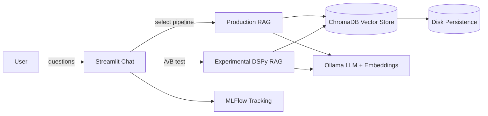
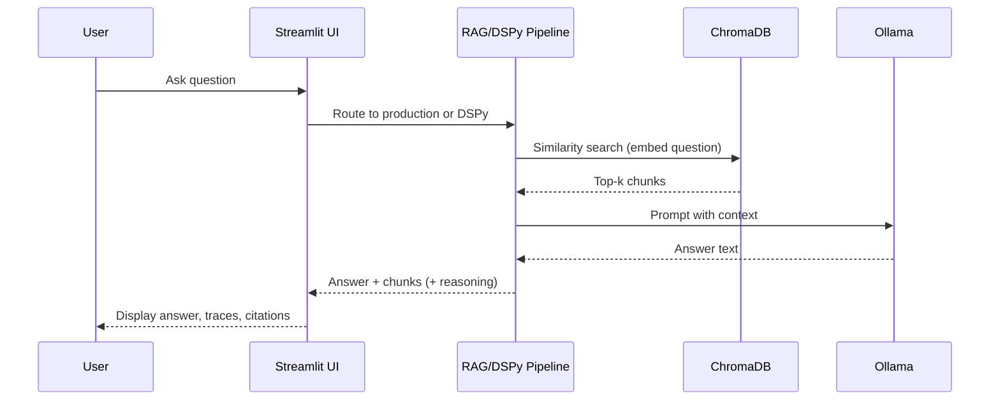

# Privacy-First Local RAG Chatbot
A dual-track Streamlit chatbot that keeps all data on your machine. Choose between a stable production RAG pipeline and experimental DSPy-powered reasoning to query your own documents with zero external calls.

<p align="center">
  
  
  
  
</p>

## Table of Contents
- [🚀 Quick Start](#-quick-start)
- [🧭 Project Overview](#-project-overview)
- [✨ Features](#-features)
- [📂 Repository Structure](#-repository-structure)
- [⚙️ How It Works](#%EF%B8%8F-how-it-works)
- [🔧 Configuration & Environment](#-configuration--environment)
- [🎬 Examples / Demos](#-examples--demos)
- [🧑‍💻 Development Guide](#-development-guide)
- [🧰 Tech Stack Summary](#-tech-stack-summary)
- [🗺️ Roadmap / TODO](#%EF%B8%8F-roadmap--todo)
- [🤝 Contributing](#-contributing)
- [📄 License](#-license)

## 🚀 Quick Start
1. **Prerequisites**
   - Python 3.10+ and `pip`
   - [Ollama](https://ollama.ai) running locally (default `http://localhost:11434`).
  ```bash
   ollama serve
   ```

2. **Clone & Install**
   ```bash
   git clone <repo-url>
   cd montrose-marathon
   python -m venv .venv && source .venv/bin/activate
   pip install -r requirements.txt
   ```

3. **Pre-flight: show active settings & verify local models**
   ```bash
   python model_preflight.py
   ```
   This prints the resolved settings (`OLLAMA_BASE_URL`, `CHAT_MODEL`, `EMBED_MODEL`, chunk sizes), lists models Ollama already has, and tries tiny generate/embed calls. If a model is missing it tells you to `ollama pull <model>`.

4. **Ingest your documents** (place `.txt`/`.md` files in `data/docs/` or point to another folder)
   ```bash
   python ingest.py  # builds embeddings into data/vector_store/
   ```
5. **Launch the UI**
   ```bash
   streamlit run app.py
   ```
   
6. Open the provided localhost URL. Choose **Production (Stable)** or **Experimental (DSPy)** pipeline from the sidebar, adjust retrieval `k`. Start chatting—everything stays on your machine! 

## 🧭 Project Overview
A privacy-first Retrieval-Augmented Generation (RAG) assistant with two interchangeable pipelines: a stable production path and an experimental DSPy path for advanced reasoning. Both share the same Ollama-backed LLM client, ChromaDB vector store, and MLFlow tracking for A/B comparisons.



## ✨ Features
- 🔒 **Local-first privacy:** Ollama + ChromaDB with telemetry disabled; no external calls. Embeddings and logs stay in `data/` on disk.
- 🧪 **Dual pipelines:** Toggle between a stable production RAG and multiple DSPy modules (basic, multihop, adaptive, self-critique) for side-by-side experimentation.
- 🖥️ **Streamlit chat UI:** Side-by-side chat, pipeline selector, and context/trace expanders.
- 📚 **Simple ingestion**: CLI or UI button to load `.txt`/`.md` files, chunk, embed, and index them in Chroma with duplicate-safe re-ingestion.
- 📊 **MLFlow tracking:** Compare production vs. experimental runs with logged answers, reasoning, and retrieval stats.
- 🧩 **Backend abstraction**: Ollama client hides model calls and can be swapped for future local runtimes (vLLM/LlamaCPP placeholders included).

## 📂 Repository Structure
```text
.
├─ app.py                 # Streamlit chat UI with pipeline selector and context viewers
├─ ingest.py              # Document loader + chunker + vector store ingestion
├─ rag.py                 # Production RAG glue (retrieve → prompt → generate)
├─ rag_dspy.py            # Experimental DSPy pipelines (basic, multihop, adaptive, self-critique)
├─ llm_client.py          # Ollama-backed LLM client + DSPy adapter
├─ vector_store.py        # ChromaDB wrapper with DSPy retriever and duplicate-safe ingest
├─ models.py              # Pydantic models for chunks, responses, and chat messages
├─ mlflow_tracker.py      # Decorators and helpers for experiment logging
├─ settings.py            # Centralized paths, models, flags, logging, telemetry suppression
├─ data/                  # Local docs, vector store, logs, mlruns (all on disk)
├─ docs/                  # Design document and LLM cheat sheet
└─ requirements.txt       # Python dependencies (Streamlit, ChromaDB, DSPy, MLFlow, etc.)
```

## ⚙️ How It Works
1. **Ingestion:** `ingest.py` walks `data/docs/`, loads `.txt/.md`, chunks text (size 1000, overlap 200), embeds via Ollama, and upserts into ChromaDB with duplicate-safe replacement.
2. **Retrieval:** `rag.py` embeds user questions and pulls top-k chunks from ChromaDB.
3. **Generation:** Ollama generates answers using a grounded prompt; experimental DSPy pipelines add reasoning, decomposition, adaptive retrieval, or self-critique.
4. **UI:** Streamlit renders chat history, reasoning traces, retrieved chunks, and pipeline metadata; users can rebuild the index from the sidebar.
5. **Tracking:** MLFlow (optional) logs answers, reasoning, and metrics for production vs. experimental runs.



## 🔧 Configuration & Environment
- **Settings:** Adjust defaults in `settings.py` (models, chunk sizes, top-k, paths, feature flags for DSPy/MLFlow).
- **Environment variables:** Override via `export OLLAMA_BASE_URL=...`, `CHAT_MODEL=...`, `EMBED_MODEL=...`, `ENABLE_DSPY=false`, `ENABLE_MLFLOW=false`, etc.
- **Data locations:**
  - Docs: `data/docs/`
  - Vector store (ChromaDB): `data/vector_store/`
  - Logs: `data/logs/app.log`
  - MLFlow runs: `data/mlruns/`
- **Privacy:** Telemetry is disabled globally for ChromaDB and related libs in `settings.py`.

## 🎬 Examples / Demos
- **Ingest sample docs**
  ```bash
  cp your-notes.md data/docs/
  python ingest.py
  ```
- **Chat in Streamlit**
  - Choose *Production (Stable)* for reliable answers.
  - Try *Experimental (DSPy)* modules to see reasoning traces, sub-questions, or self-critique.
- **Inspect context**: Expand "📚 Context" in the UI to view retrieved chunks and sources.
- **MLFlow comparison**: With MLFlow installed, inspect `data/mlruns/` or start the UI to compare runs.


## 🧑‍💻 Development Guide
- **Setup**
  ```bash
  python -m venv .venv && source .venv/bin/activate
  pip install -r requirements.txt
  ```
- **Run linting & formatting**
  ```bash
  ruff .
  black .
  ```
- **Run tests**
  ```bash
  pytest
  ```
- **Local models**: Ensure Ollama is running with `mistral:latest` and `nomic-embed-text`. Adjust in `settings.py` if you prefer other models.
- **Experiment with DSPy**: Ensure `dspy-ai` is installed (in requirements) and keep `ENABLE_DSPY=true` to activate the experimental sidebar options.

## 🧰 Tech Stack Summary
| Layer        | Technology                 | Purpose                                  |
|--------------|----------------------------|------------------------------------------|
| UI           | Streamlit                  | Local chat interface with pipeline toggle |
| LLM Backend  | Ollama (mistral, nomic)    | Local generation + embeddings             |
| Retrieval    | ChromaDB                   | Disk-backed vector store                  |
| Orchestration| Python + custom RAG        | Production retrieval & prompting          |
| Experimental | DSPy                       | Advanced reasoning pipelines              |
| Tracking     | MLFlow                     | A/B run logging and artifacts             |
| Dev Tooling  | Ruff, Black, Pytest        | Linting, formatting, testing              |

## 🗺️ Roadmap / TODO
- PDF ingestion and richer filetype support (pypdf2, magic, HTML parsing).
- Streaming responses and token-by-token UI updates.
- Additional backends (vLLM, LlamaCPP) behind the same `LLMBackend` interface.
- More retrieval strategies (hybrid search, rerankers) and metadata filters.

## 🤝 Contributing
Contributions are welcome! Feel free to open issues or submit pull requests. Please format with Black/Ruff and include tests when possible.

## 📄 License
MIT License
