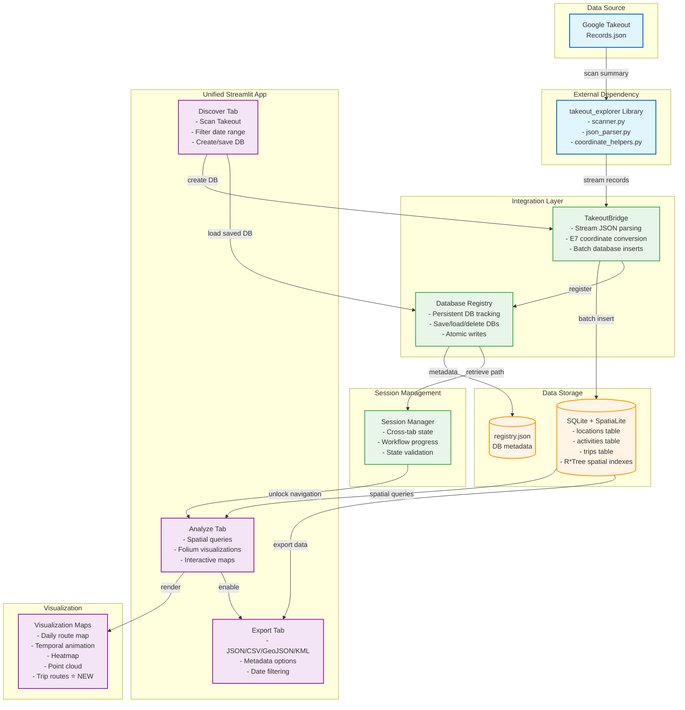

# Personal Journey Explorer

A unified platform for analyzing **Google Location History** with an intuitive Discover → Analyze → Export workflow. Built on high-performance spatial database technology (SQLite + SpatiaLite) with seamless integration of `takeout_explorer` for processing large datasets efficiently.

[](docs/quick-start-unified.md)
[](docs/deployment.md)
[](docs/)

## Quick Start (Phase 2 Unified App - Recommended)

```bash
# 1) Create and activate virtual environment
python -m venv .venv && source .venv/bin/activate  # Windows: .venv\Scripts\activate

# 2) Install dependencies
pip install -r requirements.txt

# 3) Install takeout_explorer dependency
cd ../takeout_explorer
pip install -e .
cd ../personal-journey-explorer

# 4) Launch the unified app
PYTHONPATH=. streamlit run src/app/app_unified.py --server.port 8502
```

**Then:**
1. Open browser to `http://localhost:8502`
2. Enter your Google Takeout directory path
3. Follow the **Discover → Analyze → Export** workflow in the UI

**📖 [Complete Quick Start Guide →](docs/quick-start-unified.md)**

### Getting Google Takeout Data

1. Visit [Google Takeout](https://takeout.google.com)
2. Select "Location History" only
3. Choose JSON format
4. Download and extract the zip file

## Architecture Overview

[](docs/architecture/01-system-architecture.md)
[](docs/architecture/02-database-schema.md)
[](docs/architecture/03-pipeline-flow.md)
[](docs/architecture/04-user-interface-flow.md)

Personal Journey Explorer is built on a three-layer architecture with spatial database backend for efficient processing of large GPS datasets:



**[Complete Architecture Documentation →](docs/architecture/01-system-architecture.md)**

## Repo Layout

```
personal-journey-explorer/
├── src/
│   ├── integrations/             # Phase 2 integration layer
│   │   ├── takeout_bridge.py    # Streaming parser bridge to takeout_explorer
│   │   ├── session_manager.py   # Cross-tab state management
│   │   └── database_registry.py # Persistent database tracking
│   ├── database/
│   │   └── gps_manager.py       # SQLite + SpatiaLite spatial queries
│   ├── pipeline/                 # Command-line data processing
│   │   ├── load_data.py         # JSON → database/parquet
│   │   └── make_trips.py        # Spatial trip segmentation
│   ├── visualization/
│   │   └── maps.py              # Folium map builders (5 viz modes including trip routes)
│   └── app/
│       ├── app_unified.py       # ⭐ Phase 2 unified interface (RECOMMENDED)
│       ├── app_spatial.py       # Phase 1 spatial database app
│       └── app.py               # Phase 1 basic parquet app
├── data/
│   ├── raw/                     # Google Takeout JSON files
│   ├── processed/               # Parquet outputs (legacy)
│   ├── persistent/              # Saved databases (permanent)
│   ├── temp/                    # Temporary session databases
│   └── registry.json            # Database metadata registry
├── docs/
│   ├── diagrams/                # Mermaid architecture diagrams
│   │   ├── phase2-architecture.mmd
│   │   ├── user-workflow.mmd
│   │   └── data-flow.mmd
│   ├── quick-start-unified.md   # Phase 2 quick start guide
│   ├── installing-takeout-explorer.md
│   ├── deployment.md            # Docker + Cloud deployment
│   ├── troubleshooting.md
│   └── architecture/            # Technical architecture docs
├── Dockerfile                   # Docker container definition
├── docker-compose.yml           # Docker orchestration
├── requirements.txt             # Python dependencies
└── mkdocs.yml                   # Documentation site config
```

## Key Features

### Phase 2: Unified Interface
- **Discover → Analyze → Export Workflow**: Intuitive three-tab interface for complete data journey
- **Database Registry System**: Save and load databases across sessions with persistent metadata
- **takeout_explorer Integration**: Seamless streaming parser for Google Takeout files
- **Session Management**: Cross-tab state persistence and workflow progress tracking
- **Multiple Export Formats**: JSON, CSV, GeoJSON, KML with filtering and metadata options

### Spatial Database Engine
- **SQLite + SpatiaLite**: High-performance spatial queries with R*Tree indexing
- **Viewport Optimization**: Efficient rendering of large datasets (1M+ GPS points)
- **Batch Processing**: Streaming imports with progress indicators every 10K records
- **Atomic Operations**: Registry writes with backup recovery for data safety

### Data Processing
- **Streaming Parser**: Handle multi-GB JSON files without loading into memory
- **E7 Conversion**: Automatic coordinate conversion from Google's format
- **Date Range Filtering**: Select specific time periods during database creation
- **Activity Detection**: Extract and store Google's activity classifications

### Visualization Modes
- **Interactive Maps**: Folium-based with day-colored routes and points
- **Real-time Filtering**: Dynamic date range and accuracy filtering
- **Performance Optimized**: Viewport-based data loading for large datasets
- **Multiple Views**: Daily routes, temporal animation, heatmaps, point clouds, and trip routes
- **Trip Visualization**: View detected trips with filtering by duration/distance, start/end markers, and detailed trip statistics