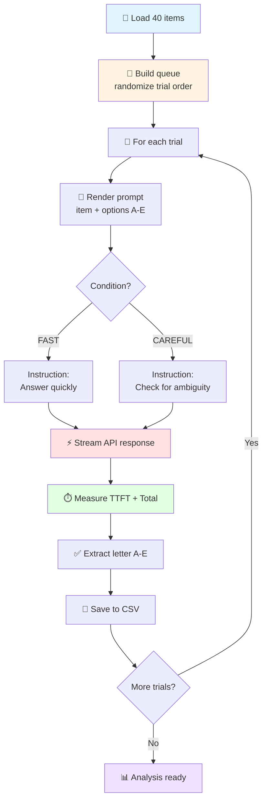
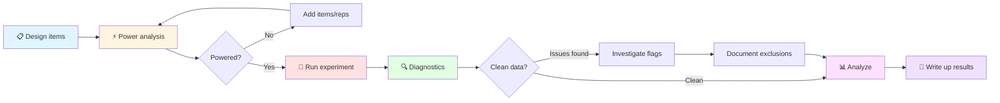

# LLM Speed-Accuracy Tradeoff Experiment

> **Measuring whether "think carefully" instructions actually slow down LLMs and improve accuracy**

A minimal, reproducible experiment comparing FAST vs CAREFUL prompting across two model types (chat and reasoning) using the OpenAI Responses API with streaming.

[](https://opensource.org/licenses/MIT)

---

## Quick Start

**1. Setup**
```bash
python -m venv .venv
source .venv/bin/activate  # On Windows: .venv\Scripts\activate
pip install openai pandas pyarrow matplotlib seaborn scipy
export OPENAI_API_KEY="your-key-here"
```

**2. Prepare your test items**

Experimental data set is included, `data/items_v1.jsonl`, with multiple-choice questions. A CSV version is available at `data/items_v1.csv` and can be regenerated with `python scripts/convert_items_to_csv.py data/items_v1.jsonl data/items_v1.csv`.
```jsonl
{"item_id": 1, "domain_tag": "logic", "prompt_stem": "If all A are B, and all B are C, then...", "options": {"A": "All A are C", "B": "All C are A", "C": "Some A are C", "D": "No A are C", "E": "Cannot determine"}, "key": "A", "is_cnd_key": 0}
```

Each item has:
- `item_id` (1-40)
- `prompt_stem` (the question)
- `options` (dict with keys A, B, C, D, E)
- `key` (correct answer: A-E)
- `is_cnd_key` (0 or 1, for conditional/tricky items)


**3. Check power (before collecting data)**
```bash
python power_analysis.py \
  --items 40 \
  --reps 2 \
  --target_power 0.8 \
  --alpha 0.025  # Bonferroni correction for 2 models
```

This tells you whether your design can detect meaningful differences. If underpowered, add more items or reps.

**4. Run the experiment**
```bash
# Phase 1-A: Code Verification (Est Cost: $0.10) -> GOAL: Verify no crashes, check output files
python run_experiment.py \
  --items data/items_v1.jsonl \
  --out_dir data/test \
  --chat_model gpt-4o-mini \
  --reasoning_model gpt-4o-mini \  
  --reps 1 \
  --seed 42


# Phase 1-B. Check estimated cost Or verify on OpenAI dashboard (Go to: https://platform.openai.com/usage)
python cost_calculator.py --results data/test/results_raw_v1.csv.   # If cost looks right, proceed to full experiment


# Phase 2: Run Experiment on OpenAI models (Budget ~$4) -> GOAL: Get preliminary OpenAI results
python run_experiment.py \
  --items data/items_v1.jsonl \
  --out_dir data/openai \
  --chat_model gpt-4o-mini \
  --reasoning_model o1-mini \
  --reps 2 \
  --seed 42

# Phase 3: Compare with another provider
(TBD)
```

**Interrupted?** Resume with `--resume`:
```bash
python run_experiment.py ... --resume
```

**5. Run diagnostics**
```bash
python diagnostics.py \
  --results data/openai/results_raw_v1.csv \
  --out_dir data/diagnostics
```

Review `data/diagnostics/diagnostic_report.txt` for confounds and measurement issues **before** analyzing.

**6. Analyze results**
```bash
python quick_analysis.py \
  --results data/results_raw_v1.csv \
  --out_dir data
```

Outputs summary tables showing:
- Accuracy and median TTFT by model × condition
- FAST→CAREFUL deltas (paired by item)
- "E" option behavior (hit vs. false alarm rates)

---

## How It Works



**Key Design Choices:**
- **Randomized trial order** - prevents confounds from API warm-up, time-of-day, etc.
- **Streaming with TTFT measurement** - captures time-to-first-token, not just total latency
- **Paired design** - same items in both conditions reduces variance
- **Inter-trial delay** - prevents rate limiting and thermal effects
- **Crash-safe logging** - appends results incrementally; resume without data loss

---

## Experimental Design

**2 × 2 Factorial Design:**

| Factor | Levels |
|--------|--------|
| **Instruction Condition** | FAST ("Answer quickly") vs. CAREFUL ("Check for ambiguity") |
| **Model Type** | Chat (gpt-4o) vs. Reasoning (o1-mini) |

**Dependent Variables:**
- **TTFT** (time to first token, milliseconds) - streaming latency
- **Accuracy** (proportion correct)

**Sample Size:**
- 40 items × 2 conditions × 2 models × 2 replicates = **320 trials**
- Effective power: Can detect ~50ms TTFT difference or ~8pp accuracy difference at 80% power

See [`METHODOLOGY.md`](METHODOLOGY.md) for detailed discussion of confounds, measurement validity, and statistical approach.

---

## Output Files

After running the experiment:

```
data/
├── items_v1.jsonl                    # Your test items (input)
├── run_queue_v1.csv                  # Trial execution plan
├── results_raw_v1.csv                # Trial-level results ⭐
├── summary_by_model_condition.csv    # Aggregate accuracy + TTFT
├── summary_E_behavior.csv            # Response bias analysis
├── summary_fast_vs_careful_deltas.csv # Paired differences
└── diagnostics/                      # Quality checks
    ├── diagnostic_report.txt         # Confound summary
    ├── flagged_items.csv             # Trials to investigate
    ├── temporal_diagnostics.png      # Time-based patterns
    ├── measurement_diagnostics.png   # TTFT validity checks
    ├── item_diagnostics.png          # Item difficulty analysis
    └── model_comparison_diagnostics.png
```

**Start with:**
1. `diagnostics/diagnostic_report.txt` - Check for problems
2. `summary_by_model_condition.csv` - Main results
3. `summary_fast_vs_careful_deltas.csv` - Effect sizes

---

## Repository Structure

```
.
├── README.md                  # This file
├── METHODOLOGY.md             # Detailed validity discussion
├── RESULTS.md                 # Template for documenting findings
├── run_experiment.py          # Main experiment runner
├── quick_analysis.py          # Fast summary statistics
├── power_analysis.py          # Pre-experiment power calculations
├── diagnostics.py             # Post-experiment confound checks
└── data/
    ├── items_v1.jsonl         # Test items (you provide)
    └── [results files]        # Generated by scripts
```

---

## Recommended Workflow



1. **Before data collection**: Run power analysis to verify design
2. **Collect data**: Run experiment with recommended patches (see [METHODOLOGY.md](METHODOLOGY.md))
3. **Check quality**: Run diagnostics before analyzing
4. **Analyze**: Use quick_analysis.py for summaries
5. **Report**: Document in RESULTS.md

---

## Key Metrics Explained

### TTFT (Time to First Token)
- Measured from API call start to first delta received
- Includes network latency + model processing
- **Shorter = faster response initiation**
- Expected: CAREFUL > FAST (if models actually "think")

### Accuracy
- Proportion of trials where response letter matches key
- Two versions computed:
  - **Strict**: Format-compliant answers only
  - **Lenient**: Any extractable correct letter
- Expected: CAREFUL > FAST (if deliberation helps)

### E-Option Behavior
- Hit rate: P(respond E | key is E)
- False alarm: P(respond E | key is not E)
- Useful for detecting response bias or guessing patterns

---

## Citation

If you use this experimental framework, please cite:

```bibtex
@misc{llm-speed-accuracy-2025,
  author = {[Your Name]},
  title = {LLM Speed-Accuracy Tradeoff Experiment Framework},
  year = {2025},
  publisher = {GitHub},
  url = {https://github.com/[username]/[repo]}
}
```

---

## Contributing

See issues for planned enhancements. Key areas for contribution:
- Additional analysis techniques (mixed-effects models, Bayesian estimation)
- Support for other API providers (Anthropic, local models)
- Extended item formats (open-ended, multi-turn)

---

## License

MIT License - see LICENSE file for details.

---

## Acknowledgments

This framework was developed for systematic comparison of instruction effects on LLM performance. It prioritizes:
- **Measurement validity** (proper TTFT capture, format validation)
- **Reproducibility** (seeded randomization, crash recovery)
- **Transparency** (comprehensive diagnostics, documented confounds)

For research context and findings, see the accompanying article: [link to be added]
