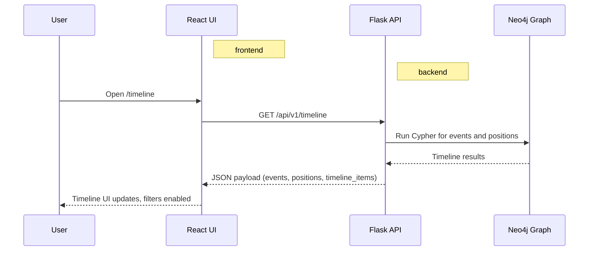
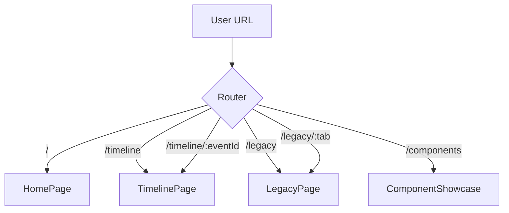
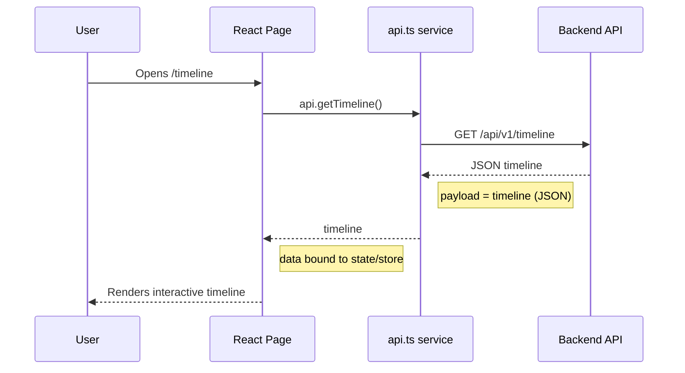
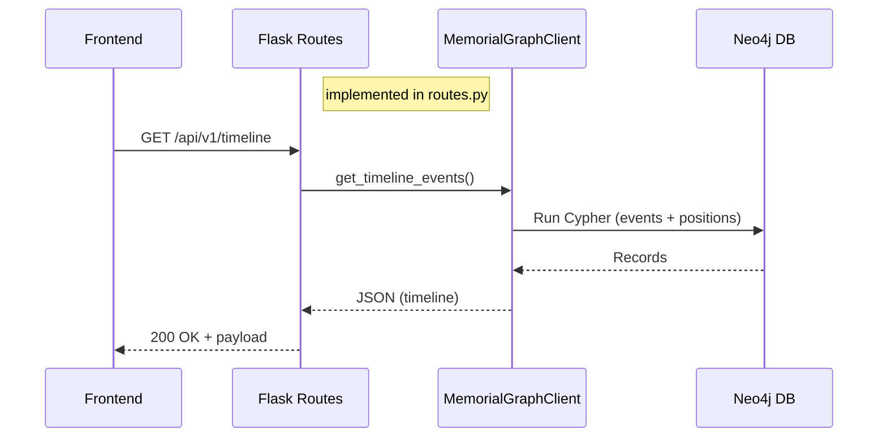
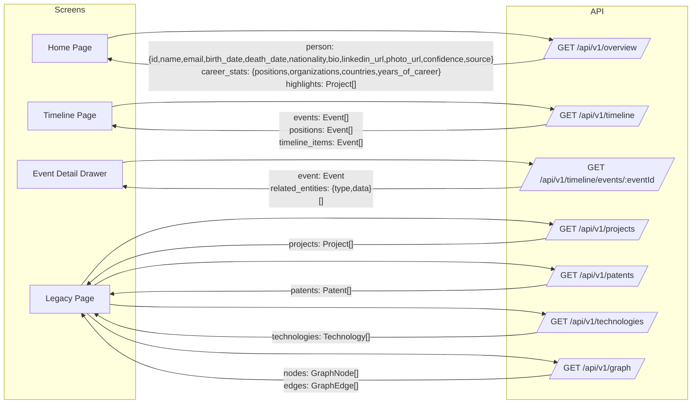

# Weaving Memories Into Graphs
## Domingo Hidalgo Knowledge Graph Project

A daughter's project to honor her late father, Domingo Segundo Hidalgo Lopez (1956-2018), by creating a Neo4j knowledge graph that captures his life, achievements, and influence. The graph weaves together artifacts, data, and memories to preserve Domingo's legacy for those he left behind and for the future humans he made possible.

Built using Neo4j, Claude AI, and Python with transparency and cost-effectiveness as core principles.

---

## Project Overview

This project creates a comprehensive knowledge graph using Neo4j to represent the life and legacy of Domingo Segundo Hidalgo Lopez. The graph includes various entities such as Person, Organization, Location, Education, Projects, Patents, and Artifacts, connected through meaningful relationships.

The project follows an iterative approach, focusing on quick wins and progressive enhancements. Starting with a biosketch and a collection of photos, the graph is gradually enriched with additional data and insights.


### Key Highlights of Domingo's Legacy

- **SiView MES System**: Core infrastructure architect (1996-1998) - still the leading MES for semiconductor manufacturing globally as of 2023+
- **SEMATECH CIM Framework**: Created proof-of-concept (1994-1995) that became a SEMI industry standard
- **IBM DCE Contributions**: Worked on Distributed Computing Environment - contributed to internet infrastructure (RPC, Kerberos)
- **Patents**: Multiple IBM Invention Achievement Awards (1988-1994), including US Patent 5,230,049
- **Global Impact**: Systems he built 25+ years ago are still running in fabs worldwide

---

## Schema & Architecture Overview 

### Tech Stack

- **Neo4j Aura:** Cloud-hosted graph database 
- **Python 3.11:** Data processing, Neo4j integration, Flask REST API 
- **Claude Sonnet 4.5:** AI-powered biosketch extraction with metrics tracking 
- **Rich CLI:** Beautiful terminal output for scripts 
- **React + Vite:** Frontend UI for timeline, legacy, and network views 

### Schema Driven Data Flow Overview


The Graph Schema defines what properties are allowed, which guides an LLM-based extraction from a biosketch and creates an "_extracted.yaml" file. A script (`populate_from_yaml.py`) enforces the schema constraints on a Neo4j database and populates it based on the "_extracted.yaml" data; this process is based a Python dataclass (matched to the schema) and `graph_builder.py` creates the nodes and relationships. From that Neo4J database, the web application can send queries to drive the interactivity of "https://domingo-hidalgo.com". 

<br clear="left"/>

### End-to-End Flow: UI → API → Neo4j



PNG reference: [`dev/diagram-how-data-moves-overview.png`](./dev/diagram-how-data-moves-overview.png)


### Graph Schema

The knowledge graph uses 14 entity types with temporal relationships:

**Core Entities:**
- `Person` - Domingo, family, colleagues
- `Organization` - LAGOVEN, IBM, SEMATECH, BALEX, universities
- `Position` - Specific roles held
- `Education` - Degrees and credentials
- `Location` - Geographic places

**Career Entities:**
- `Project` - SiView, DCS, SEMATECH CIM Framework
- `Technology` - Programming languages, frameworks, tools
- `Skill` - Professional competencies
- `Patent` - Intellectual property
- `Product` - Commercial systems (SiView MES, etc.)

**Context Entities:**
- `Event` - Career milestones
- `Artifact` - Photos, documents
- `Publication` - Papers, presentations
- `Industry` - Professional sectors

**Key Relationships:**
- `Person -[HELD_BY]-> Position -[AT_ORGANIZATION]-> Organization`
- `Person -[LED_BY]-> Project -[USED_TECHNOLOGY]-> Technology`
- `Person -[INVENTED_BY]-> Patent`
- `Position -[IN_LOCATION]-> Location`

All relationships include provenance tracking (source, confidence, dates).

---

## Project Structure

```
.
├── data/                           # Source data and artifacts
│   ├── domingo-hidalgo-biosketch.md      # Domingo's biographical sketch (source)
│   ├── domingo_extracted.yaml            # ✨ LLM-extracted structured data (1,523 lines)
│   ├── DH-LinkedIn-Profile.pdf           # Source document
│   ├── photos-artifacts-events/          # 20+ photos of diplomas, patents, plaques
│   └── enrichments/                      # ✨ External metadata enrichments (Wikipedia, Wikidata, etc.)
│       ├── README.md                     # Enrichment workflow guide
│       ├── auto_enriched.yaml            # Auto-generated from interactive tool
│       ├── photo_mappings.yaml           # ✨ Photo URL mappings for timeline cards
│       └── example_enrichment.yaml       # Template/example file
├── src/                            # ✨ Python codebase
│   ├── graph/
│   │   └── graph_builder.py              # DomingoGraphBuilder - Neo4j CRUD operations
│   ├── models/
│   │   └── base.py                       # Pydantic entity models (14 types)
│   └── metrics/
│       └── llm_tracker.py                # ✨ LLM API metrics tracking system
├── scripts/                        # ✨ Operational scripts
│   ├── extract_biosketch_to_yaml.py      # LLM extraction with metrics (supports --input, --output)
│   ├── populate_from_yaml.py             # YAML → Neo4j population (supports --input, --clear)
│   ├── delete_entities.py                # ✨ Safe entity deletion with preview and confirmations
│   ├── enrich_entity_interactive.py      # ✨ Interactive Wikidata enrichment tool
│   ├── apply_enrichments.py              # ✨ Apply enrichment YAML to Neo4j
│   ├── add_photo_urls.py                 # ✨ Add photos to timeline cards (config-driven)
│   ├── test_neo4j_connection.py          # Connection tester
│   ├── explore_domingo_graph.py          # ✨ Interactive Cypher query explorer
│   └── view_llm_metrics.py               # Metrics viewer CLI
├── dev/                            # Planning and documentation
│   ├── IMPLEMENTATION_PLAN.md            # Detailed implementation phases
│   ├── SCHEMA_EVALUATION.md              # Schema design rationale
│   └── KNOWLEDGE_GRAPH_ENRICHMENT_STRATEGY.md  # ✨ LOD enrichment options & roadmap
├── output/                         # Generated artifacts
│   └── llm_metrics.jsonl                 # ✨ LLM API usage logs
├── backend/                        # Flask API service
│   ├── app.py                      # Flask app factory + server
│   ├── routes.py                   # REST endpoints (/api/v1/*)
│   └── neo4j_client.py             # Neo4j query client
├── frontend/                       # React + Vite UI
│   ├── src/pages/                  # Route pages (Home, Timeline, Legacy)
│   ├── src/services/api.ts         # Typed API client
│   └── src/components/             # Reusable UI components
├── schema-refined.yaml             # Neo4j graph schema definition (v2.0)
├── CLAUDE.md                       # AI coding assistant context
├── CYPHER_QUERIES.md               # ✨ Curated Cypher queries documentation
├── README.md                       # Project overview (this file)
└── requirements.txt                # Python dependencies
```

---

## Quick Start

### 1. Clone and Setup

```bash
git clone https://github.com/dagny099/weaving-memories-into-graphs.git
cd weaving-memories-into-graphs

# Activate virtual environment
source .venv/bin/activate

# Install dependencies (if needed)
pip install -r requirements.txt
```

### 2. Configure Environment

Create a `.env` file in the project root:

```bash
# Neo4j Aura Connection
NEO4J_URI=neo4j+s://xxxxx.databases.neo4j.io
NEO4J_USER=neo4j
NEO4J_PASSWORD=your_password
NEO4J_DATABASE=neo4j

# Claude API (for extraction)
ANTHROPIC_API_KEY=sk-ant-xxxxx
```

### 3. Test Connection

```bash
python scripts/test_neo4j_connection.py
```

### 4. Explore the Graph

```bash
# Interactive Cypher query explorer
python scripts/explore_domingo_graph.py

# View LLM API usage metrics
python scripts/view_llm_metrics.py
```

---

## Run the App (Frontend + Backend)

The frontend and backend run on separate ports. Defaults are **Frontend: 5173** and **Backend: 5000**.

### 1. Start the Backend (Flask API)

```bash
cd backend
pip install -r requirements.txt

# Optional overrides
export PORT=5000
export CORS_ORIGINS=http://localhost:5173

python app.py
```

The API will be available at `http://localhost:5000` (health check: `GET /health`).

### 2. Start the Frontend (React + Vite)

```bash
cd frontend
npm install

# Optional: point the UI to a different backend URL
export VITE_API_BASE_URL=http://localhost:5000

npm run dev -- --port 5173
```

The UI will be available at `http://localhost:5173`.

---

## Usage

### Exploring the Graph

```bash
# Interactive Cypher query explorer with beautiful output
python scripts/explore_domingo_graph.py
```

This runs 11 curated queries showing:
- 💼 Career trajectory (LAGOVEN → IBM → SEMATECH → BALEX)
- 🚀 Projects with global impact (SiView MES, SEMATECH CIM Framework)
- 💡 Patents and intellectual property
- 💻 Technologies mastered across career
- 🌍 Geographic timeline (Venezuela → USA → Japan → USA)
- 👥 Professional network
- 📅 Timeline of major events
- And more...

### Understanding LLM Metrics

**Every API call is logged** with tokens, cost, and latency tracking. 
**View metrics anytime** with `python scripts/view_llm_metrics.py`.
**Cost transparency:** Know exactly what each extraction costs.
**JSONL persistence:** All metrics saved to `output/llm_metrics.jsonl`

```bash
# Summary view
python scripts/view_llm_metrics.py

# Detailed view with all calls
python scripts/view_llm_metrics.py --detailed

# Filter by time
python scripts/view_llm_metrics.py --last-hours 24

# Filter by provider
python scripts/view_llm_metrics.py --provider anthropic
```

### Query Documentation

See **[CYPHER_QUERIES.md](./CYPHER_QUERIES.md)** for:
- 20+ curated Cypher queries
- Query explanations and expected results
- Copy-paste ready queries for Neo4j Browser
- Advanced pattern matching queries
- Visualization queries

### Extracting Biosketches

**Multi-Biosketch Support:** The extraction scripts support CLI arguments to process multiple biosketches (Barbara, family members, etc.) without overwriting existing data.

```bash
# Extract Domingo's biosketch (default)
python scripts/extract_biosketch_to_yaml.py

# Extract Barbara's biosketch
python scripts/extract_biosketch_to_yaml.py --input barbara-hidalgo-sotelo-biosketch.md

# Output filename is auto-derived: barbara-hidalgo-sotelo-biosketch.md → barbara_extracted.yaml
# Or specify custom output:
python scripts/extract_biosketch_to_yaml.py --input barbara-hidalgo-sotelo-biosketch.md --output barbara_extracted.yaml

# Review the generated YAML files
# Edit data/domingo_extracted.yaml or data/barbara_extracted.yaml if needed

# Populate Neo4j with Domingo's data (default)
python scripts/populate_from_yaml.py

# Populate Neo4j with Barbara's data
python scripts/populate_from_yaml.py --input barbara_extracted.yaml

# Clear database and populate fresh (WARNING: deletes all data)
python scripts/populate_from_yaml.py --input domingo_extracted.yaml --clear

# View all CLI options
python scripts/extract_biosketch_to_yaml.py --help
python scripts/populate_from_yaml.py --help
```

### Managing and Deleting Entities

**Safe deletion** with preview, confirmation prompts, and automatic relationship cleanup:

```bash
# Preview deletion (dry run) - shows what would be deleted without actually deleting
python scripts/delete_entities.py --id "person-barbara-hidalgo" --dry-run

# Delete single entity by ID
python scripts/delete_entities.py --id "person-barbara-hidalgo"

# Delete all entities from a YAML source (useful for removing test data)
python scripts/delete_entities.py --source "barbara_extracted.yaml"

# Delete all entities of a specific type
python scripts/delete_entities.py --type Person

# Delete with property filter (e.g., test data)
python scripts/delete_entities.py --type Person --filter "n.name CONTAINS 'Test'"

# Clear entire database (requires double confirmation)
python scripts/delete_entities.py --clear-all

# Skip confirmation prompts (for scripting)
python scripts/delete_entities.py --id "test-entity" --yes

# View all options and examples
python scripts/delete_entities.py --help
```

**Safety Features:**
- ✅ **Preview before deletion** - Always shows what will be deleted
- ✅ **Confirmation prompts** - Requires explicit approval for destructive operations
- ✅ **Automatic relationship cleanup** - Uses `DETACH DELETE` to remove connected relationships
- ✅ **Dry-run mode** - Test deletions without making changes
- ✅ **Double confirmation** - Extra safety for `--clear-all` operations

**Common Use Cases:**
```bash
# Accidentally imported wrong YAML? Remove it by source
python scripts/delete_entities.py --source "wrong_file.yaml" --dry-run  # Preview first
python scripts/delete_entities.py --source "wrong_file.yaml"            # Then delete

# Remove test entities after experimenting
python scripts/delete_entities.py --type Person --filter "n.id STARTS WITH 'test-'"

# Start fresh (careful!)
python scripts/delete_entities.py --clear-all
python scripts/populate_from_yaml.py --input domingo_extracted.yaml
```

### Knowledge Graph Enrichment

**Add external metadata** to entities (Wikipedia links, Wikidata IDs, logos, screenshots):

```bash
# Interactive enrichment (semi-automated)
# Search Wikidata, approve matches, auto-fetch metadata
python scripts/enrich_entity_interactive.py --type organization
python scripts/enrich_entity_interactive.py --type product
python scripts/enrich_entity_interactive.py --entity-id org-ibm

# Force fresh data (bypass 30-day cache)
python scripts/enrich_entity_interactive.py --type organization --no-cache

# Apply enrichments to Neo4j
python scripts/apply_enrichments.py data/enrichments/auto_enriched.yaml
python scripts/apply_enrichments.py --all  # Apply all enrichment files
python scripts/apply_enrichments.py --all --dry-run  # Preview changes

# ℹ️ The enrichment tool follows Wikimedia best practices (2026):
# - User-Agent header with contact info (required)
# - Conservative rate limiting (~5 req/sec)
# - 30-day caching to minimize API calls
# - Full provenance tracking (source, timestamp, confidence)

# Manual enrichment
# Edit YAML files in data/enrichments/ directly
# See data/enrichments/README.md for format and examples
```

**Salient properties prioritized in UI:**
- `wikipedia_url`, `wikidata_id` - Linked Open Data connections
- `official_website`, `linkedin_url` - External references
- `logo_url`, `screenshot_url` - Rich media
- `founded_date`, `stock_symbol` - Key facts

**See:** `/dev/KNOWLEDGE_GRAPH_ENRICHMENT_STRATEGY.md` for full enrichment strategy and options.

### Photo Enrichment for Timeline Cards

**Add photos** to timeline event and position cards for visual storytelling:

```bash
# 1. Copy image to frontend
cp my-photo.jpg frontend/public/images/events/

# 2. Add mapping to config (edit this file)
#    data/enrichments/photo_mappings.yaml

# 3. Preview changes
python scripts/add_photo_urls.py --dry-run

# 4. Apply to Neo4j
python scripts/add_photo_urls.py

# 5. Deploy frontend (commit images and push)
cd frontend && git add public/images/events/ && git commit -m "Add photos" && git push
```

**Config file format** (`data/enrichments/photo_mappings.yaml`):
```yaml
positions:
  - match: "p.title CONTAINS 'Superintendent'"
    photo_url: /images/events/tanker-1981.jpg
    photo_caption: "Oil tanker under construction, Japan (1981)"

events:
  - match: "e.id = 'event-002'"
    photo_url: /images/events/diploma-bs-1978.jpg
    photo_caption: "BS Diploma, University of Michigan (1978)"
```

**See:** `/dev/KNOWLEDGE_GRAPH_ENRICHMENT_STRATEGY.md#photo-enrichment-for-timeline-cards` for full documentation.

---

## Architecture

### Frontend Architecture

**Routing map**



**Data flow**



PNG references:
- [`dev/diagram-frontend-react-routes.png`](./dev/diagram-frontend-react-routes.png)
- [`dev/diagram-frontend-data-flow.png`](./dev/diagram-frontend-data-flow.png)

### Backend Architecture

**Request lifecycle**



**API contracts by screen**



PNG references:
- [`dev/diagram-backend-data-flow.png`](./dev/diagram-backend-data-flow.png)
- [`dev/diagram-data-contract-fields-by-screen.png`](./dev/diagram-data-contract-fields-by-screen.png)

---

## Documentation

- **[CLAUDE.md](./CLAUDE.md)** - Full project context for AI assistants
- **[CYPHER_QUERIES.md](./CYPHER_QUERIES.md)** - 20+ curated Cypher queries
- **[dev/IMPLEMENTATION_PLAN.md](./dev/IMPLEMENTATION_PLAN.md)** - Detailed roadmap
- **[schema-refined.yaml](./schema-refined.yaml)** - Complete graph schema definition
- **[frontend/README.md](./frontend/README.md)** - Frontend tooling details
- **[backend/](./backend/)** - Flask API source (see `app.py` and `routes.py`)

---

## License

This project is licensed under the [MIT License](./LICENSE).

---

## Contact Information

For questions or suggestions, please reach out:

- **Email:** [barbs@balex.com](mailto:barbs@balex.com)
- **LinkedIn:** [https://www.linkedin.com/in/barbara-hidalgo-sotelo/](https://www.linkedin.com/in/barbara-hidalgo-sotelo/)
- **Website:** [barbhs.com](https://barbhs.com)

---

*"His code lives on in systems used worldwide. His impact spans decades and continents. This graph is a testament to a life well-lived."*
