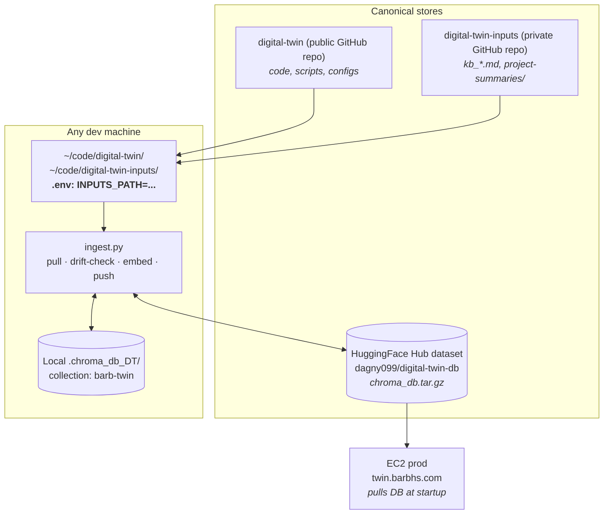
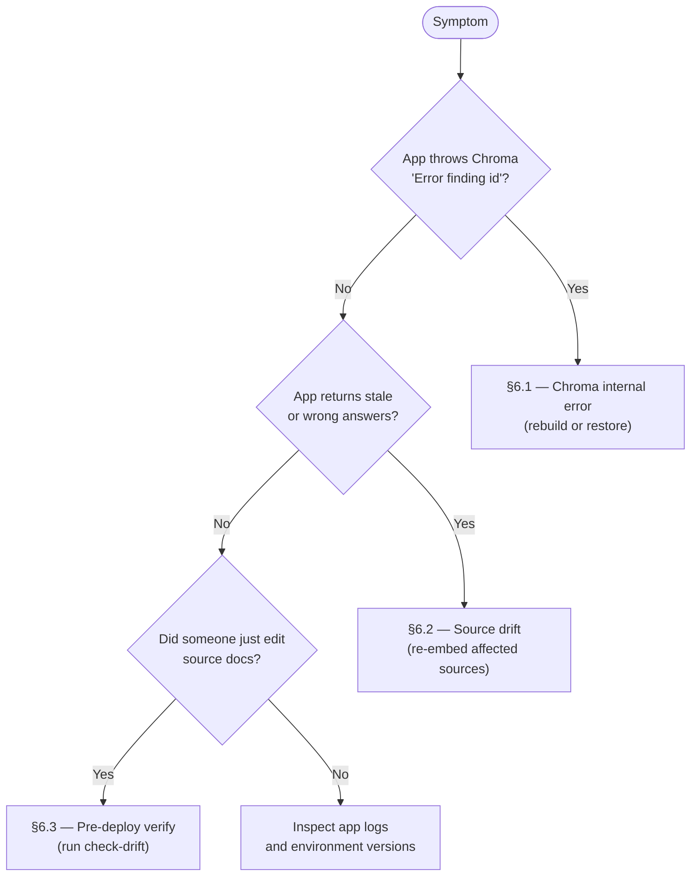

# ChromaDB Ops Runbook (Sync, Verify, Compare, Recover)

One-stop reference for maintaining the `barb-twin` ChromaDB collection used by the digital twin app.

> **What changed (May 2026 revision).** The workflow now distinguishes two canonical stores: the **private `digital-twin-inputs` repo** (source docs) and the **HuggingFace Hub dataset** (embedded state). `ingest.py` performs `pull → embed → push` automatically, so manual `pull_db()` is rare. Chunk metadata now carries a `content_hash` field, surfaced by the new `ingest.py --check-drift` command.

---

## 1. Mental model: where things live



**Key paths:**
- Chroma path (local, on every machine): `.chroma_db_DT/`
- Collection name: `barb-twin`
- App retrieval calls `collection.query(...)` in `respond_ai`
- Source docs live at `$INPUTS_PATH/` (private repo clone)
- DB backup lives at `dagny099/digital-twin-db` on HF Hub

**Source-of-truth rule:** the *content* is canonical in the private inputs repo (git history). The *embeddings* are canonical in the HF Hub dataset (HF revision history). Neither lives in your local clone permanently — both are pulled on demand.

---

## 2. Routine health checks

Use in roughly this order, broadest to narrowest:

```bash
# 1. Is the DB present, how many chunks, broken down by source?
#    Also surfaces INPUTS_PATH so you can confirm where ingest will read from.
python ingest.py --status

# 2. Are source docs and DB in sync? (sha256 of each file vs content_hash in chunks)
python ingest.py --check-drift

# 3. Older inventory views — still useful for cross-checking
python scripts/verify_collection.py --show-sources
python scripts/verify_collection.py --show-sections

# 4. Chunk quality + tiny-chunk detection
python chunk_inspector.py

# 5. End-to-end retrieval probe (no UI)
python chunk_inspector.py --query "Barbara background" --n 10
```

**What `--check-drift` tells you** — five distinct states:

| Status | Meaning | Action |
|---|---|---|
| ✅ in sync | source hash matches DB hash | none |
| ⚠️ DRIFTED | source changed since embed | `python ingest.py --source <key> --force` |
| ❓ unhashed | chunks pre-date the `content_hash` field | one-time backfill: `python ingest.py --all --force` |
| ❌ missing | source file not at the resolved path | check `INPUTS_PATH` in `.env` |
| ⏭️ not embedded | registry knows about it, no chunks in DB | `python ingest.py --source <key>` |

---

## 3. Syncing local DB ⇄ HF Hub

`db_sync.py` exposes `push_db()` and `pull_db()`. **In normal use, `ingest.py` calls both for you** — pull before any embed (so you start from canonical state) and push after (so the rest of the world sees your update).

You only need to call these manually in three situations:

```bash
# A. After a destructive local op you DON'T want propagated
#    (e.g. you wiped .chroma_db_DT/ and want to restore from HF, not re-ingest)
python -c "from db_sync import pull_db; pull_db()"

# B. After fixing chunks via a direct collection.update() that bypassed ingest.py
python -c "from db_sync import push_db; push_db()"

# C. On prod, to refresh the DB from the latest HF snapshot without restarting the app
python -c "from db_sync import pull_db; pull_db()"
```

**Prereqs:** `HF_TOKEN` must be set (env or `.env`); for push, `.chroma_db_DT/` must exist locally.

---

## 4. Editing source docs (the multi-machine workflow)

The pull-before-embed handshake protects against silent overwrites only if you also pull the **inputs repo** before editing. Habit:

```bash
# Before editing any kb_*.md or project-summaries/*.md:
cd ~/code/digital-twin-inputs/
git pull

# Edit
vim kb_career_narrative.md

# Commit + push back to canonical
git add . && git commit -m "..." && git push

# Then re-embed (ingest.py handles DB pull/push automatically)
cd ~/code/digital-twin/
python ingest.py --source kb-career --force
```

**Why `--force` here:** `embed_kb_doc.py` has section-level idempotency that skips work if a `(source, section)` pair already exists. If you edited content *under* an existing section header without renaming the header, a plain run skips it. `--force` wipes that source's chunks first. The `--check-drift` command exists precisely to tell you when you need to do this.

---

## 5. Comparing state across machines

**With the new architecture this should be rare.** All machines pull the same DB from HF Hub; all machines pull the same inputs from the private repo. They should be the same by construction.

When you *do* suspect drift between machines (e.g. one machine's app is returning different answers), the diagnostic is:

```bash
# On each machine, run:
python ingest.py --status > status_$(hostname).txt
python ingest.py --check-drift > drift_$(hostname).txt
cd ~/code/digital-twin-inputs/ && git rev-parse HEAD > inputs_head_$(hostname).txt

# Then diff the files between machines
```

Divergence almost always traces to one of:
- One machine didn't pull the latest DB before testing (`pull_db()` manually)
- One machine has uncommitted edits in the inputs repo
- One machine has `INPUTS_PATH` pointing somewhere stale

---

## 6. Incident triage

Three meaningfully different failure modes. Use this decision tree to pick the right runbook:



`Error finding id` is a Chroma index/state inconsistency — usually stale or corrupt files, an interrupted delete or re-embed, or a Chroma version mismatch with the on-disk format. Treat as Chroma-internal first.

### 6.1 Prod incident runbook — Chroma internal error

**Recovery model: prod doesn't re-ingest.** Prod has no inputs repo (privacy). Recovery is: restore from the HF Hub snapshot. If that's also bad, fix on a dev machine (which has inputs) and push a fresh snapshot.

```bash
# 1) Enter app repo
cd /home/ec2-user/barbs-digital-twin

# 2) Activate app venv
source /home/ec2-user/venvs/gradio-ui-py312/bin/activate

# 3) Capture runtime versions
python -c "import sys,chromadb,gradio; print(sys.version); print('chromadb',chromadb.__version__); print('gradio',gradio.__version__)"

# 4) Snapshot dependency versions for postmortem
pip freeze > /tmp/pip-freeze-$(date +%F-%H%M).txt

# 5) Verify what prod is currently holding
python ingest.py --status

# 6) Probe retrieval without serving UI
python chunk_inspector.py --query "Barbara background" --n 10

# 7) Back up the broken DB before any restore attempt
cp -r .chroma_db_DT .chroma_db_DT.backup_$(date +%F-%H%M)

# 8) Wipe local Chroma and restore from HF Hub snapshot
rm -rf .chroma_db_DT
python -c "from db_sync import pull_db; pull_db()"

# 9) Re-verify
python ingest.py --status && python chunk_inspector.py --query "Barbara background" --n 10

# 10) Restart the app service
sudo systemctl restart digital-twin
```

If step 9 still fails, the HF snapshot itself is bad. On a dev machine: `python ingest.py --all --force` (this pulls inputs, re-embeds, pushes a fresh snapshot to HF). Then repeat steps 7–10 on prod.

### 6.2 Source drift remediation

When `--check-drift` shows one or more sources as `⚠️ DRIFTED`:

```bash
# On a dev machine (the one with the freshest inputs):
cd ~/code/digital-twin-inputs/
git pull   # make sure you have the canonical version

cd ~/code/digital-twin/
python ingest.py --check-drift   # confirm which sources

# Re-embed each drifted source
python ingest.py --source kb-career --force
python ingest.py --source kb-projects --force   # ...etc

# Verify clean
python ingest.py --check-drift   # all should be ✅ in sync

# ingest.py pushes to HF automatically; prod picks it up on next pull
```

### 6.3 Pre-deploy verification

After editing docs, before walking away:

```bash
python ingest.py --check-drift          # everything ✅ in sync?
python chunk_inspector.py --query "<question that touches the edited content>" --n 10
```

If the probe retrieves the new content, you're done.

---

## 7. Operational guardrails

- **Pull before edit.** `git pull` in the inputs repo before editing any source doc. Skipping this is the #1 cause of sync conflicts.
- **Trust `--check-drift`.** It's faster than mentally tracking what you changed where.
- **Full re-ingest after major dependency upgrades** that could affect Chroma internals (Chroma itself, sqlite, the embedding model).
- **Keep env versions pinned** across dev and prod. Compare with `pip freeze` if you suspect drift.
- **Push a fresh HF snapshot only after `--check-drift` shows clean.** `ingest.py` does this for you on successful runs; just don't ctrl-C in the middle of an embed.
- **Don't put the private inputs repo on prod.** Privacy boundary; prod doesn't need it.

---

## 8. Quick FAQ

### Q: Is `Error finding id` likely Gradio-related?
Usually no — stack traces typically point to Chroma's query planning/index resolution, not the UI layer.

### Q: What's the single fastest sanity check?
`python ingest.py --status` — confirms DB exists, total chunk count, per-source breakdown, and the resolved `INPUTS_PATH`. About 2 seconds.

### Q: How often should I push a fresh backup to HF?
You don't need to think about it. `ingest.py` pushes automatically after every successful non-dry-run. Just don't interrupt an in-progress embed.

### Q: What if I edited an inputs doc but a plain re-embed didn't pick up the change?
Section-level idempotency skipped it because the section header was unchanged. Use `--force` to wipe and rebuild that source. `--check-drift` will catch this case for you.

### Q: I see `❓ unhashed` in `--check-drift` output. What do I do?
One-time backfill: `python ingest.py --all --force`. These are chunks that pre-date the `content_hash` metadata field. After the backfill, every source has a hash and drift detection is exhaustive.

### Q: Can prod ever drift from dev?
Yes, if prod hasn't pulled the latest HF snapshot. On prod: `python -c "from db_sync import pull_db; pull_db()"` and restart. Setting this up to happen on app start (or on a timer) is a worthwhile hardening.
