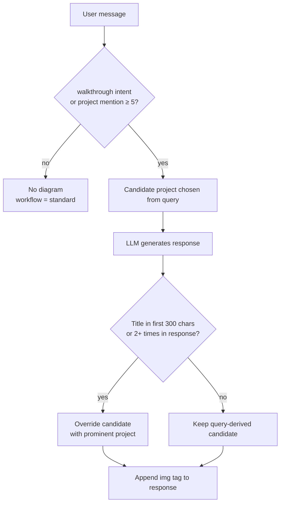

# Diagram Display — Design Doc

**Status:** Decisions recorded; implementation not started. Build order in [Plan](#plan).
**Created:** 2026-07-26 · **Updated:** 2026-07-26 (production log evidence, decisions D1–D5)
**Scope:** When the twin attaches a project diagram to a chat response, and which one.
**Owner:** Barbara

---

## Table of Contents

- [Why this doc exists](#why-this-doc-exists)
- [Current behavior](#current-behavior)
- [Options considered](#options-considered)
- [Empirical baseline](#empirical-baseline)
- [Failure cases](#failure-cases)
- [Structural issues](#structural-issues)
- [Decisions](#decisions)
- [Still open](#still-open)
- [Plan](#plan)

---

## Why this doc exists

The diagram-display rule is real, deliberate, and undocumented. It lives as a code comment
labeled `Option C: Intent + Prominence` ([`app.py:1450`](../app.py)) with no record of what
Options A and B were or why C won. It is duplicated verbatim in `app_admin.py`, has no test
or eval coverage, and has no entry in [`LESSONS_LEARNED.md`](LESSONS_LEARNED.md) (the log
jumps 001 → 003).

The [MAINTAINER_GUIDE roadmap](MAINTAINER_GUIDE.md#roadmap) has nothing on diagram display.
The two items that touch diagrams at all are adjacent, not about this:

- **Multi-modal support** — the twin *reading* images, not showing them.
- **Session-aware project diversity** — changes *which* project a generic walkthrough picks
  (and therefore which diagram), never *whether* one appears. Stubbed at
  [`featured_projects.py:248`](../featured_projects.py).

So this doc is the baseline: what the system does today, what it gets wrong, and what we'd
have to decide before changing it.

---

## Current behavior

Diagram selection happens in two passes, split around the LLM call.

### Pass 1 — pre-LLM candidate (`app.py:1277`)

```python
diagram_project = walkthrough_project or find_mentioned_project(message)
diagram_path = get_diagram_path(diagram_project) if diagram_project else None
```

- `select_project_for_walkthrough()` — requires walkthrough *intent* (regex verb patterns like
  `walk me through`, `tell me about <project>`), then matches a project by name, then falls back
  to word-overlap scoring, then to `random.choice()`.
- `find_mentioned_project()` — no intent required, fires on any mention. Scores each project and
  returns the best if it clears a hard threshold of **5**:

  | Signal | Points |
  |--------|--------|
  | `mention_keywords` phrase match | +10 each |
  | Full title substring match | +8 |
  | Partial title word (4+ chars) | +2 each |
  | Tag word overlap | +1 each |

### Pass 2 — post-LLM filter (`app.py:1450`)

This is "Option C". Two stages:

**Intent gate.** The candidate survives only if the *user's message* showed project intent:

```python
user_asked_about_projects = (
    walkthrough_project is not None or
    find_mentioned_project(message) is not None
)
```

If false, `diagram_project` and `diagram_path` are both cleared — logged as
`DIAGRAM: Suppressed (no project intent)`.

**Prominence override.** Inside the gate, the *generated response* is scanned by
`find_prominent_project()`. A project is "prominent" if its title appears in the first
300 characters, or 2+ times anywhere. First match in list order wins and replaces the
query-derived choice. If nothing is prominent, the query-derived candidate stands.

The resulting path is logged as `workflow` = `walkthrough` | `diagram_only` | `standard`
in `query_log.jsonl`.

### Decision path



---

## Options considered

**Caveat: A and B are reconstructed, not recovered.** No design note, commit message, or
deleted file in the repo history records them — the label `Option C` in the code is the only
surviving trace. These are the three positions the code's structure implies, reconstructed so
the tradeoff is at least legible. Treat them as hypotheses about past reasoning, not as history.

| Option | Rule | Why it likely lost |
|--------|------|--------------------|
| **A — Query-only** | Show a diagram whenever the *message* mentions a project. This is Pass 1 with no Pass 2. | Over-fires on conversational questions. See the pre-Option-C log evidence below: "Tell me a little about yorself" attached the Digital Twin diagram. |
| **B — Response-only** | Ignore the query; show a diagram if the *response* prominently features a project. | The twin mentions its own build frequently, so casual replies would pull diagrams unbidden. Also can't be computed before streaming ends, so there's no early signal for the walkthrough path. |
| **C — Intent + Prominence** (shipped) | Require query intent *and* let the response refine which project. | Conjunction of A and B: query intent suppresses the false positives A had; the response pass fixes A's wrong-project picks. |

The essential insight in C is that **the query decides *whether*, and the response decides
*which***. That division is sound and worth keeping regardless of what changes.

---

## Empirical baseline

Updated 2026-07-26 against a current production export (`latest.json`, 318 rows,
2026-04-02 → 2026-07-26). The file is gitignored, so these numbers are recorded here rather
than reproducible from the repo alone; pull a fresh copy with `./scripts/pull_latest_log.sh`.

Composition: 300 query rows, 18 `event: vote` feedback rows. `is_owner_traffic` exists only
from 2026-04-23 — **60 confirmed owner, 30 confirmed visitor, 210 unknown**. Only the 30 are
safely representative of visitor behavior.

**Option C did not reduce how often diagrams appear.** Splitting on the 2026-05-05 cutover:

| Period | Query rows | Diagram-bearing | Rate |
|--------|-----------|-----------------|------|
| Before Option C | 220 | 58 | 26% |
| After Option C | 80 | 21 | 26% |

The populations aren't matched, so this isn't a controlled comparison — but it does rule out
the comfortable assumption that the intent gate quietly fixed the over-firing. It changed
*which* queries get diagrams, not *how many*. Failure 4 below is the proof that it still
fires on the wrong ones.

**Replaying current logic** over the 116 unique messages in the older
[`scripts/query_log_ORIG.jsonl`](../scripts/query_log_ORIG.jsonl) sample: 17 pass the intent
gate, 99 are suppressed. Three pre-Option-C `diagram_only` responses now correctly go dark
(`What did you do at Inflective`, `What do you like to do for work and fun`,
`Tell me a little about yorself`) — Option C working as designed on the cases it was built for.

All 9 featured projects have a diagram file on disk, so a missing-asset path is not currently
exercised.

---

## Failure cases

Each of these was reproduced against the current code, not hypothesized.

### 1. Tag overlap lets long pasted text trip the threshold

A visitor pasted a ~3,500-character job description. It scored **exactly 5** against
Poolula Platform — the threshold — and attached the Poolula diagram to a career-advice answer.
No keyword matched. The score came entirely from generic overlap:

- tag words `rag`, `fastapi`, `evaluation` present in the JD → +3
- the word `platform` in the JD matching a partial title word → +2

**Root problem:** the score is an unnormalized sum against a fixed integer threshold, so it
grows with input length. Any sufficiently long technical paste will eventually clear 5 by
accident. Pasted JDs are a first-class use case for this twin, which makes this the sharpest
failure of the set.

### 2. Prominence matches titles but ignores aliases

`find_mentioned_project()` matches against `mention_keywords` (rich alias lists —
`fitness dashboard`, `workout tracker`, `concept cartography`, `this chatbot`, …).
`find_prominent_project()` matches **only the exact lowercased title**.

The two passes therefore disagree on what counts as naming a project. A response that says
"Fitness Dashboard" — the name used in the query that triggered it, and in that project's own
repo — never matches the title `Fitness Tracker`, so the prominence pass silently no-ops and
the query-derived guess stands unchecked. Same for `concept cartography` vs
`Concept Cartographer`.

### 3. Generic walkthroughs are nondeterministic

`Walk me through a project` has fewer than 2 meaningful words after stopword filtering, so it
hits `random.choice()`. Over 200 replays the selection spread across all 9 projects
(Beehive Monitor 29, ConvoScope 27, Poolula 24, …, Digital Twin 18).

The same visitor asking the same question twice gets different projects and different
diagrams. That may be intentional variety, but it makes the feature untestable as written and
it's the gap the roadmap's session-aware diversity item was meant to close.

### 4. Personal questions with topical overlap still pull diagrams

**Confirmed in production, from a real visitor.** Session `h5bfd6ktyjh`, 2026-07-13,
`is_owner_traffic: false`, ChromaDB backend, post-Option-C:

| Turn | Message | Result |
|------|---------|--------|
| 1 | "Can you give images?" | `standard` — twin replies **"I can't generate or send images directly in this chat — I'm text-only here."** |
| 2 | "Can you explain how RAG works in simple terms?" | `standard` |
| 3 | "How did you get into beekeeping, and does it influence your work?" | `diagram_only` — **Beehive Monitor architecture diagram attached** |

One visitor, one session. The twin denied having a capability it has, then two turns
later exercised that capability unrequested on a biographical question. Both halves are
failures, and they point in opposite directions — which is why D1 (what a diagram is
*for*) had to be settled before any threshold tuning would mean anything.

Turn 1 is also the clearest possible evidence for D5: `SYSTEM_PROMPT.md` never mentions
diagrams, so the model doesn't know they exist and answered honestly from its own
incorrect self-model. See [LESSONS_LEARNED.md](LESSONS_LEARNED.md) Entry 005.

The generic form of the failure:

`How did you get into beekeeping, and does it influence your work?` clears the gate via the
`beekeeping` keyword and attaches the Beehive Monitor architecture diagram. The question is
biographical; the answer is a story; the attachment is a system diagram. The intent gate
can't separate "asking about the subject" from "asking about the software."

A greeting that happens to contain the words "digital twin" also attaches the twin's own
architecture diagram.

### 5. The gate never sees the conversation

`decide_diagram()`'s inputs are the current message and the current response. Session
`h5bfd6ktyjh` above shows why that's a limit: turn 1 established that this visitor
wanted images, and turn 3 had no access to that fact.

The same blindness runs the other way. Confirmed visitor sessions in the log contain
follow-up turns like `"messy EHR data"`, `"missing or incomplete data"`,
`"both structured fields and notes"`, and bare `"yes"` — each scored in isolation against
project keywords, with no memory of what the conversation was about. A visitor who names
a project in turn 1 and asks "how does the parser work?" in turn 2 gets no diagram,
because turn 2 mentions no project.

Not addressed by steps 1–4 below. Recorded here so it isn't rediscovered as a surprise;
it interacts with the **Conversation memory** item on the
[MAINTAINER_GUIDE roadmap](MAINTAINER_GUIDE.md#roadmap).

---

## Structural issues

Independent of the rule itself:

- **Duplicated, not shared.** The block at `app.py:1450` is reproduced at `app_admin.py:1213`.
  Nothing enforces sync, and the admin UI is the tool used to evaluate changes to this exact
  logic — drift there is silently misleading. This should be one function in
  `featured_projects.py` before any behavior change lands.
- **The LLM has no idea diagrams exist.** `SYSTEM_PROMPT.md` contains zero mentions of
  diagrams. The model cannot request one, decline one, or write a sentence that introduces
  one. Every decision is post-hoc string matching over text written without knowledge that an
  image may be appended to it.
- **No test or eval coverage.** Nothing in `tests/` or `evals/` asserts on diagram decisions,
  though `workflow` is logged per query and the offline replay above shows the decision
  functions are trivially testable in isolation.
- **Magic numbers.** Threshold `5`, prominence window `300`, repeat count `2`, keyword `+10` /
  title `+8` / partial `+2` / tag `+1`. All inline, none named, none justified in writing —
  the same condition that preceded the scoring-weight incident in
  [LESSONS_LEARNED Entry 001](LESSONS_LEARNED.md).
- **First-match-wins ordering.** `find_prominent_project()` returns on the first project that
  qualifies, in `featured_projects.yaml` order. If a response discusses two projects, the
  winner is decided by YAML position, not relevance.

---

## Decisions

Settled 2026-07-26.

### D1 — A diagram illustrates; it does not invite

**A diagram is an illustration of an answer already given**, not an invitation to explore.

This is the load-bearing decision. Consequences:

- The beekeeping case (failure 4) is a **bug**, not a judgment call. A biographical answer
  should not carry an architecture diagram, however strong the keyword overlap.
- The correct chat asset is a **self-contained card** that restates the answer visually.
  A tall, detailed flowchart is a reference document — it was never a chat asset. See
  [VISUAL_SYSTEM_ROADMAP.md](VISUAL_SYSTEM_ROADMAP.md).
- The gate must distinguish *asking about the subject* ("how did you get into beekeeping")
  from *asking about the software* ("how does the beehive monitor work"). Keyword presence
  cannot make that distinction; this is the strongest argument for D5.

### D2 — Bias toward suppression, buy transparency back with text

The two error directions are not symmetric. A missing diagram is a small loss. A wrong
diagram reads as "the system didn't understand my question" — an accuracy failure in the
visual channel, on a portfolio whose thesis is grounded-not-hallucinating.

The `_is_walkthrough_request` docstring's "false positives are cheap" remains true for
*context injection* and is now explicitly **not** true for *diagrams*. When the two
disagree, diagrams lose.

Suppression should be **visible but weightless**: one line of prose offering the diagram,
no image, no scroll cost. This replaces the silent judgment call without reopening the
false-positive problem.

### D3 — Nondeterminism is a feature

Generic walkthrough requests should keep returning a random project.
`random.choice()` in `select_project_for_walkthrough()` stays.

Testing implication: the golden set asserts on the **gate** (diagram / no diagram) and on
**which project when one is named** — never on the random fallback, which is asserted by
set membership or under a fixed seed. The session-diversity roadmap item is now about
avoiding *repeats within a session*, not about determinism.

### D4 — Attach the card, offer the deep dive

Not "offer instead of attach" — both, split by asset role. The hero card attaches inline
with no friction (it illustrates, per D1). Deeper assets are offered as text and opened on
request. Depends on the multi-asset model in
[VISUAL_SYSTEM_ROADMAP.md](VISUAL_SYSTEM_ROADMAP.md) Phase 2.

### D5 — Model suggests, rules dispose *(direction agreed, not yet scheduled)*

Exposing diagram availability to the model is worth doing, as a **suggestion layer over the
deterministic gate** rather than a replacement. Benefits, strongest first:

1. Fixes D1's hard case at the root — the model knows whether it wrote a story or a system
   explanation. String matching structurally cannot know this.
2. Retires alias maintenance (failure 2) permanently.
3. Resolves multi-project responses by relevance instead of YAML order.
4. Lets the model **introduce** the diagram in prose. Today the image is appended with no
   textual bridge, which is what makes it read as an advertisement rather than an illustration.

Costs and mitigations: hallucinated diagram names are validated against the manifest and
dropped; token cost is ~9 names plus one instruction; if the model declines to suggest, the
existing rules still run as the floor.

**Sequencing:** do not build this until the golden set exists, or there is no way to measure
whether it helped.

---

## Still open

- **Threshold calibration.** Normalizing the mention score needs a defensible cutoff. Derive
  it from the golden set rather than picking another magic number.
- **What "subject vs software" looks like in rules.** If D5 slips, the gate needs some
  non-LLM approximation of D1's distinction. Unsolved.
- **Whether the offer line (D2) is model-written or templated.** Templated is predictable
  and cheap; model-written fits the voice better but is another thing to test.

---

## Plan

Ordered by dependency, not by size. Steps 1–4 are agreed; step 5 is agreed in principle
(D5) and unscheduled.

### 1. Extract to one function — *agreed*

`decide_diagram(message, response, walkthrough_project)` in `featured_projects.py`, called
by both `app.py` and `app_admin.py`. Pure, no I/O, returns the chosen project (or `None`)
plus a reason string for logging.

Prerequisite for everything below: the logic currently cannot be tested without running a
Gradio app, and the admin console — the tool used to *evaluate* changes to this logic — runs
its own copy that can silently drift from production.

### 2. Golden-set tests — *agreed*

**What this needs from Barbara: labels, roughly 30 minutes.** Everything else is mechanical.

1. Extract ~50 real messages from `query_log.jsonl`, weighted toward the ambiguous middle
   (the 116 unique messages already replayed for this doc are the starting pool).
2. Each row gets a proposed expected decision; Barbara corrects the wrong ones. That
   correction pass *is* the specification — it's where D1 stops being a sentence and becomes
   test cases.
3. `tests/test_diagram_decisions.py` asserts `decide_diagram()` against the fixture.

Per D3, assertions cover the gate and named-project selection only; the random fallback is
asserted by set membership or under a fixed seed.

This has to land before steps 3 and 5, because both need a way to prove they helped.

### 3. Normalize the mention score — *agreed*

Stop the score growing with input length (failure 1). Options: cap the tag contribution,
divide by message length, or require at least one high-signal match (keyword or full title)
before tags can count at all. The third is probably closest to intent — tags should *break
ties*, not *create* matches, which is the same lesson as
[Entry 001](LESSONS_LEARNED.md#entry-001--2026-05-17--graph-signal-bonuses-overrode-vector-similarity-causing-hallucination).

Calibrate the cutoff against the golden set.

### 4. Share the alias list — *agreed*

Have `find_prominent_project()` match `mention_keywords` in addition to the exact title, so
the two passes agree on what naming a project means (failure 2). Small diff, immediate win.

An initial alias pass is also worth doing on the data itself — the current lists are uneven
(`ChronoScope` has 7, `ConvoScope` has 3) and the highest-value additions are the names each
project is called *in its own summary prose*, since that's the text the model is echoing when
`find_prominent_project()` runs.

### 5. Model suggests, rules dispose — *agreed in principle (D5), unscheduled*

Add the diagram manifest to `SYSTEM_PROMPT.md`; let the response carry an explicit signal;
validate it against the manifest; fall back to steps 3–4 when absent. Blocked on step 2.

---

## Related

Visual quality, asset roles, and the multi-asset direction are tracked separately in
[VISUAL_SYSTEM_ROADMAP.md](VISUAL_SYSTEM_ROADMAP.md). The two docs share a root: D1's
"illustrate, don't invite" is what determines which asset belongs in chat at all.

---

**Related:**
[MAINTAINER_GUIDE.md § Roadmap](MAINTAINER_GUIDE.md#roadmap) ·
[LESSONS_LEARNED.md](LESSONS_LEARNED.md) ·
[`featured_projects.py`](../featured_projects.py) ·
[`app.py:1450`](../app.py)
