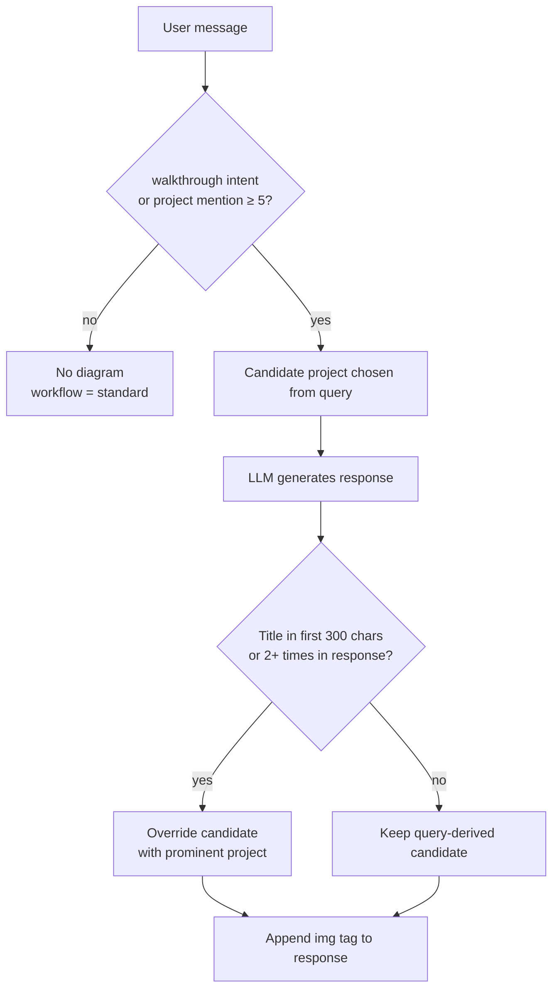

# Diagram Display — Design Doc

**Status:** Planning — describes current behavior and open questions. No decision made yet.
**Created:** 2026-07-26
**Scope:** When the twin attaches a project diagram to a chat response, and which one.
**Owner:** Barbara

---

## Table of Contents

- [Why this doc exists](#why-this-doc-exists)
- [Current behavior](#current-behavior)
- [Options considered](#options-considered)
- [Empirical baseline](#empirical-baseline)
- [Failure cases](#failure-cases)
- [Structural issues](#structural-issues)
- [Open questions](#open-questions)
- [Candidate directions](#candidate-directions)

---

## Why this doc exists

The diagram-display rule is real, deliberate, and undocumented. It lives as a code comment
labeled `Option C: Intent + Prominence` ([`app.py:1450`](../app.py)) with no record of what
Options A and B were or why C won. It is duplicated verbatim in `app_admin.py`, has no test
or eval coverage, and has no entry in [`LESSONS_LEARNED.md`](LESSONS_LEARNED.md) (the log
jumps 001 → 003).

The [MAINTAINER_GUIDE roadmap](MAINTAINER_GUIDE.md#roadmap) has nothing on diagram display.
The two items that touch diagrams at all are adjacent, not about this:

- **Multi-modal support** — the twin *reading* images, not showing them.
- **Session-aware project diversity** — changes *which* project a generic walkthrough picks
  (and therefore which diagram), never *whether* one appears. Stubbed at
  [`featured_projects.py:248`](../featured_projects.py).

So this doc is the baseline: what the system does today, what it gets wrong, and what we'd
have to decide before changing it.

---

## Current behavior

Diagram selection happens in two passes, split around the LLM call.

### Pass 1 — pre-LLM candidate (`app.py:1277`)

```python
diagram_project = walkthrough_project or find_mentioned_project(message)
diagram_path = get_diagram_path(diagram_project) if diagram_project else None
```

- `select_project_for_walkthrough()` — requires walkthrough *intent* (regex verb patterns like
  `walk me through`, `tell me about <project>`), then matches a project by name, then falls back
  to word-overlap scoring, then to `random.choice()`.
- `find_mentioned_project()` — no intent required, fires on any mention. Scores each project and
  returns the best if it clears a hard threshold of **5**:

  | Signal | Points |
  |--------|--------|
  | `mention_keywords` phrase match | +10 each |
  | Full title substring match | +8 |
  | Partial title word (4+ chars) | +2 each |
  | Tag word overlap | +1 each |

### Pass 2 — post-LLM filter (`app.py:1450`)

This is "Option C". Two stages:

**Intent gate.** The candidate survives only if the *user's message* showed project intent:

```python
user_asked_about_projects = (
    walkthrough_project is not None or
    find_mentioned_project(message) is not None
)
```

If false, `diagram_project` and `diagram_path` are both cleared — logged as
`DIAGRAM: Suppressed (no project intent)`.

**Prominence override.** Inside the gate, the *generated response* is scanned by
`find_prominent_project()`. A project is "prominent" if its title appears in the first
300 characters, or 2+ times anywhere. First match in list order wins and replaces the
query-derived choice. If nothing is prominent, the query-derived candidate stands.

The resulting path is logged as `workflow` = `walkthrough` | `diagram_only` | `standard`
in `query_log.jsonl`.

### Decision path



---

## Options considered

**Caveat: A and B are reconstructed, not recovered.** No design note, commit message, or
deleted file in the repo history records them — the label `Option C` in the code is the only
surviving trace. These are the three positions the code's structure implies, reconstructed so
the tradeoff is at least legible. Treat them as hypotheses about past reasoning, not as history.

| Option | Rule | Why it likely lost |
|--------|------|--------------------|
| **A — Query-only** | Show a diagram whenever the *message* mentions a project. This is Pass 1 with no Pass 2. | Over-fires on conversational questions. See the pre-Option-C log evidence below: "Tell me a little about yorself" attached the Digital Twin diagram. |
| **B — Response-only** | Ignore the query; show a diagram if the *response* prominently features a project. | The twin mentions its own build frequently, so casual replies would pull diagrams unbidden. Also can't be computed before streaming ends, so there's no early signal for the walkthrough path. |
| **C — Intent + Prominence** (shipped) | Require query intent *and* let the response refine which project. | Conjunction of A and B: query intent suppresses the false positives A had; the response pass fixes A's wrong-project picks. |

The essential insight in C is that **the query decides *whether*, and the response decides
*which***. That division is sound and worth keeping regardless of what changes.

---

## Empirical baseline

**Data caveat:** the live `query_log.jsonl` is gitignored and not present in this checkout.
The sample used here is [`scripts/query_log_ORIG.jsonl`](../scripts/query_log_ORIG.jsonl) —
218 rows on an older schema (`project`, `walkthrough`, `workflow`; no `project_title`),
**logged before Option C shipped**. So the `workflow` values in it reflect Option A behavior.
To characterize Option C, the current `find_mentioned_project()` and
`select_project_for_walkthrough()` were replayed offline against the same messages.

**Logged (pre-Option-C) distribution, 218 rows:**

| workflow | count |
|----------|-------|
| `standard` | 150 |
| `diagram_only` | 27 |
| `walkthrough` | 25 |
| *(missing field)* | 16 |

Diagram-bearing paths were dominated by one project: **Digital Twin 26**, Beehive Monitor 7,
Fitness Tracker 7, Concept Cartographer 4, ChronoScope 3, Resume Graph Explorer 2,
ConvoScope 1, Poolula Platform 1, Academic Citation Platform 1.

**Replaying current logic over the 116 unique messages:** 17 pass the intent gate, 99 are
suppressed. Three of the pre-Option-C `diagram_only` responses now correctly go dark
(`What did you do at Inflective`, `What do you like to do for work and fun`,
`Tell me a little about yorself`), which is Option C working as designed.

All 9 featured projects have a diagram file present on disk, so a missing-asset path is not
currently exercised.

---

## Failure cases

Each of these was reproduced against the current code, not hypothesized.

### 1. Tag overlap lets long pasted text trip the threshold

A visitor pasted a ~3,500-character job description. It scored **exactly 5** against
Poolula Platform — the threshold — and attached the Poolula diagram to a career-advice answer.
No keyword matched. The score came entirely from generic overlap:

- tag words `rag`, `fastapi`, `evaluation` present in the JD → +3
- the word `platform` in the JD matching a partial title word → +2

**Root problem:** the score is an unnormalized sum against a fixed integer threshold, so it
grows with input length. Any sufficiently long technical paste will eventually clear 5 by
accident. Pasted JDs are a first-class use case for this twin, which makes this the sharpest
failure of the set.

### 2. Prominence matches titles but ignores aliases

`find_mentioned_project()` matches against `mention_keywords` (rich alias lists —
`fitness dashboard`, `workout tracker`, `concept cartography`, `this chatbot`, …).
`find_prominent_project()` matches **only the exact lowercased title**.

The two passes therefore disagree on what counts as naming a project. A response that says
"Fitness Dashboard" — the name used in the query that triggered it, and in that project's own
repo — never matches the title `Fitness Tracker`, so the prominence pass silently no-ops and
the query-derived guess stands unchecked. Same for `concept cartography` vs
`Concept Cartographer`.

### 3. Generic walkthroughs are nondeterministic

`Walk me through a project` has fewer than 2 meaningful words after stopword filtering, so it
hits `random.choice()`. Over 200 replays the selection spread across all 9 projects
(Beehive Monitor 29, ConvoScope 27, Poolula 24, …, Digital Twin 18).

The same visitor asking the same question twice gets different projects and different
diagrams. That may be intentional variety, but it makes the feature untestable as written and
it's the gap the roadmap's session-aware diversity item was meant to close.

### 4. Personal questions with topical overlap still pull diagrams

`How did you get into beekeeping, and does it influence your work?` clears the gate via the
`beekeeping` keyword and attaches the Beehive Monitor architecture diagram. The question is
biographical; the answer is a story; the attachment is a system diagram. The intent gate
can't separate "asking about the subject" from "asking about the software."

Similarly, `Mitja Bosnic / Just testing your digital twin` attaches the twin's own
architecture diagram to what is essentially a greeting.

---

## Structural issues

Independent of the rule itself:

- **Duplicated, not shared.** The block at `app.py:1450` is reproduced at `app_admin.py:1213`.
  Nothing enforces sync, and the admin UI is the tool used to evaluate changes to this exact
  logic — drift there is silently misleading. This should be one function in
  `featured_projects.py` before any behavior change lands.
- **The LLM has no idea diagrams exist.** `SYSTEM_PROMPT.md` contains zero mentions of
  diagrams. The model cannot request one, decline one, or write a sentence that introduces
  one. Every decision is post-hoc string matching over text written without knowledge that an
  image may be appended to it.
- **No test or eval coverage.** Nothing in `tests/` or `evals/` asserts on diagram decisions,
  though `workflow` is logged per query and the offline replay above shows the decision
  functions are trivially testable in isolation.
- **Magic numbers.** Threshold `5`, prominence window `300`, repeat count `2`, keyword `+10` /
  title `+8` / partial `+2` / tag `+1`. All inline, none named, none justified in writing —
  the same condition that preceded the scoring-weight incident in
  [LESSONS_LEARNED Entry 001](LESSONS_LEARNED.md).
- **First-match-wins ordering.** `find_prominent_project()` returns on the first project that
  qualifies, in `featured_projects.yaml` order. If a response discusses two projects, the
  winner is decided by YAML position, not relevance.

---

## Open questions

These need answers before an implementation plan is worth writing.

1. **What is a diagram *for*?** Illustration of an answer already given, or an invitation to
   explore? The beekeeping case resolves differently depending on which.
2. **Should the model decide?** Exposing diagram availability in the system prompt (or as a
   tool call) would replace string matching with intent the model actually has. Cost: latency,
   tokens, and a new failure mode where the model asks for diagrams that don't exist.
3. **Is nondeterminism a feature?** If yes, keep `random.choice()` and close the
   session-diversity roadmap item as intentional. If no, it needs a seed or a rotation.
4. **What's the acceptable error direction?** `_is_walkthrough_request` documents its bias —
   "false positives are cheap." Case 1 above suggests that's no longer true for diagrams
   specifically: an irrelevant architecture diagram on a career-advice answer reads as a bug,
   not as generosity.
5. **Should suppression be visible?** Today a suppressed diagram leaves no trace for the
   visitor. An explicit "I have an architecture diagram for this — want to see it?" would turn
   a silent judgment call into an offer.

---

## Candidate directions

Not commitments — the option space, roughly ordered by cost.

- **Normalize the mention score.** Divide by message length or cap tag contribution, so long
  pastes stop accumulating incidental points. Directly fixes case 1.
- **Share the alias list.** Have `find_prominent_project()` use `mention_keywords` as well as
  the title. Directly fixes case 2, small diff.
- **Extract to one function.** `decide_diagram(message, response, walkthrough_project)` in
  `featured_projects.py`, called by both apps. Prerequisite for testing anything.
- **Golden-set tests.** The offline replay done for this doc is most of a test fixture already:
  a JSONL of message → expected decision, asserted against the pure functions. Would have
  caught cases 1 and 2.
- **Tell the model.** Add diagram availability to `SYSTEM_PROMPT.md` and let the response
  signal intent explicitly (a marker token, or a tool call). Largest change, addresses
  cases 2 and 4 at the root.
- **Offer instead of attach.** Render a caption or button rather than injecting the image
  unconditionally. Changes the UX contract, so it's a product decision, not a tuning one.

---

**Related:**
[MAINTAINER_GUIDE.md § Roadmap](MAINTAINER_GUIDE.md#roadmap) ·
[LESSONS_LEARNED.md](LESSONS_LEARNED.md) ·
[`featured_projects.py`](../featured_projects.py) ·
[`app.py:1450`](../app.py)
