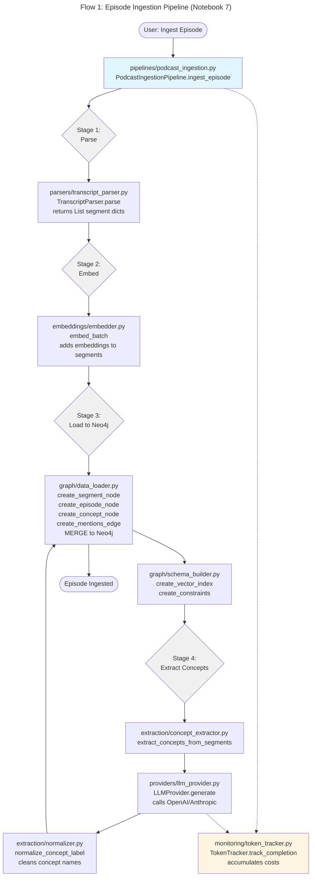
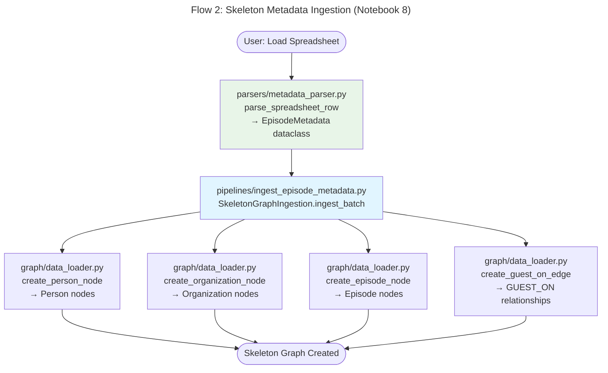
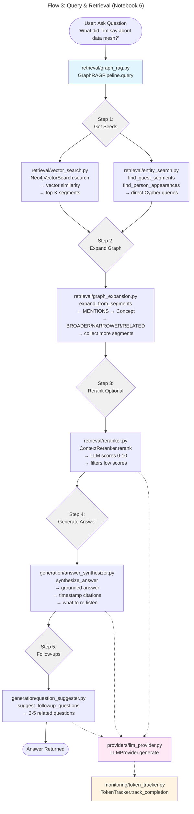
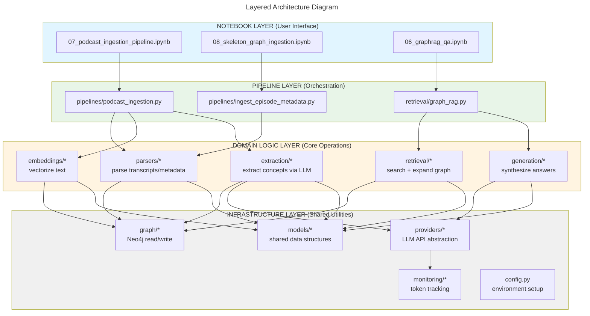
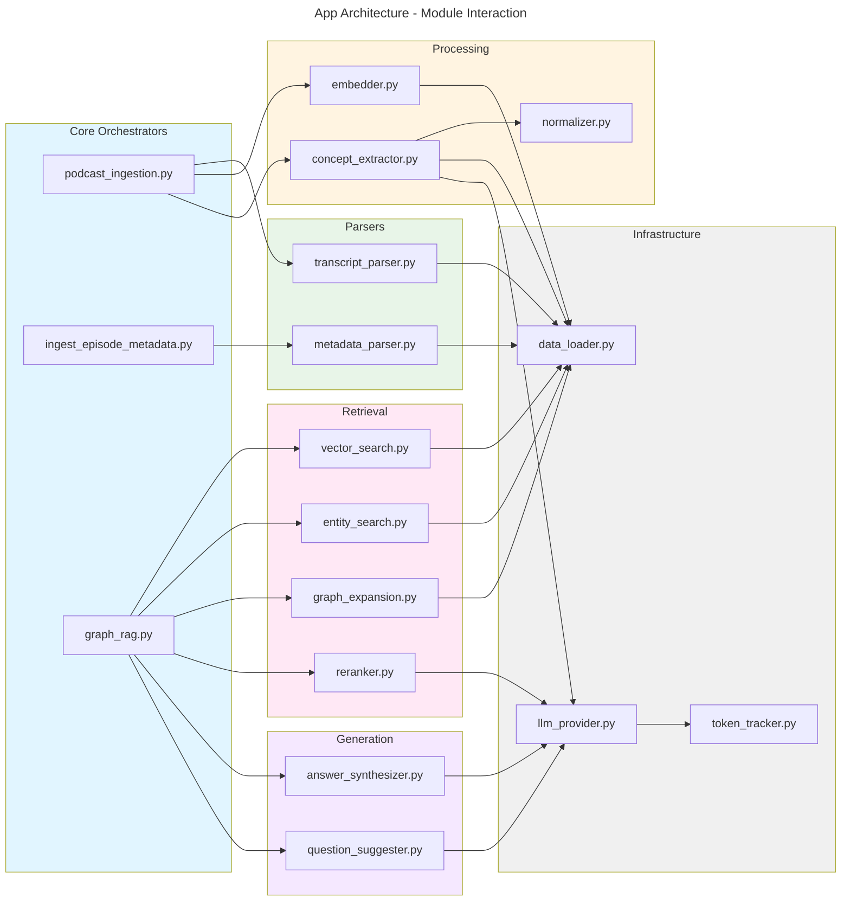
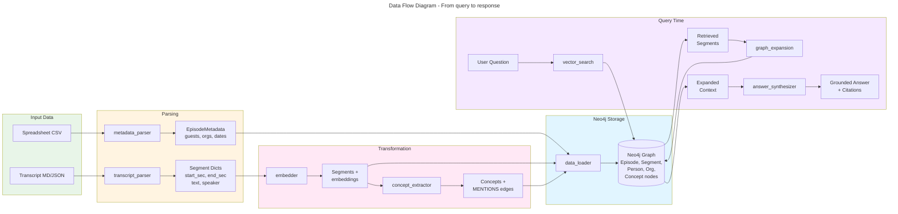

# Architecture Flow Diagrams

## Flow 1: Episode Ingestion Pipeline (Notebook 7)
Shows the complete journey from raw transcript to Neo4j graph with concepts 

## Flow 2: Skeleton Metadata Ingestion (Notebook 8)
Shows how spreadsheet data becomes Person/Org/Episode nodes

## Flow 3: Query & Retrieval (Notebook 6)
Shows the 5-stage retrieval pipeline from question to answer 

## Layered Architecture
Shows the 4-layer dependency structure (Notebook → Pipeline → Domain → Infrastructure) 

## Module Interaction Matrix
Shows which modules call which other modules

## Data Flow: Episode → Neo4j → Answer
Shows the end-to-end data transformation journey

