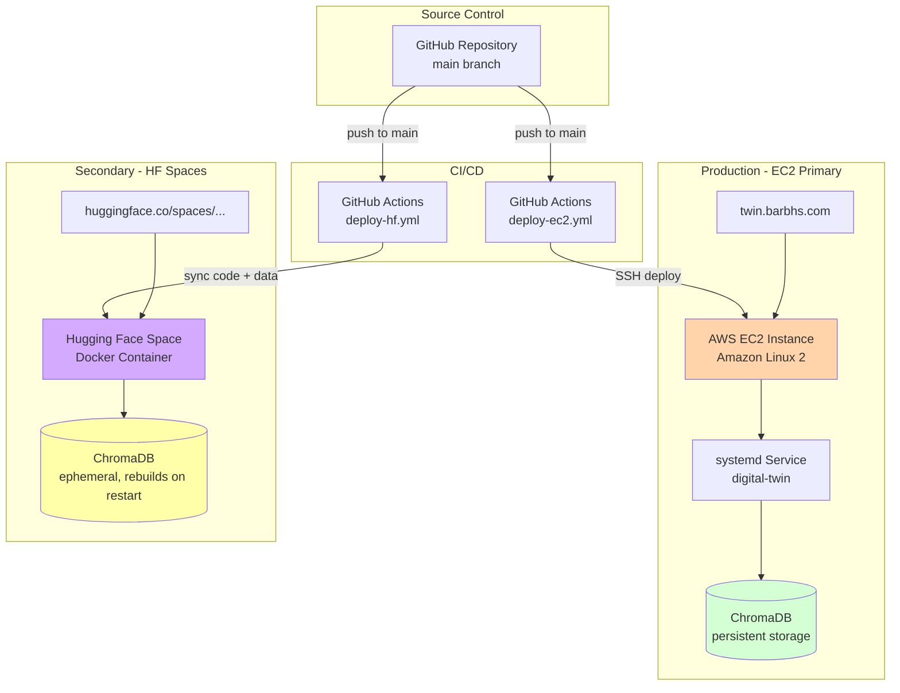

# Maintainer Guide: Deployment, Operations & Evaluation

This guide covers deployment, continuous evaluation, logging analytics, and operational tasks for maintaining the digital twin in production.

## Table of Contents

- [Deployment](#deployment)
- [Evaluation](#evaluation)
- [Query Log Analytics](#query-log-analytics)
- [Database Operations](#database-operations)
- [Roadmap](#roadmap)

---

## Deployment

### Deployment Architecture



Both deployments are automated via GitHub Actions and trigger on every push to `main`.

### EC2 Deployment (Primary)

The app runs as a `systemd` service on an AWS EC2 instance (Amazon Linux 2). On push to `main`, GitHub Actions SSHes in, pulls the latest code, installs dependencies, restarts the service, and smoke-tests the endpoint.

**Required GitHub Secrets** (Settings → Secrets and variables → Actions):

| Secret | Value |
|--------|-------|
| `EC2_HOST` | Public IP or hostname |
| `EC2_USER` | `ec2-user` |
| `EC2_SSH_KEY` | Private key of the dedicated deploy keypair |
| `EC2_APP_DIR` | Path to app on instance (e.g. `/home/ec2-user/barbs-digital-twin`) |
| `EC2_SERVICE_NAME` | systemd service name (e.g. `digital-twin`) |

**Full setup instructions:** See `.github/workflows/deploy-ec2.yml` for the complete guide including:
- Keypair generation
- sudoers configuration
- systemd unit file template
- Security group setup

### Hugging Face Spaces Deployment (Secondary)

Still active. On push to `main`, GitHub Actions syncs app code and input data to the HF Space repo. ChromaDB is ephemeral on HF Spaces — the app rebuilds it from scratch on container restart.

**Required GitHub Secret**: `HF_TOKEN`

**Note:** This deployment is useful for redundancy and sharing but has limitations:
- No persistent ChromaDB storage
- Slower cold starts (rebuilds DB on restart)
- Limited to free tier resources

**Full setup instructions:** See `.github/workflows/deploy-hf.yml`

### Manual Deployment

If you need to deploy manually:

**EC2:**
```bash
ssh ec2-user@<EC2_HOST>
cd /path/to/barbs-digital-twin
git pull
source .venv/bin/activate
pip install -r requirements.txt
sudo systemctl restart digital-twin
sudo systemctl status digital-twin
```

**Hugging Face:**
```bash
# Install HF CLI if not already installed
pip install huggingface_hub

# Login
huggingface-cli login

# Sync files
python db_sync.py --push  # If you want to push ChromaDB
# Or manually sync via git to the HF Space repo
```

---

## Evaluation

The Digital Twin uses an offline evaluation harness to test response quality, retrieval behavior, and regression risk after prompt, model, or knowledge-base changes.

For the conceptual design of the evaluation system — including question types, controlled vocabularies, scoring dimensions, and diagnosis categories — see [EVALUATION_GUIDE.md](../evals/EVALUATION_GUIDE.md).

For quick run commands, see [EVAL_QUICKSTART.md](../evals/EVAL_QUICKSTART.md).

### What the eval harness is for

Use the harness to answer three practical questions:

1. Does the twin know the right things?
2. Does it answer in the right way?
3. If an answer is weak, why?

The harness is most useful for:
- regression checks after KB changes
- quality checks after prompt or model changes
- lightweight model comparisons
- pre-deploy validation

### What it does not fully cover

The offline harness is primarily a single-turn evaluation system. It does not fully exercise:
- tool calling
- project walkthrough mode
- multi-turn conversational behavior

Those should still be spot-checked in the running app.

### Core evaluation artifacts

The evaluation system is built around four artifacts:

- **Question bank** — defines what a good answer should accomplish
- **Review template** — captures what happened in a run and how it was judged
- **Data dictionary** — defines the evaluation fields and their intended use
- **Controlled vocabulary registry** — governs enums and review tags so analysis stays consistent over time

### When to run evals

Run evals after:
- editing `SYSTEM_PROMPT.md`
- changing or re-ingesting KB sources
- changing model, temperature, or top-k
- before deployment

### Recommended workflow

```bash
python run_evals.py
python analyze_evals.py --export

---

## Query Log Analytics

Every conversation turn and visitor vote (👍/👎) is logged to `query_log.jsonl`. The analyzer surfaces knowledge gaps, performance issues, cost trends, and visitor satisfaction.

**Production logs:** `query_log.jsonl`
**Admin logs:** `query_log_admin.jsonl` (separate for experimentation)

**Learn more:** [`LOGGING_GUIDE.md`](LOGGING_GUIDE.md) | [`ADMIN_LOGGING_GUIDE.md`](ADMIN_LOGGING_GUIDE.md)

### Basic Analytics

```bash
# Full report
python scripts/analyze_logs.py

# Satisfaction analysis (thumbs up/down)
python scripts/analyze_logs.py --votes

# Queries where retrieval was weak
python scripts/analyze_logs.py --knowledge-gaps

# Analyze only the last N queries
python scripts/analyze_logs.py --last 50

# Export to JSON
python scripts/analyze_logs.py --export summary.json
```

Use the exported review sheet to score and diagnose weak responses.

### Typical causes of weak answers

A weak answer usually points to one of five causes:
- knowledge gap  
- retrieval gap  
- prompt behavior  
- model tendency  
- evaluation item needs revision  

Record the diagnosis in the review sheet so evaluation leads to concrete improvements rather than vague notes.

### Admin Analytics (Model Comparison & Cost Analysis)

```bash
# Full admin report
python scripts/analyze_logs.py --admin

# Quality, cost, and latency by model
python scripts/analyze_logs.py --compare-models

# ROI: similarity per dollar
python scripts/analyze_logs.py --cost-analysis

# OpenAI vs Anthropic vs Gemini vs Ollama
python scripts/analyze_logs.py --compare-providers

# Temperature and top-K impact
python scripts/analyze_logs.py --config-experiments
```

### What Gets Logged

- Query text and response
- Model and provider used
- Latency (end-to-end and LLM-only)
- Token counts (prompt, completion, total)
- Cost in USD
- Top-K retrieval similarity scores
- Workflow type (chat, walkthrough, tool)
- Tool calls executed
- Visitor votes (👍/👎)

**Performance:** ~16μs logging overhead per query (negligible)

### Quick Check Commands

```bash
# View recent queries
python scripts/analyze_logs.py --last 10

# Check if logging is working
python -c "
if [ -f query_log.jsonl ]; then
  wc -l query_log.jsonl
else
  echo 'No log file yet - will be created on first query'
fi
"

# View raw logs
cat query_log.jsonl | tail -5 | python -m json.tool
```

---

## Database Operations

### ChromaDB Sync (HF Hub)

Push/pull ChromaDB to/from Hugging Face Hub for backup or sharing:

```bash
# Push local DB to HF Hub
python db_sync.py --push

# Pull from HF Hub to local
python db_sync.py --pull

# Specify a different repo (default: dagny099/barb-digital-twin-db)
python db_sync.py --push --repo username/repo-name
```

### Verify Collection

Check what's in the database:

```bash
# Basic stats
python scripts/verify_collection.py

# Per-source breakdown
python scripts/verify_collection.py --show-sources

# All unique section names
python scripts/verify_collection.py --show-sections
```

### Audit Chunks

Inspect chunk quality and simulate retrieval:

```bash
# Full audit report
python chunk_inspector.py

# Test a specific query
python chunk_inspector.py --query "Resume Explorer architecture"

# Show only problematic chunks (<150 chars)
python chunk_inspector.py --tiny

# One source only
python chunk_inspector.py --source kb-projects

# Dump all chunks
python chunk_inspector.py --all-chunks
```

### Clear Collection

Wipe the entire database (with confirmation):

```bash
python scripts/clear_collection.py
```

**Warning:** This deletes all embeddings. You'll need to re-run `python scripts/ingest.py --all` to rebuild.

---

## Monitoring & Maintenance

### Daily Checks

1. **Service health** (if on EC2):
   ```bash
   ssh ec2-user@<host>
   sudo systemctl status digital-twin
   journalctl -u digital-twin -n 50
   ```

2. **Query logs** (check for errors or low satisfaction):
   ```bash
   python scripts/analyze_logs.py --votes --last 50
   ```

3. **Disk space** (ChromaDB can grow):
   ```bash
   du -sh .chroma_db_DT/
   ```

### Weekly Checks

1. **Knowledge gaps** (what are users asking that we can't answer?):
   ```bash
   python scripts/analyze_logs.py --knowledge-gaps
   ```

2. **Cost trends**:
   ```bash
   python scripts/analyze_logs.py --cost-analysis
   ```

3. **Model performance**:
   ```bash
   python scripts/analyze_logs.py --compare-models
   ```

### Monthly Maintenance

1. **Run full evaluation suite:**
   ```bash
   python run_evals.py
   python analyze_evals.py
   ```

2. **Review and update knowledge base** based on:
   - Knowledge gaps from logs
   - Failed eval questions
   - User feedback (👎 votes)

3. **Backup ChromaDB:**
   ```bash
   python db_sync.py --push
   ```

4. **Review prompt effectiveness:**
   - Check failure modes in logs
   - Update SYSTEM_PROMPT.md if needed
   - Re-run visitor evals

---

## Troubleshooting

### App won't start

```bash
# Check Python version
python --version  # Should be 3.11+

# Check dependencies
pip install -r requirements.txt

# Check .env file
cat .env | grep OPENAI_API_KEY

# Check ChromaDB
python scripts/verify_collection.py
```

### Empty responses or errors

```bash
# Check logs
tail -100 query_log.jsonl

# Test retrieval
python chunk_inspector.py --query "test query"

# Check DB contents
python scripts/verify_collection.py
```

### High costs

```bash
# Analyze cost by model
python scripts/analyze_logs.py --cost-analysis

# Check if you're using expensive models
grep LLM_MODEL .env

# Consider switching to cheaper models in .env
```

### Poor response quality

```bash
# Run evals to diagnose
python run_evals.py

# Check retrieval quality
python chunk_inspector.py --query "<failing query>"

# Review prompt
cat SYSTEM_PROMPT.md

# Check knowledge gaps
python scripts/analyze_logs.py --knowledge-gaps
```

---

## Roadmap

Future enhancements and features under consideration:

- [ ] **Multi-modal support**: Integrate image understanding for project screenshots
- [ ] **Citation tracking**: Return source documents with responses
- [ ] **Conversation memory**: Implement session-based memory across conversations
- [ ] **Session-aware project diversity**: Track shown projects per session to avoid repetition in walkthrough mode (weighted random fallback that biases toward unseen projects)
- [ ] **Voice interface**: Add speech-to-text/text-to-speech capabilities
- [ ] **Fine-tuning**: Train a custom model on Barbara's writing style
- [ ] **Knowledge graph integration**: Neo4j backend for relationship-rich queries
- [ ] **Automated updates**: GitHub Actions to re-embed on repo changes
- [x] **Evaluation suite**: Offline eval harness across 8 categories (see [`EVAL_QUICKSTART.md`](../evals/EVAL_QUICKSTART.md))
- [x] **Multi-provider LLM support**: OpenAI, Anthropic, Google, Ollama via LiteLLM with cost tracking
- [x] **Production-grade logging**: Query analytics with <16μs overhead for continuous improvement (see [`LOGGING_GUIDE.md`](LOGGING_GUIDE.md), [`ADMIN_LOGGING_GUIDE.md`](ADMIN_LOGGING_GUIDE.md))

---

## Contributing

This is a personal project, but suggestions and ideas are welcome! Feel free to:
- Open issues for bugs or feature requests
- Submit PRs for improvements (especially documentation)
- Share your own digital twin fork

See the main [README.md](../README.md) for contact information.

---

**Related Guides:**
- [DEVELOPER_GUIDE.md](DEVELOPER_GUIDE.md) - Setup, architecture, and customization
- [VISITOR_GUIDE.md](VISITOR_GUIDE.md) - How to use the twin
- [README.md](../README.md) - Project overview
