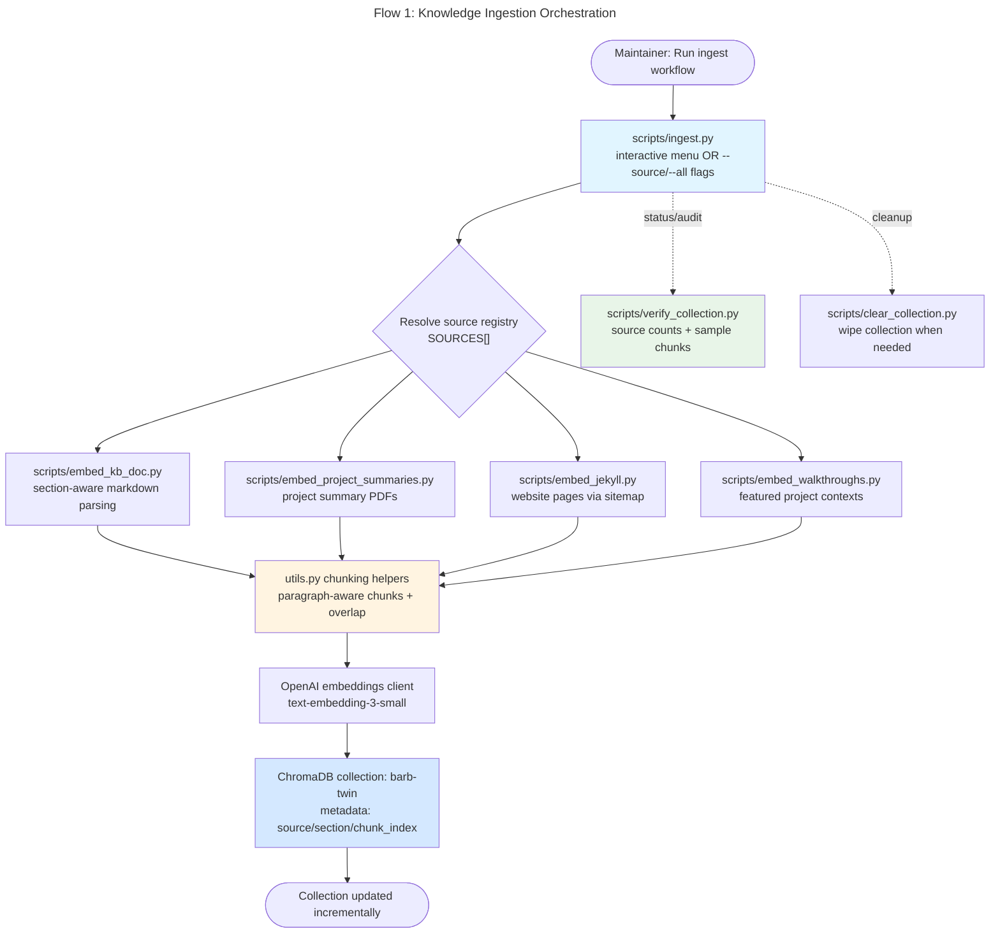
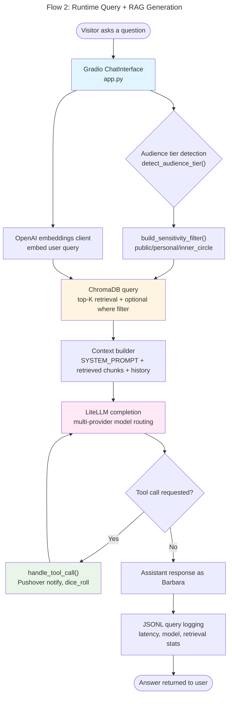
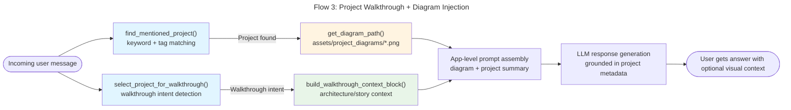
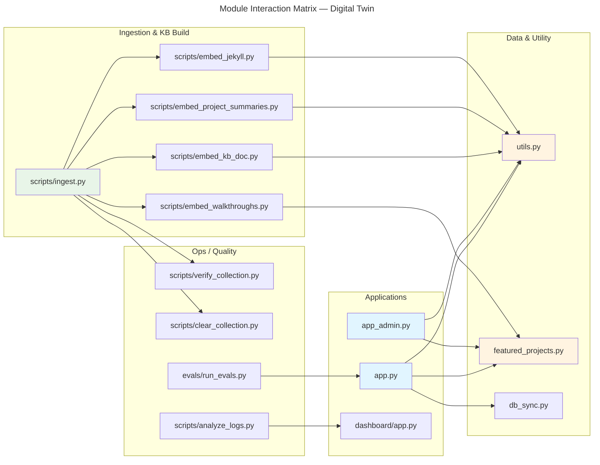
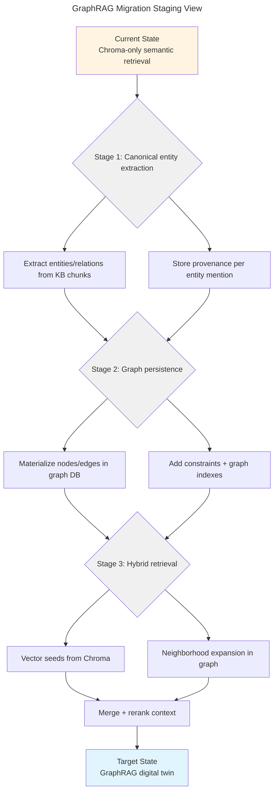

# Architecture Flow Diagrams — Digital Twin Project

## Flow 1: Knowledge Ingestion Orchestration (`scripts/ingest.py`)
Shows how source-specific embedding scripts are orchestrated into one persistent ChromaDB collection.



## Flow 2: Runtime Query + RAG Generation (`app.py`)
Shows the public twin request path from user message to grounded response.



## Flow 3: Project Walkthrough + Diagram Injection (`featured_projects.py`)
Shows how project mentions trigger richer walkthrough context and optional diagram rendering.



## Layered Architecture (Current Digital Twin)
Shows the current 4-layer dependency structure before the planned GraphRAG migration.

```mermaid
---
id: 4d1f45bd-91db-4fa0-8e5a-4ecb53405f7c
title: "Layered Architecture — Digital Twin"
---
graph TB
    subgraph UX["INTERFACE LAYER"]
        A1[app.py — public chat]
        A2[app_admin.py — local debug/admin]
        A3[dashboard/app.py — analytics dashboard]
    end

    subgraph ORCH["ORCHESTRATION LAYER"]
        O1[scripts/ingest.py]
        O2[featured_projects.py]
        O3[scripts/analyze_logs.py]
        O4[evals/run_evals.py]
    end

    subgraph DOMAIN["DOMAIN LOGIC LAYER"]
        D1[retrieval + context assembly in app.py]
        D2[sensitivity gating + policy logic]
        D3[chunking/section parsing helpers in utils.py]
        D4[analytics/sessionization + metrics]
    end

    subgraph INFRA["INFRASTRUCTURE LAYER"]
        I1[ChromaDB persistent store (.chroma_db_DT)]
        I2[Embedding API client (OpenAI)]
        I3[LLM provider abstraction (LiteLLM)]
        I4[File-based logs (JSONL)]
        I5[HF Hub sync (db_sync.py)]
    end

    A1 --> O2
    A1 --> D1
    A2 --> D1
    A3 --> D4

    O1 --> D3
    O3 --> D4
    O4 --> D1

    D1 --> I1
    D1 --> I2
    D1 --> I3
    D1 --> I4

    O1 --> I1
    O1 --> I2
    O1 --> I5

    D4 --> I4

    style UX fill:#e1f5ff
    style ORCH fill:#e8f5e8
    style DOMAIN fill:#fff4e1
    style INFRA fill:#f0f0f0
```

## Module Interaction Matrix (Current State)
Shows high-level module coupling and call directions.



## GraphRAG Migration Staging View (Planned Next Step)
Provides a parallel bridge from current Chroma-only RAG toward hybrid graph + vector retrieval.


