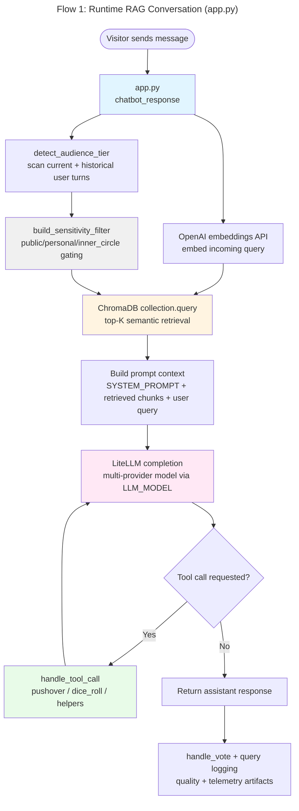
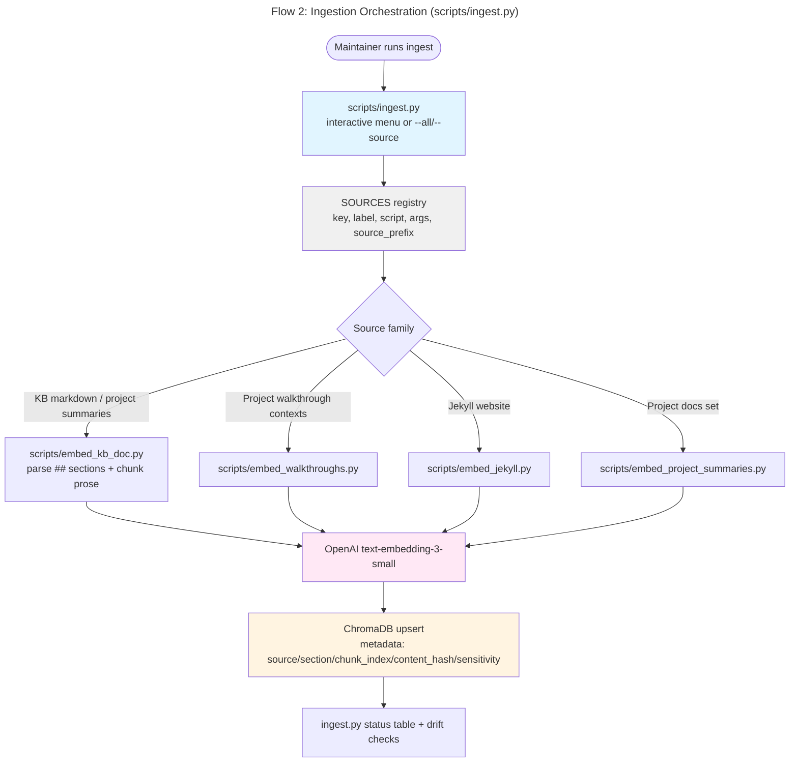
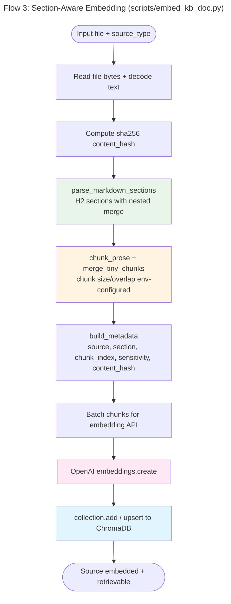
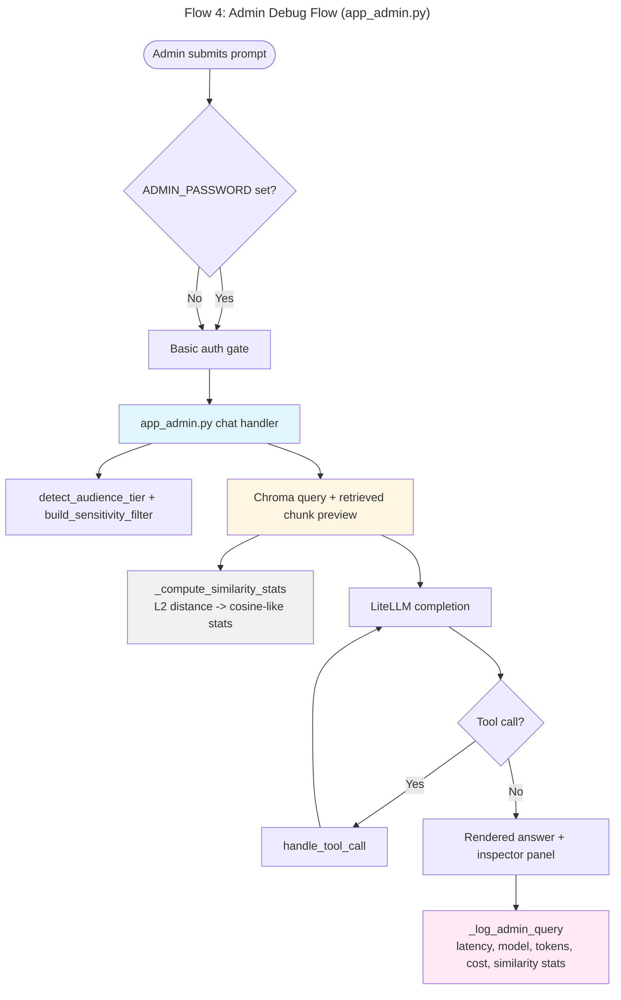

# Architecture Flow Diagrams — Barbara's Digital Twin

## Flow 1: Runtime RAG Conversation (Public App)
Shows the end-to-end runtime path from user message to grounded reply in Barbara's voice.



## Flow 2: Knowledge Ingestion Orchestration
Shows how the ingestion manager routes many sources through specialized embedding scripts into ChromaDB.



## Flow 3: Section-Aware Document Embedding
Shows the internal transformation pipeline for one structured markdown source.



## Flow 4: Admin Debug + Retrieval Inspector
Shows the admin-only path that combines response generation with observability and diagnostics.



## Layered Architecture
Shows a parallel layered view of the current digital twin codebase, analogous to the GraphRAG project's layer map.

```mermaid
---
id: 13fa7b3a-dtw-05
title: "Layered Architecture Diagram (Digital Twin)"
---
graph TB
    subgraph UI["INTERFACE LAYER"]
        U1[app.py - public chat UI]
        U2[app_admin.py - debug/admin UI]
        U3[dashboard/app.py - analytics dashboard]
    end

    subgraph ORCH["ORCHESTRATION LAYER"]
        O1[scripts/ingest.py - source routing + status]
        O2[featured_projects.py - walkthrough selection]
        O3[scripts/analyze_logs.py / analytics workflows]
    end

    subgraph DOMAIN["DOMAIN LOGIC LAYER"]
        D1[utils.py - chunking, section parsing, metadata helpers]
        D2[scripts/embed_kb_doc.py - structured KB embedding]
        D3[scripts/embed_jekyll.py - website ingestion]
        D4[scripts/embed_walkthroughs.py - project context embedding]
    end

    subgraph INFRA["INFRASTRUCTURE LAYER"]
        I1[ChromaDB (.chroma_db_DT)]
        I2[OpenAI embeddings client]
        I3[LiteLLM provider abstraction]
        I4[query logs + admin logs + telemetry scripts]
        I5[db_sync.py - HF Hub backup/restore]
    end

    U1 --> O2
    U1 --> I3
    U1 --> I1
    U2 --> I3
    U2 --> I1
    U2 --> I4
    U3 --> I4

    O1 --> D2
    O1 --> D3
    O1 --> D4
    O1 --> I1
    O1 --> I2

    D2 --> I2
    D2 --> I1
    D3 --> I2
    D3 --> I1
    D4 --> I2
    D4 --> I1
    D1 --> D2
    D1 --> D3

    I1 --> I5

    style UI fill:#e1f5ff
    style ORCH fill:#e8f5e8
    style DOMAIN fill:#fff4e1
    style INFRA fill:#f0f0f0
```
