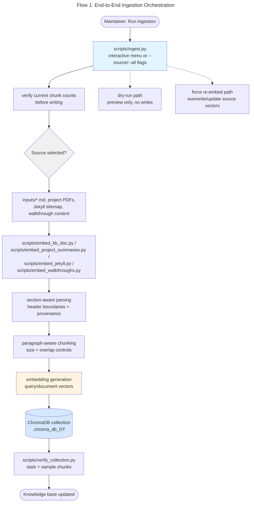
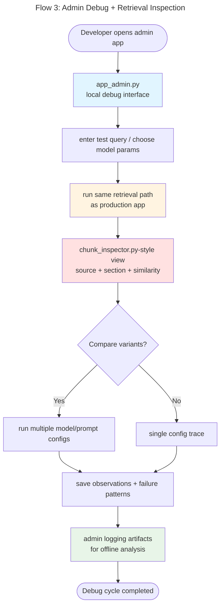
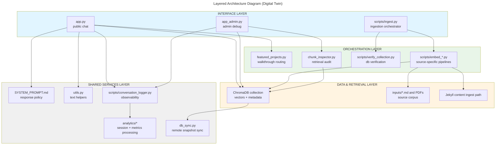
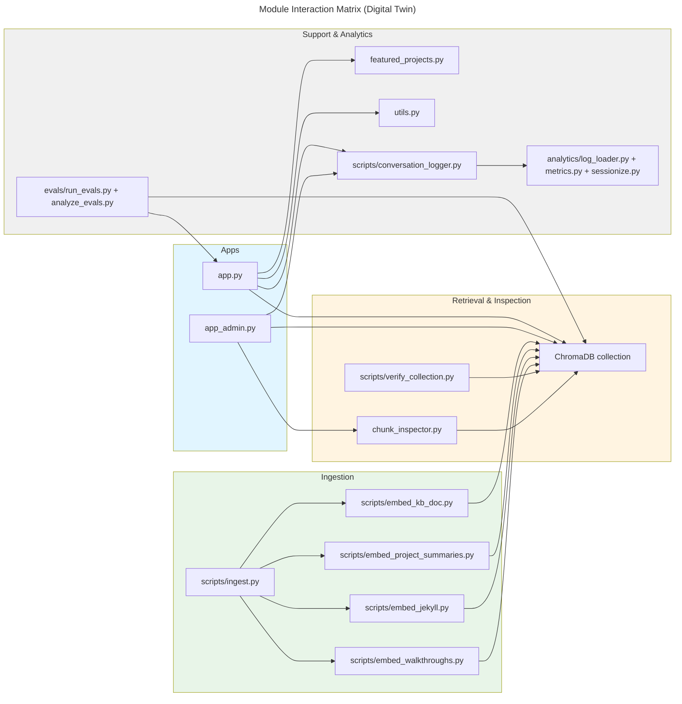

# Architecture Flow Diagrams (Digital Twin Project)

## Flow 1: End-to-End Ingestion Orchestration (`scripts/ingest.py`)
Shows how curated knowledge sources are discovered, chunked, embedded, and persisted to ChromaDB.



## Flow 2: Public Conversation Runtime (`app.py`)
Shows the request lifecycle from visitor message to grounded answer.

```mermaid
---
id: b3f1be5c-cf49-4b89-bf11-86417d0e8bbd
title: "Flow 2: Public Conversation Runtime"
---
graph TD
    Start([Visitor sends message]) --> UI[Gradio ChatInterface<br/>app.py]
    UI --> PromptLoad[SYSTEM_PROMPT.md loaded<br/>persona + guardrails]

    PromptLoad --> QueryEmbed[embed user query]
    QueryEmbed --> Retrieve[ChromaDB semantic search<br/>top-K chunks + similarity]
    Retrieve --> ContextBuild[assemble prompt context<br/>system + retrieval + chat history]

    ContextBuild --> LLMCall[LiteLLM completion call<br/>provider/model via env]
    LLMCall --> ToolGate{Tool call requested?}

    ToolGate -->|Yes| ToolExec[handle_tool_call()<br/>notifications / dice roll]
    ToolExec --> LLMCall

    ToolGate -->|No| Answer[final response in Barbara's voice]
    Answer --> LogWrite[scripts/conversation_logger.py<br/>request/latency/cost metadata]
    LogWrite --> End([Response returned to visitor])

    Retrieve -.-> ProjectAssist[featured_projects.py<br/>project walkthrough helpers]

    style UI fill:#e1f5ff
    style Retrieve fill:#fff4e1
    style LLMCall fill:#ffe8f5
    style LogWrite fill:#e8f5e8
```

## Flow 3: Admin Debug + Retrieval Inspection (`app_admin.py`)
Shows the local-only diagnostics path for model comparison and retrieval forensics.



## Layered Architecture (Current Digital Twin)
Shows the dependency structure from interfaces to shared infrastructure.



## Module Interaction Matrix (Current State)
Highlights core modules and their primary interactions before a GraphRAG evolution.



## Forward-Looking Notes for "GraphRAG Makeover"
- The current flows are retrieval-first with vector similarity and metadata provenance.
- A GraphRAG transition can add an entity/concept graph expansion stage between retrieval and answer synthesis.
- Keep this file as the "baseline architecture" snapshot to compare pre/post GraphRAG behavior.
