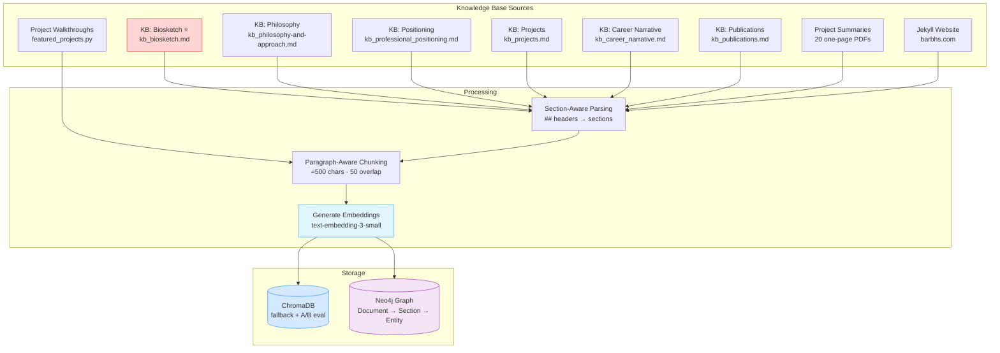

# Knowledge Base Design

The knowledge base is the foundation of the digital twin's accuracy. The design principle is simple: **structure content for retrieval quality, not just storage.** Every architectural choice — from section boundaries to metadata schema to source priority — was made to improve what the LLM actually sees when answering a question.

---

## Source Architecture



---

## Metadata Schema

Every chunk carries three provenance fields:

```python
{
    'source': 'source-type:identifier',  # e.g., 'kb-biosketch:kb_biosketch.md'
    'section': 'Section Name' or None,   # e.g., 'Professional Experience'
    'chunk_index': 0                     # position within section (resets per section)
}
```

This schema means the LLM always knows *where* a retrieved chunk came from — not just its content, but its parent section, source document, and sensitivity tier. This is the "section-aware" part of the design.

---

## Chunking Strategy

- **Chunk size**: ~500 characters (configurable)
- **Overlap**: 50 characters (re-includes trailing paragraphs to prevent boundary gaps)
- **Atomic unit**: Paragraphs (double-newline delimited) — never split mid-sentence
- **`chunk_index`**: Resets to 0 per section, not globally — this is intentional. It preserves section-relative position without inflating global indices.

The strategy balances semantic coherence (paragraphs as natural units), retrieval granularity (chunks ≈ 1–2 paragraphs), and context continuity (overlap prevents sharp boundary losses).

---

## Source Priority Order

When sources provide conflicting information, the system resolves deterministically:

1. **Biosketch** — authoritative source of truth for identity, background, and values
2. **Philosophy & Approach** — how Barbara thinks about problems
3. **Intellectual Foundations** — frameworks and influences
4. **Dissertation & Research** — academic background
5. **Projects Overview** — project registry
6. **Individual Project Briefs** — per-project documentation
7. **Career Narrative** — career arc told as a story
8. **Easter Eggs / Personal Recognition** — inner-circle content

The biosketch always wins. If it contradicts something in a project brief, the biosketch is correct.

---

## Source Types in Detail

### KB Documents (Markdown)

Six curated KB documents are parsed by `embed_kb_doc.py` using the same logic: `##` headers create named section boundaries, and `chunk_prose()` handles the rest.

| Source Key | File | Content |
|---|---|---|
| `kb-biosketch` | `inputs/kb_biosketch.md` | Identity, background, values — the authoritative source |
| `kb-philosophy` | `inputs/kb_philosophy-and-approach.md` | How Barbara thinks about data and meaning-making |
| `kb-positioning` | `inputs/kb_professional_positioning.md` | Differentiators, cognitive science angle, problems she solves |
| `kb-projects` | `inputs/kb_projects.md` | Project registry with tech stack and deployment status |
| `kb-career` | `inputs/kb_career_narrative.md` | Five-chapter career arc from MIT through independent GenAI work |
| `kb-publications` | `inputs/kb_publications.md` | Academic papers with PDF links |

### Project Summaries (PDFs)

20 one-page PDFs follow a consistent template: *What it is / Who it's for / What it does / How it works.* The parser uses fuzzy prefix matching to detect section headers from the template. Each PDF also gets a synthetic "overview" chunk combining title + *What it is* + *Who it's for* — optimized for portfolio-style queries.

Metadata extras for PDFs: `project_name`, `tech_stack` (comma-joined list of detected technologies).

### Jekyll Website

Fetched live via `https://barbhs.com`'s `sitemap.xml`. `trafilatura` strips nav/footer automatically. Each page becomes one document with its page title as the section name.

### Project Walkthroughs

Deep-dive context for featured projects comes from the `walkthrough_context` field in `featured_projects.py`. Each walkthrough is stored as a single Section node in Neo4j — linked to its Project node via `Project -[:DESCRIBED_IN]-> Section`, which means it earns the +0.08 project graph bonus in composite scoring.

!!! warning "ChromaDB vs Neo4j walkthroughs"
    `scripts/embed_walkthroughs.py` still exists for ChromaDB ingestion but is no longer the active path. Neo4j walkthroughs are populated during `populate_neo4j_graph.py` and embedded by `scripts/embed_sections.py`. Do not confuse the two paths.

---

## Why This Design

The core insight: **retrieval is biased toward whatever content was written to be retrievable.** Curated content that uses dense, question-shaped vocabulary ("projects I'm proud of," "applied ML") consistently outperforms narrative content that uses chronological, engagement-shaped vocabulary — even when the narrative content is more topically specific.

This has real consequences for KB design:
- New sections must either match the curated style or be surfaced through retrieval-scoring adjustments
- The biosketch's density and structure is deliberate — it's written for retrieval, not for reading
- Section boundaries matter: a chunk that straddles two topics will be retrieved for the wrong query half the time

See [Entry 002 in Lessons Learned](../lessons-learned/entry-002.md) for a concrete example of this bias in action.
