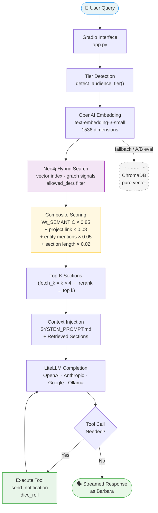
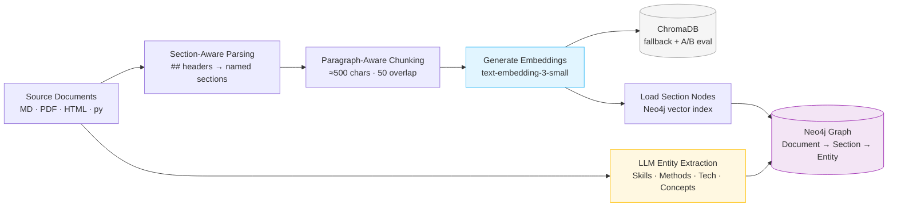
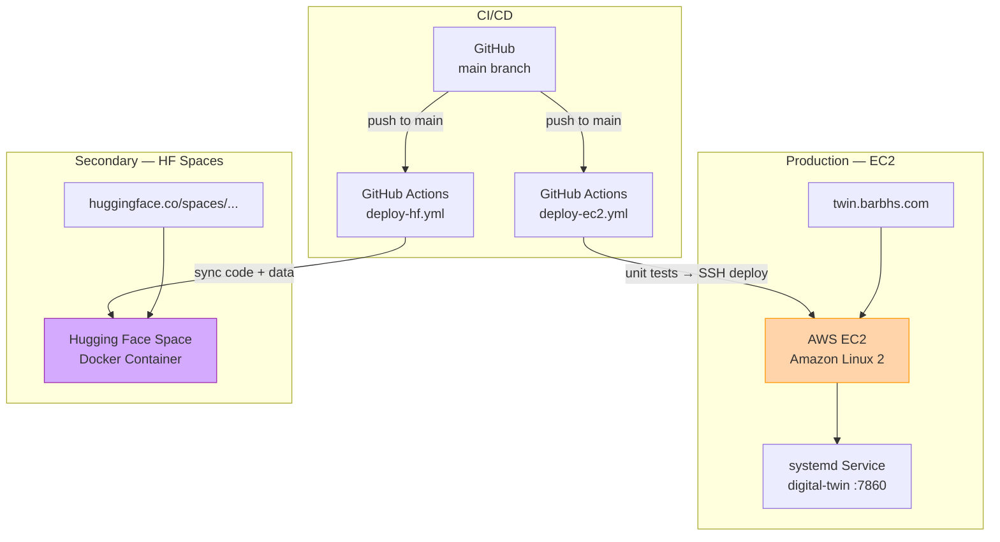

# System Overview

Barbara's digital twin is a GraphRAG system — retrieval-augmented generation backed by a Neo4j knowledge graph. This page covers the full retrieval pipeline, from user query to streamed response.

---

## Retrieval Pipeline



---

## Data Ingestion Pipeline



---

## Key Processing Steps

1. **Parse** — `##` headers create named Section boundaries. Every chunk knows its parent section, source document, and sensitivity tier.
2. **Chunk** — Paragraph-aware splitting with configurable size (~500 chars) and overlap (50 chars). `chunk_index` resets per section, not globally.
3. **Embed** — Each section is embedded via `text-embedding-3-small` (1536 dimensions).
4. **Load** — Section nodes and embeddings are loaded into Neo4j's vector index. The same chunks are also stored in ChromaDB for fallback and A/B comparison.
5. **Entity Extraction** — An LLM extracts Skills, Methods, Technologies, and Concepts from project walkthroughs. These become 167 canonical entity nodes, connected to sections via `MENTIONS` edges. Projects link to their descriptive sections via `DESCRIBED_IN`.

---

## Neo4j Graph Schema

The graph has three primary node types:

```
(Document) -[:HAS_SECTION]-> (Section) -[:MENTIONS]-> (Entity)
(Project)  -[:DESCRIBED_IN]-> (Section)
```

- **Document** — a source file (KB doc, PDF, website page)
- **Section** — a named chunk with embedding vector and `sensitivity_tier`
- **Entity** — a canonical node (Skill, Method, Technology, Concept)
- **Project** — a named project in Barbara's portfolio

Graph connectivity is what enables the hybrid scoring: a Section linked to a Project or mentioning many Entities earns graph bonuses on top of its vector similarity score.

---

## Sensitivity Tier Gating

The `allowed_tiers` parameter is passed directly into the Cypher `WHERE` clause — no post-filter. Tier detection runs before embedding, so ineligible sections are never scored.

```python
WHERE s.sensitivity_tier IN $allowed_tiers
```

See [Passphrase & Tiers](../getting-started/tiers.md) for how tiers are detected.

---

## Deployment Architecture



See [EC2 Primary](../deployment/ec2-primary.md) and [HuggingFace Spaces](../deployment/huggingface-spaces.md) for setup instructions.

---

## Key Files

| File | Purpose |
|---|---|
| [`app.py`](https://github.com/dagny099/barbs-digital-twin/blob/main/app.py) | Main Gradio app — RAG pipeline, streaming, tool calls, logging |
| [`neo4j_utils.py`](https://github.com/dagny099/barbs-digital-twin/blob/main/neo4j_utils.py) | Neo4j driver, `query_neo4j_rag()`, scoring weight constants |
| [`SYSTEM_PROMPT.md`](https://github.com/dagny099/barbs-digital-twin/blob/main/SYSTEM_PROMPT.md) | Persona, voice rules, factual accuracy guardrails, tool protocols |
| [`featured_projects.py`](https://github.com/dagny099/barbs-digital-twin/blob/main/featured_projects.py) | Project walkthrough logic and diagram serving |
| [`replay_retrieval.py`](https://github.com/dagny099/barbs-digital-twin/blob/main/replay_retrieval.py) | Neo4j retrieval debugger — composite score breakdown |
| [`chunk_inspector.py`](https://github.com/dagny099/barbs-digital-twin/blob/main/chunk_inspector.py) | ChromaDB chunk quality auditor |
