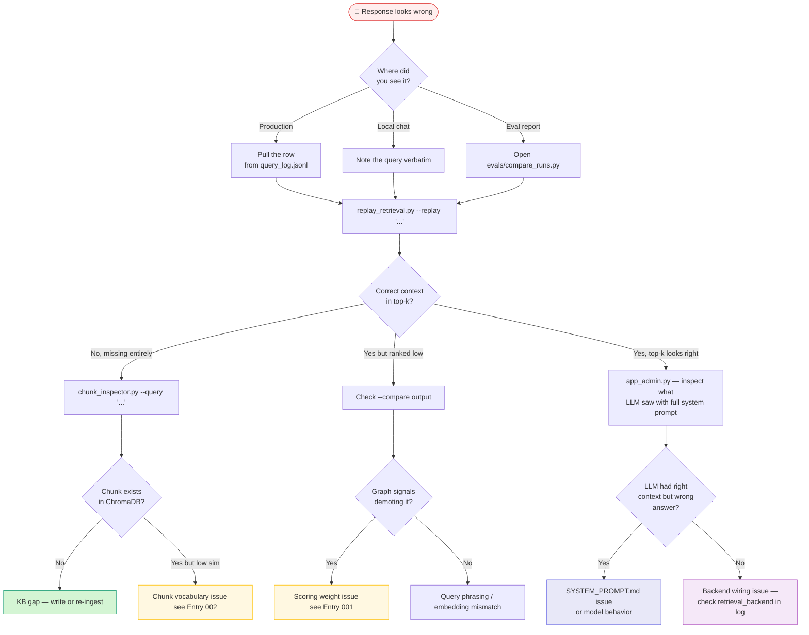

# Diagnostic Playbook

A single decision tree for "the twin said something wrong — now what?" Every node in this tree maps to a specific tool you've already built. Start at the top and branch.

The system has five diagnostic surfaces, each pointed at a different layer of the pipeline:

| Tool | Layer it sees | Best for |
|---|---|---|
| [`replay_retrieval.py`](debug-tools.md#replay_retrievalpy-neo4j-retrieval-debugger) | Neo4j retrieval + composite scoring | "Did the right context get retrieved? Why?" |
| [`chunk_inspector.py`](debug-tools.md#chunk_inspectorpy-chromadb-chunk-quality-auditor) | ChromaDB chunk store | "Is the chunk even in the KB? Is it healthy?" |
| [`app_admin.py`](debug-tools.md#app_adminpy-admin-interface) | Live RAG + LLM, side-by-side | "What did the LLM actually see for this question?" |
| [`evals/compare_runs.py`](debug-tools.md#evalscompare_runspy-ab-eval-run-viewer) | Before/after eval runs | "Did my fix help — and did it break anything else?" |
| [`scripts/analyze_logs.py`](../deployment/ec2-primary.md#query-logs) + [Query Log Schema](../reference/query-log-schema.md) | Production traffic | "Is this an isolated incident or a pattern?" |

---

## The Decision Tree



---

## Step-by-Step Walkthroughs

### Branch 1 — Production complaint

**Symptom**: A visitor's screenshot or a 👎 vote on a real query.

```bash
# 1. Find the row in query_log.jsonl by message snippet
jq -c 'select(.message | contains("beekeeping")) | {ts, message, chunk_similarity_max, model, retrieval_backend}' query_log.jsonl | tail -5

# 2. Replay it through the live retrieval — exact same query, exact same backend
python replay_retrieval.py --replay "beekeeping" --compare

# 3. If the row is owner-traffic and you remember writing it: re-run analytics excluding your own traffic to see if other people hit the same issue
python scripts/analyze_logs.py --knowledge-gaps --exclude-owner
```

If the same query appears multiple times with low similarity, it's a **KB gap**, not a one-off. Add it to your content backlog.

---

### Branch 2 — Correct context wasn't retrieved

`replay_retrieval.py` shows the top-k for your query. If the chunk you *expected* to see isn't there:

```bash
# Is the chunk even in ChromaDB?
python chunk_inspector.py --query "the exact thing you expected to retrieve"

# If yes but ranked low: inspect chunk health for that source
python chunk_inspector.py --source kb-biosketch
python chunk_inspector.py --tiny    # are there orphaned <150-char chunks?
```

**Common causes:**

| Symptom | Likely cause | Fix |
|---|---|---|
| Chunk doesn't appear in `chunk_inspector` at all | KB doc not ingested / wrong source key | Run `scripts/ingest.py --status` to confirm; re-embed if needed |
| Chunk appears but with very low similarity to your query | Vocabulary mismatch — narrative-style content losing to curated-style content | See [Entry 002 — Curated vs. Narrative](../lessons-learned/entry-002.md) |
| Chunk appears in ChromaDB but not Neo4j | The Neo4j vector index didn't include it (forgot `embed_sections.py`?) | Re-run the Neo4j population path |

---

### Branch 3 — Right context was retrieved but ranked too low

This is the **scoring weights** failure mode. Open `replay_retrieval.py --compare` and read the rank-drift table:

- Section moving **up** in Neo4j vs ChromaDB → graph bonuses are promoting it (good if appropriate, bad if it overrides a more semantically-relevant chunk)
- Section moving **down** in Neo4j → high vector similarity but no graph connections, so it lost the bonus race

If a high-similarity chunk is being demoted by graph bonuses on a structurally-connected but less-relevant chunk, you're hitting **Entry 001**.

```bash
# Before changing weights, run the canary
python replay_retrieval.py --query "How did you get into beekeeping?" --compare
# The beekeeping answer-bank chunk should rank #1 in Neo4j. If it doesn't, bonuses are too large.
```

See [Entry 001 — Graph Signals & Hallucination](../lessons-learned/entry-001.md) for the full incident write-up before touching `Wt_SEMANTIC`, `BONUS_PROJECT`, `BONUS_ENTITY`, or `BONUS_LENGTH`.

---

### Branch 4 — Retrieval was correct, answer was wrong

If `replay_retrieval.py` shows the right chunks in the top-k and `app_admin.py` confirms they made it into the LLM context, the issue is one layer down.

| Check | What to look for |
|---|---|
| `SYSTEM_PROMPT.md` | Is there an explicit guardrail being violated? Is the tone wrong? Is the LLM ignoring a "do not invent" instruction? |
| `model` field in the log row | If the response came from a different model than usual (model dropdown left at non-default), the persona behavior can drift |
| `retrieval_backend` field | If `chromadb`, no NEXT_SECTION expansion happened — was the response missing a continuation? |
| `had_error` or `empty_response` | True means a real failure — check `journalctl -u digital-twin -n 50` on EC2 |

---

### Branch 5 — "Is this an isolated incident, or a pattern?"

You usually need this answer before deciding whether to fix anything.

```bash
# Knowledge gaps across all traffic
python scripts/analyze_logs.py --knowledge-gaps --exclude-owner

# Satisfaction by model — are 👎 concentrated on one model?
python scripts/analyze_logs.py --votes --compare-models

# Did this start recently?
python scripts/analyze_logs.py --cutoff-date 2026-05-01 --votes

# Cost vs quality — am I burning money on questions I answer badly?
python scripts/analyze_logs.py --cost-analysis
```

The full schema for what these reports read is in [Query Log Schema](../reference/query-log-schema.md).

---

## After You Fix Something

Whatever you changed (prompt, weights, KB content, model), prove it didn't regress:

```bash
# 1. Re-run the canary
python replay_retrieval.py --query "How did you get into beekeeping?" --compare

# 2. Re-run the eval suite
cd evals/
python run_evals.py

# 3. Diff against the previous run
python compare_runs.py     # http://localhost:7863 — opens with the two most recent runs pre-selected
```

The compare viewer highlights chunks that appeared in only one run — that's where regressions hide. If a question that was answered well in the old run now retrieves different chunks, look there first.

---

## Capturing What You Learned

When a fix took more than fifteen minutes to find, that's a **Lessons Learned** entry. The template lives at the top of [Lessons Learned → Overview](../lessons-learned/index.md). Even a one-paragraph entry saves future-you the same hour of digging.

What earns an entry:

- A non-obvious failure mode (retrieval looked fine but the answer was wrong, etc.)
- A tuning decision where the wrong choice was the intuitive one
- A design tradeoff with a real reason behind it (not "we just decided")
- Something that would have saved time if you'd known it going in

Tools that help you write the entry without re-doing the work:

- `replay_retrieval.py --replay "..."` reproduces the original retrieval exactly
- `query_log.jsonl` has the timestamps, scores, and full response text
- `compare_runs.py` gives you the before/after eval evidence for the entry's "Supporting data" section
